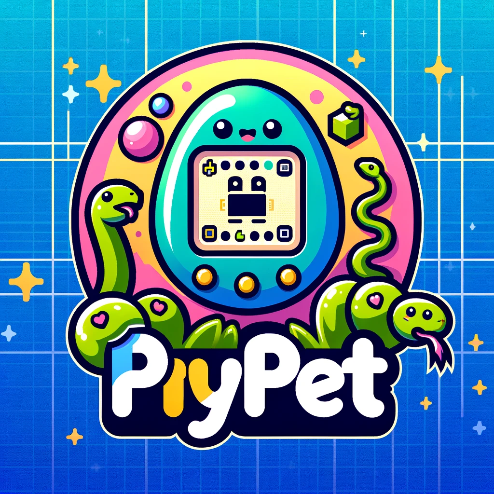

# Python Programming Course

    
  

**Professor**: Dr. David Escobar Castillejos

## PiyPet: Your Virtual Pet in Python

Welcome to PiyPet, the interactive Python-based virtual pet simulator where you can adopt, interact, and grow with your legendary creature. Choose from the mythical Fenrir, the mighty Kraken, or the majestic Dragon, each bringing unique interactions and adventures.

### Before You Begin
- **Preparation is Key**: Thoroughly review the instructions and ensure you understand the requirements and functionalities before diving into the code.

### Game Architecture
#### Classes Overview
- LegendaryPet: This base class for all pets in the game.
  - Attributes: Name, Hunger, Energy, Happiness, Items (inventory of pet-specific items)
  - Core Methods: Eat (reduces Hunger), Sleep (boosts Energy), UseItem (applies item effects), Poked (modifies Happiness), GatherFood (collects resources)
- Specialized Pets: Fenrir, Kraken, and Dragon are subclasses of LegendaryPet, each with unique characteristics and interactive gameplay elements.
    - Exclusive Abilities and Methods:
      - Fenrir: 
        - Poked: Triggers a specific reaction (woof) and influences Happiness.
        - Run: Engages Fenrir in a scavenging hunt that impacts Hunger and Energy but offers item discovery.
        - FenrirSays: A Simon says-like game that significantly boosts Happiness while also affecting Hunger and Energy.
      - Kraken: 
        - Poked: Initiates a unique response (growl) and affects Happiness.
        - Dive: Sends the Kraken on an underwater quest that impacts Hunger and Energy but offers item discovery.
        - WhereIsKraken: A memory challenge where players guess the Kraken's location (3 possible locations) to significantly increase Happiness, with side effects on Hunger and Energy.
      - Dragon: 
        - Poked: Shows a distinctive reaction (roar) and modifies Happiness.
        - Fly: Allows the Dragon to embark on aerial explorations, which influence Hunger and Energy while offering chances to find items.
        - TailClawFang: A Rock, Paper, Scissors game that greatly elevates Happiness at the expense of increasing Hunger and decreasing Energy.

#### Items
Items are discovered through your pet's adventures. These items can have varying impacts on your pet:
- Good Items: Enhance your pet's stats. They can be stored in your pet's inventory for strategic use at a later time. Examples might include toys that increase happiness, food that reduces hunger, or potions that restore energy.
- Bad Items: Negatively affect your pet's wellbeing. These items have immediate effects, lowering happiness, increasing hunger, or draining energy. 

### Game Flow
1. Start the game: Choose to either load an existing pet or create a new one from the available species: Fenrir, Kraken, or Dragon.
2. Interact with your pet: You can feed, put to sleep, use items with your pet, and more!
3. Monitor your pet's needs: Keep an eye on Hunger, Energy, and Happiness levels to keep your pet healthy and happy.
4. Explore unique actions and games: Each pet has special actions like Fenrir’s Run, Kraken’s Dive, or Dragon’s Fly, along with exclusive games to find items and boost your pet’s mood!

#### Interacting With Your Pet
- Eat: Feed your pet to decrease its Hunger.
- Sleep: Put your pet to sleep to increase its Energy.
- Use Item: Interact with different items in your pet’s inventory.
- Poked: This action allows you to interact directly with your pet, increasing its Happiness level with each interaction. However, pets do not like to be poked excessively.
  -  If you poke your pet 10 or more times within a two-minute window, its Happiness will begin to decrease instead. 
- Gather Food: Send your pet out to gather food, which may decrease its Energy but gain items that will reduce its Hunger.
- Play: What pet does not like to play? Engage in pet-specific games to significantly boost Happiness of your creature!

### Saving and Loading Pets
Your pet's current state is automatically saved when you exit the game. When you start the game, you will have the option to continue with your existing pet or start with a new one.