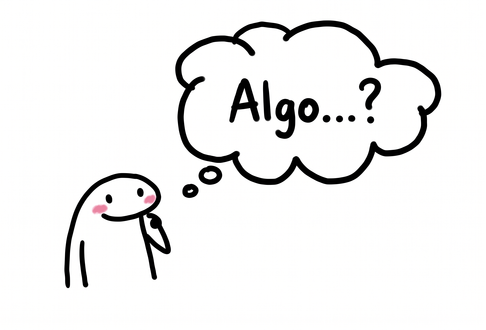

# 01 · Problem Solving & Algorithm Design


Every program is born from a **problem**. This module teaches the mindset required *before* writing code.

## The three states of a problem solver

The doodle above captures what happens every time you face a real problem:

1. **Worried.** You see the problem but don't yet know how to approach it.
2. **Thinking.** You break it down, gather information, weigh options.
3. **Eureka.** A candidate solution appears. You're ready to design and test it.

Programming follows the exact same arc. We're going to make that arc **repeatable** instead of random.

---

## 1. Problem Solving

> **Definition:** the process of identifying and resolving challenges in a logical, effective way.

Before building software, you have to understand the problem. Rushing to type code before understanding the problem is the single most common reason programs fail.

### The 7 problem-solving steps

 **1. Identify and define the problem**

- Understand it clearly. Can you say it in one sentence?
- Break it into smaller, manageable parts.
- Find the main cause, not just the symptoms.

 **2. Gather information**

- Research what's known.
- Collect data.
- Talk to people who've seen this situation.

 **3. Analyze the problem**

- Examine the information you gathered.
- Look for patterns, constraints, and causes.
- Use tools — cause-and-effect diagrams, SWOT — when they help.

 **4. Develop possible solutions**

- Brainstorm many alternatives.
- Mix creative and structured approaches.
- Don't fall in love with the first idea.

 **5. Evaluate possible solutions**

- Compare pros and cons.
- Weigh feasibility, cost, and impact.
- Pick the most promising option.

 **6. Implement the solution**

- Create an action plan.
- Assign responsibilities.
- Define a timeline.
- In programming, this becomes writing the actual application.

 **7. Monitor and adjust**

- Does it actually work?
- Detect errors. Collect feedback.
- Adjust when needed.

### Everyday practice scenarios

Apply the 7 steps to situations that have nothing to do with computers yet:

- Organizing a group trip with different budgets and preferences.
- Diagnosing why a computer has suddenly become slow.
- Deciding food options for a party with dietary restrictions.
- Fixing a bicycle chain that keeps slipping.
- Packing efficiently for a one-week trip with only carry-on.

If you can walk through the 7 steps on paper for each scenario, you're thinking like a programmer already.

---

## 2. Algorithms

> **Definition:** a step-by-step description of how to solve a problem.

Once you understand the problem, you describe the sequence of actions that solves it. That sequence is the algorithm.

### The recipe analogy



An algorithm is like a **recipe**. A recipe lists ingredients and the exact order of steps. An algorithm lists inputs and the exact order of actions. Skip a step, change the order, and the result changes.

### Everyday algorithms

- Preparing a sandwich.
- Washing a load of clothes.
- Making tea.
- Converting Fahrenheit to Celsius.
- Finding a specific book on a shelf.

### Algorithms in programming

In computing, algorithms define the steps that will be translated into code. A navigation app uses an algorithm to:

1. Identify starting point and destination.
2. Calculate possible routes.
3. Select the shortest (or fastest) route.

Same three-step idea whether you're writing it for a human or a computer.

---

## 3. Flowcharts

> **Definition:** a visual way to represent an algorithm using standard shapes.

Flowcharts are the first **formal** representation of an algorithm. They're pictures with a strict grammar — anyone trained to read them understands the algorithm without needing to read any language.

### Core shapes

| Shape | Meaning |
|-------|---------|
| Oval | Start / End of the process |
| Rectangle | Process / Task (an action to perform) |
| Parallelogram | Input / Output (data in or out) |
| Diamond | Decision (a yes/no that branches the flow) |
| Circle | Connector (jumps to another part of the diagram) |
| Arrow | Direction and order |

### Why flowcharts matter

They help you:

- Visualize a process clearly.
- Understand the order of steps.
- Spot decisions and branches.
- Simplify what looks complex.

### Practice flowcharts

Draw a flowchart for each of these:

- Going to a store to buy a pen (decide: is the store open? do they have pens? do you have money?).
- Calculating the average of two numbers.
- Printing the numbers from 1 to 5.

### Tools

- [diagrams.net](https://app.diagrams.net/) — free, works in the browser.
- [Lucidchart](https://www.lucidchart.com/) — free tier available.
- Pencil and paper — still the fastest way to iterate.

---

## 4. Pseudocode

> **Definition:** a structured, language-independent way of describing an algorithm.

Pseudocode is the second major representation. It looks like code but isn't runnable in any real programming language — its only job is to describe logic clearly so humans can check it before committing to syntax.

### Why pseudocode matters

It helps you:

- Focus on **logic** before **syntax**.
- Describe algorithms in a clean, readable format.
- Discuss solutions with others without worrying about which language.
- Catch mistakes before you write real code.

### Typical pseudocode actions

- `START / END`
- `READ <variable>`
- `WRITE <expression>`
- `<variable> = <expression>` (assignment)
- Arithmetic: `+`, `-`, `*`, `/`
- Conditions: `IF <condition> THEN ... ELSE ... END IF`
- Loops: `WHILE <condition> DO ... END WHILE`

### Example — sum of two numbers

```text
START
  READ a
  READ b
  sum = a + b
  WRITE sum
END
```

### Practice pseudocode

- Sum of two numbers (above).
- Print numbers from 1 to 5.
- Fahrenheit to Celsius conversion.
- Logging in to a social network (read user, read password, check match, grant or deny).

---

## Module 01 closing idea

By combining **problem solving**, **algorithms**, **flowcharts**, and **pseudocode**, you begin to think like a programmer **before** writing a single line of real code. Next module: what programming actually is, the languages we use, and what the computer is doing underneath.
