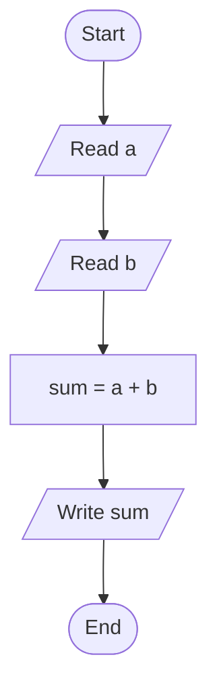
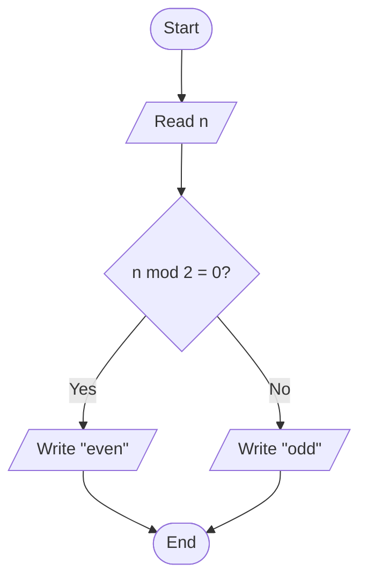
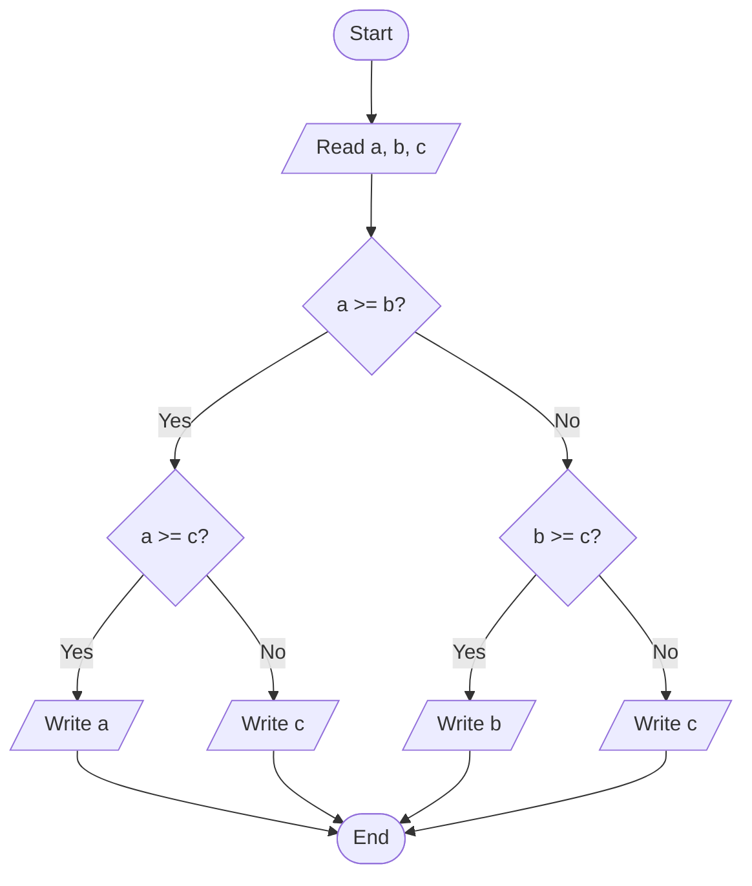
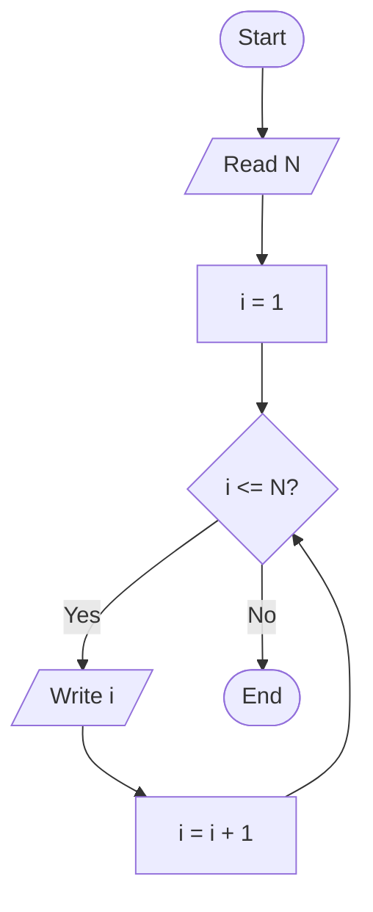
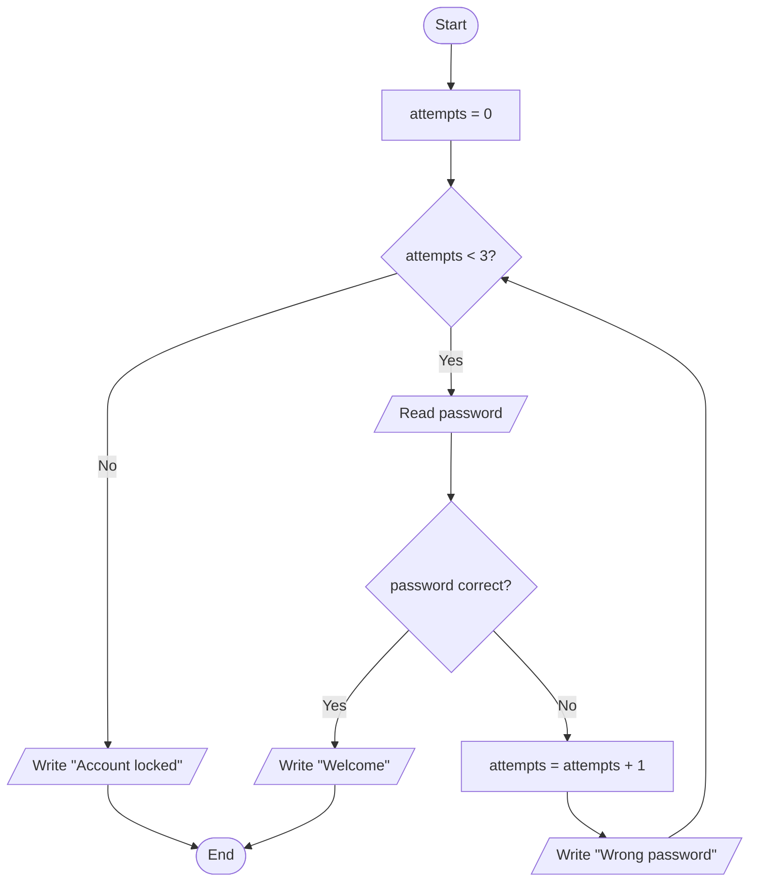
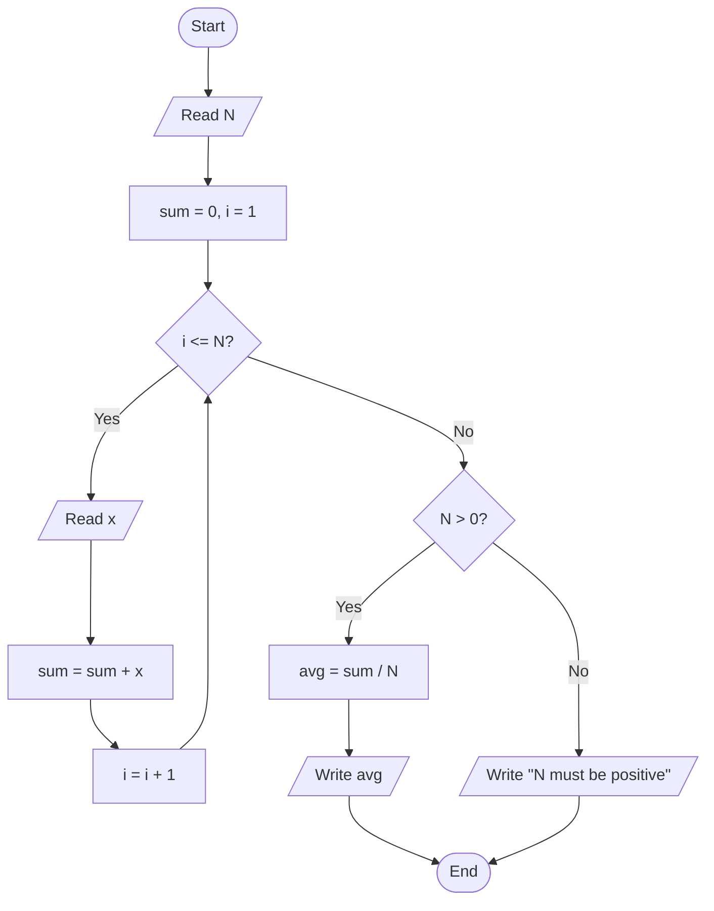

# 02 · Flowcharts

You designed a solution in Module 01. Now draw it — using a **grammar of shapes** anyone trained to read flowcharts will understand, regardless of their language.

## Why flowcharts

Flowcharts are the first **formal representation** of an algorithm. Formal means: every shape has a fixed meaning, and two people reading the same flowchart should interpret it the same way.

They help you:

- **See the control flow** at a glance.
- **Spot decisions and branches** that narrative descriptions hide.
- **Debug logic** before you write any code.
- **Communicate** across languages and experience levels — a junior dev, a business analyst, and a senior architect can stand in front of the same flowchart and discuss it.

---

## The shape grammar

These are the core shapes. Every flowchart in this course uses only these.

| Shape | Meaning | Mermaid syntax |
|-------|---------|----------------|
| Oval / pill | **Start** or **End** of the process | `([text])` |
| Rectangle | **Process** — an action to perform | `[text]` |
| Parallelogram | **Input / Output** — data flowing in or out | `[/text/]` |
| Diamond (rhombus) | **Decision** — a yes/no that branches the flow | `{text}` |
| Circle | **Connector** — jumps to another part of the diagram | `((text))` |
| Sub-routine box | A **pre-defined process** (call to another flowchart) | `[[text]]` |
| Arrow | **Direction** and order of flow | `-->` |

### Reading order

- **Top to bottom** by default.
- **Left to right** for horizontal splits.
- An arrow **must** leave every shape except End.
- Every decision diamond has **exactly two exits** (usually Yes / No).

---

## Example 1 — Sum of two numbers

The simplest possible algorithm. No decisions, no loops.

**Reading it:** start → ask for `a` → ask for `b` → compute `sum` → display `sum` → end.

---

## Example 2 — Is a number even or odd?

First decision point.

**Key idea:** both branches **must** eventually reach the same End. Don't leave dangling paths.

---

## Example 3 — Largest of three numbers

Nested decisions. Notice how each diamond has exactly two exits.

**Trace it yourself** with `a=5, b=9, c=2`: `D1` → No → `D3` → Yes → Write `b` → End. Correct: 9 is indeed the largest.

---

## Example 4 — Print numbers from 1 to N (loop)

Loops in flowcharts are expressed with a **back-arrow** from a process to an earlier decision.

**Anatomy of a loop:**

1. **Initialization** — `i = 1`.
2. **Condition** — `i <= N?` (a decision).
3. **Body** — what runs if the condition is true (`Write i`).
4. **Update** — change whatever the condition depends on (`i = i + 1`).
5. **Back to the condition** — the back-arrow.

If you miss the update step, you get an **infinite loop**. Very common beginner bug.

---

## Example 5 — Login with 3 attempts

A real-world pattern: retry with a limit.

**Two exits from the loop:** either the user gets in, or they hit the attempt limit. Always think about **how the loop ends** when you design it.

---

## Example 6 — Average of N numbers

Combining a loop with accumulation.

**Edge case handled:** `N = 0` would cause a division by zero, so we check before dividing. Always hunt for cases that break the "happy path".

---

## Common mistakes

1. **No Start or End.** Every flowchart is a process — processes have boundaries.
2. **Decisions with only one exit.** A diamond that only has Yes isn't a decision; it's a question without consequence. Make both branches meaningful.
3. **Arrows that don't rejoin.** After a branch, all paths must reach End (or loop back) — no dangling threads.
4. **Loops with no exit condition.** If the decision inside a loop never becomes No, the flowchart describes an infinite loop.
5. **Mixing "what" and "how".** Flowcharts describe *what* happens, not *how* in a specific language. Keep syntax out of them.
6. **Too much in one diamond.** `if (x > 0 AND y < 10 AND z != 5)` inside a single decision is hard to read. Split into sequential decisions when logic gets complex.
7. **No clear variable names.** `Set x = 5` tells a reader nothing. `Set retry_count = 0` tells a story.

---

## Practice problems

Draw a flowchart for each. Solutions will be worked in class.

1. Read two numbers and print the larger one.
2. Read a number and print its absolute value (without using a built-in function).
3. Read a year and print whether it's a leap year (divisible by 4, except century years not divisible by 400).
4. Print the multiplication table of a given number up to ×10.
5. Sum of the digits of a 3-digit number.
6. Read numbers until the user enters 0, then print their count and their average.
7. Guess-the-number game: computer picks 1–10, user has 3 tries.
8. Calculate a final grade given 3 partial grades and the weights (e.g., 30%, 30%, 40%). Display "Passed" if ≥ 6.0, "Failed" otherwise.

---

## Tools

-  [diagrams.net](https://app.diagrams.net/) — free, works in the browser, no sign-up.
-  [Lucidchart](https://www.lucidchart.com/) — free tier, cloud.
-  [Mermaid Live Editor](https://mermaid.live/) — the same format used in the examples above; copy-paste-tweak.
-  **Pencil and paper** — still the fastest way to iterate. Draw ugly, iterate fast, clean up later.

---

## Closing idea

A flowchart is a **visual algorithm**. If you can't draw your solution as a flowchart, you probably don't understand it well enough to code it yet. Get it right on paper first; the computer will thank you.

**Next:** [Module 03 — Pseudocode](03-pseudocode.md) — the text-based companion to flowcharts.
