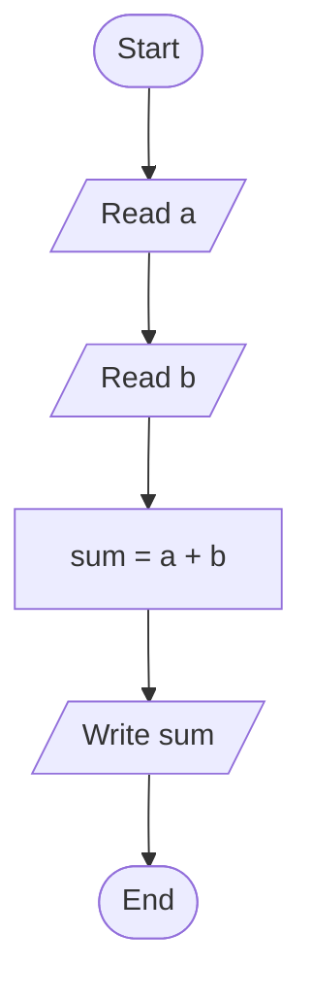
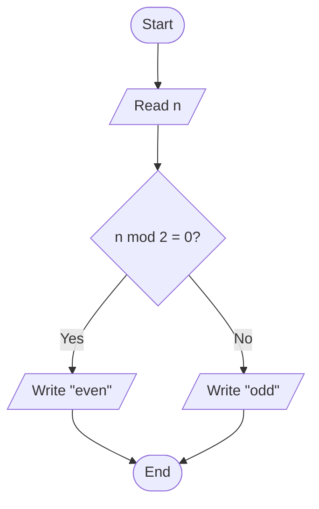

# 03 · Pseudocode


Flowcharts are pictures. Pseudocode is **structured text** that describes the same logic in a way that reads almost like code — but isn't tied to any real programming language.

## Why pseudocode exists

Flowcharts are excellent for seeing the **shape** of an algorithm. But they get clumsy when logic gets long, and nobody wants to draw a 200-shape diagram for a moderate-size program.

Pseudocode fills the gap:

- Lets you focus on **logic before syntax**.
- Describes algorithms in a clean, readable format that reviewers can scan quickly.
- Lets teams discuss solutions **without picking a programming language yet**.
- Catches mistakes before you commit to real code.

> Pseudocode is *not* a programming language. No computer runs it directly. Its only job is to be **unambiguous to humans**.

---

## Conventions used in this course

Every course has its own pseudocode dialect. Ours is simple and bilingual-friendly. English and Spanish keyword equivalents are both shown — pick a language and stick with it within a single algorithm.

### Structure

- One instruction per line.
- **Indent** the body of an `IF`, `WHILE`, `FOR`, or `FUNCTION` by 2 or 4 spaces.
- Close every block with an `END …` line matching the opener.
- Variables live in lowercase; `CONSTANTS_IN_ALL_CAPS`.

### Core vocabulary

| English | Español | Meaning |
|---------|---------|---------|
| `START` / `END` | `INICIO` / `FIN` | Program boundaries |
| `READ x` | `LEER x` | Get input from the user, store in `x` |
| `WRITE x` | `ESCRIBIR x` | Display `x` |
| `x = expression` | `x = expresión` | Assignment |
| `IF condition THEN ... END IF` | `SI condición ENTONCES ... FIN SI` | Decision |
| `IF ... ELSE ... END IF` | `SI ... SINO ... FIN SI` | Decision with alternative |
| `WHILE condition DO ... END WHILE` | `MIENTRAS condición HACER ... FIN MIENTRAS` | Loop |
| `FOR i = a TO b DO ... END FOR` | `PARA i = a HASTA b HACER ... FIN PARA` | Counter loop |
| `FUNCTION name(params) ... RETURN x END FUNCTION` | `FUNCION nombre(params) ... RETORNAR x FIN FUNCION` | Named sub-algorithm |

### Operators

- Arithmetic: `+`, `-`, `*`, `/`, `mod` (remainder).
- Comparison: `=`, `!=`, `<`, `<=`, `>`, `>=`.
- Logical: `AND`, `OR`, `NOT`.

---

## Example 1 — Sum of two numbers

Side-by-side with the flowchart from Module 02.



```text
START
  READ a
  READ b
  sum = a + b
  WRITE sum
END
```

**Correspondence:**

- `START` / `END` pills → `START` / `END` keywords.
- Parallelograms → `READ` / `WRITE`.
- Rectangle → assignment line.

---

## Example 2 — Even or odd



```text
START
  READ n
  IF n mod 2 = 0 THEN
    WRITE "even"
  ELSE
    WRITE "odd"
  END IF
END
```

**Correspondence:**

- Diamond → `IF ... ELSE ... END IF`.
- Yes branch → body of `IF`.
- No branch → body of `ELSE`.

---

## Example 3 — Largest of three numbers

```text
START
  READ a, b, c
  IF a >= b AND a >= c THEN
    WRITE a
  ELSE
    IF b >= c THEN
      WRITE b
    ELSE
      WRITE c
    END IF
  END IF
END
```

**Note** — we used `AND` to collapse two nested decisions into one, which is clearer when the logic allows it.

---

## Example 4 — Print numbers from 1 to N

Two ways of writing the same loop: `WHILE` (general) and `FOR` (counter).

### `WHILE` version

```text
START
  READ N
  i = 1
  WHILE i <= N DO
    WRITE i
    i = i + 1
  END WHILE
END
```

### `FOR` version (more compact)

```text
START
  READ N
  FOR i = 1 TO N DO
    WRITE i
  END FOR
END
```

**Rule of thumb:** use `FOR` when you know the exact number of iterations up front; use `WHILE` when the loop ends on a condition (user input, data found, timeout).

---

## Example 5 — Login with 3 attempts

```text
START
  attempts = 0
  logged_in = false
  WHILE attempts < 3 AND logged_in = false DO
    READ password
    IF password = "secret123" THEN
      WRITE "Welcome"
      logged_in = true
    ELSE
      WRITE "Wrong password"
      attempts = attempts + 1
    END IF
  END WHILE
  IF logged_in = false THEN
    WRITE "Account locked"
  END IF
END
```

**Two loop-exit conditions** in one `WHILE`: hit the attempt limit OR successfully logged in. Compound conditions keep pseudocode tight.

---

## Example 6 — Average of N numbers (with function)

When an algorithm grows, extract reusable pieces into **functions**.

```text
FUNCTION average(sum, count)
  IF count > 0 THEN
    RETURN sum / count
  ELSE
    RETURN 0
  END IF
END FUNCTION

START
  READ N
  sum = 0
  FOR i = 1 TO N DO
    READ x
    sum = sum + x
  END FOR
  result = average(sum, N)
  IF N > 0 THEN
    WRITE result
  ELSE
    WRITE "N must be positive"
  END IF
END
```

**Why extract `average`?**

- Describes *intent* (computing an average), not *mechanism* (a division).
- Can be reused elsewhere in a bigger program.
- Lets the main program read as a high-level narrative.

---

## Shape → keyword cheat sheet

| Flowchart shape | Pseudocode construct |
|-----------------|----------------------|
| Oval (Start/End) | `START` / `END` |
| Rectangle (process) | assignment or procedure call |
| Parallelogram (I/O) | `READ` / `WRITE` |
| Diamond (decision) | `IF ... END IF` or `IF ... ELSE ... END IF` |
| Diamond used for loops | `WHILE ... END WHILE` |
| Counter loop | `FOR i = a TO b DO ... END FOR` |
| Sub-routine box | `FUNCTION ... END FUNCTION` / `CALL fn(args)` |

Learn one representation well; the other becomes easy.

---

## Common mistakes

1. **Mixing pseudocode with real syntax.** `x++` is C / Java; use `x = x + 1`. Pseudocode stays language-agnostic.
2. **Missing `END` lines.** Every `IF` / `WHILE` / `FOR` / `FUNCTION` needs its closer. Otherwise the structure is ambiguous.
3. **No indentation.** Indentation is how a reader sees the scope of a block. Without it, nested logic becomes a puzzle.
4. **Undefined variables.** Any variable you read or test must have been initialized first.
5. **Off-by-one errors in loops.** `FOR i = 1 TO N` runs *N* times (inclusive). `FOR i = 0 TO N` runs *N+1* times. Pick and be consistent.
6. **Vague conditions.** `IF data is bad` — what does "bad" mean? `IF x < 0 OR x > 100` is unambiguous.
7. **Implementation details leaking in.** "Allocate a `HashMap<String, Integer>`" belongs in real code, not pseudocode. Say "a mapping from name to count".

---

## Practice problems

Write pseudocode for each. Then (bonus) draw the matching flowchart.

1. Read a number; print whether it's positive, negative, or zero.
2. Convert Fahrenheit to Celsius.
3. Read 10 numbers and print the largest.
4. Read numbers until -1 is entered. Print the sum and the count.
5. Check if a word is a palindrome (reads the same forward and backward).
6. Count vowels in a sentence.
7. Tax calculation: given income, apply 10% tax up to 10,000; 15% on the portion from 10,001 to 30,000; 25% above 30,000.
8. A multiplication practice game: ask 5 random questions, count correct answers, display the score.
9. Fibonacci: print the first N Fibonacci numbers.
10. Linear search: find whether a value appears in a list of N numbers.

---

## Closing idea

Pseudocode is the **last stop before real code**. By the time you're writing it, the problem should already be understood (Module 01), the shape of the solution drawn (Module 02), and the logic tight. Translating good pseudocode to a programming language is the easy part; getting to good pseudocode is where the real work is.

**Next:** [Module 04 — Programming Foundations](04-programming-foundations.md) — what programming actually is and what the computer is doing underneath.
