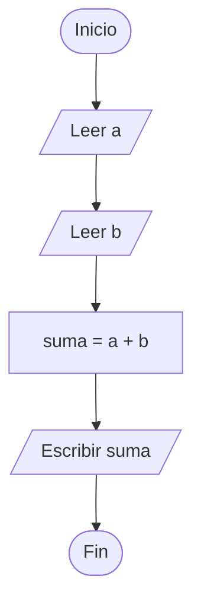
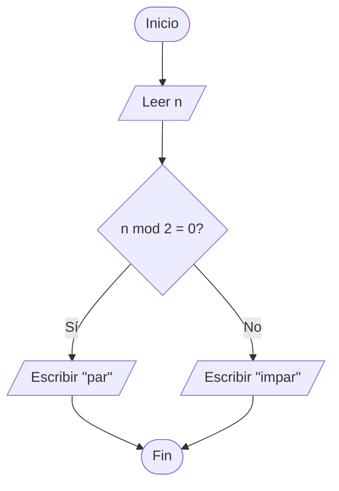
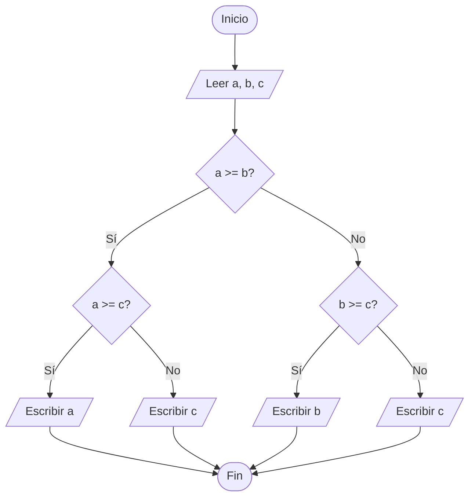
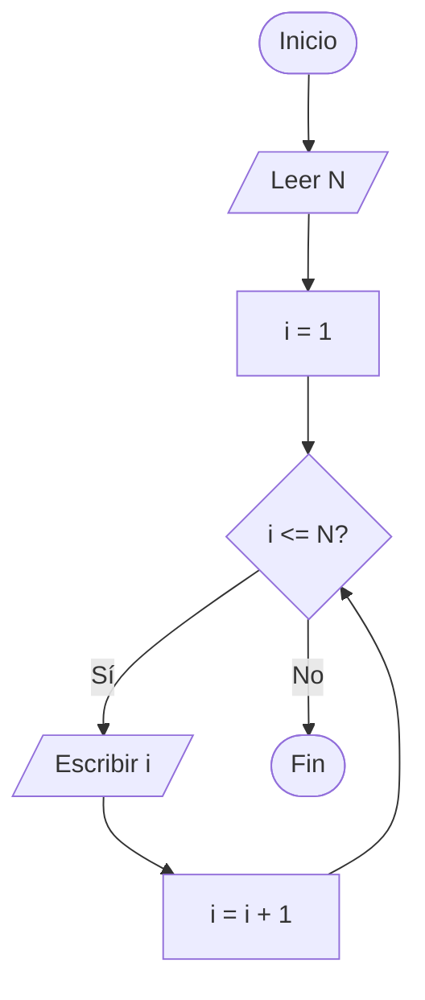
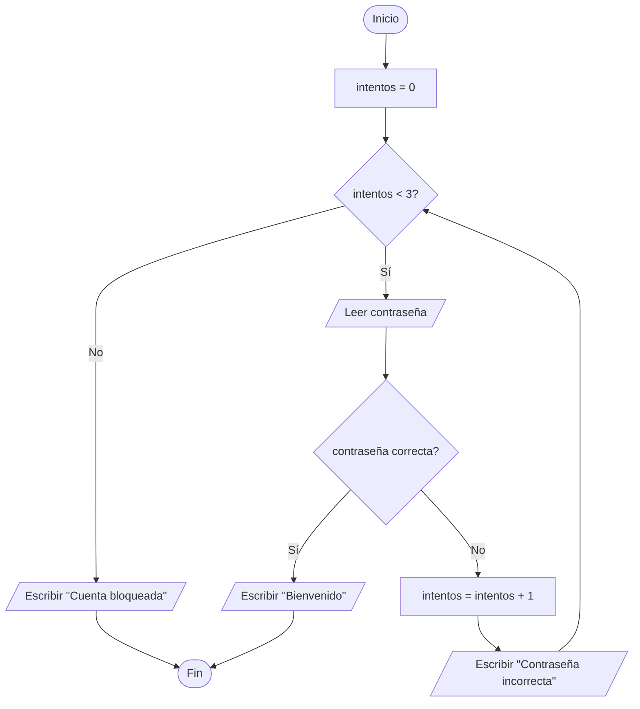
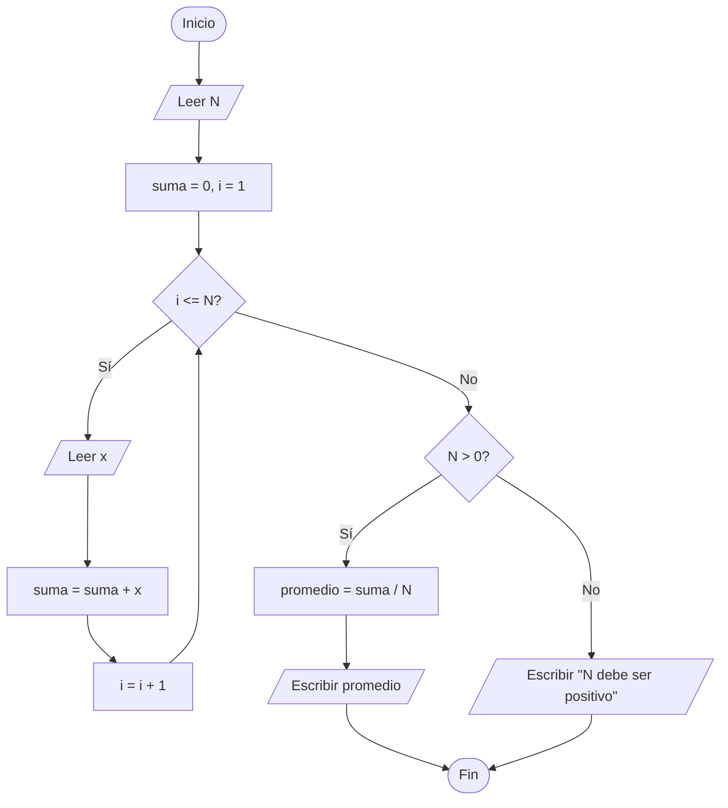

# 02 · Diagramas de flujo

Diseñaste una solución en el Módulo 01. Ahora dibújala — usando una **gramática de formas** que cualquiera entrenado en diagramas de flujo entenderá, sin importar su idioma.

## Por qué diagramas de flujo

Los diagramas de flujo son la primera **representación formal** de un algoritmo. Formal significa: cada forma tiene un significado fijo, y dos personas que leen el mismo diagrama deben interpretarlo igual.

Ayudan a:

- **Ver el flujo de control** de un vistazo.
- **Detectar decisiones y ramas** que se esconden en descripciones en prosa.
- **Depurar la lógica** antes de escribir código.
- **Comunicar** a través de idiomas y niveles de experiencia — una persona junior, un analista de negocio y un arquitecto pueden pararse frente al mismo diagrama y discutirlo.

---

## Gramática de formas

Estas son las formas centrales. Cada diagrama del curso usa solo estas.

| Forma | Significado | Sintaxis Mermaid |
|-------|-------------|------------------|
| Óvalo / píldora | **Inicio** o **Fin** del proceso | `([texto])` |
| Rectángulo | **Proceso** — acción a realizar | `[texto]` |
| Paralelogramo | **Entrada / Salida** — dato que entra o sale | `[/texto/]` |
| Rombo | **Decisión** — sí/no que bifurca el flujo | `{texto}` |
| Círculo | **Conector** — salta a otra parte del diagrama | `((texto))` |
| Caja de subrutina | **Proceso predefinido** (llamada a otro diagrama) | `[[texto]]` |
| Flecha | **Dirección** y orden del flujo | `-->` |

### Orden de lectura

- **De arriba hacia abajo** por defecto.
- **De izquierda a derecha** para divisiones horizontales.
- Cada forma **debe** tener una flecha saliente excepto Fin.
- Cada rombo de decisión tiene **exactamente dos salidas** (usualmente Sí / No).

---

## Ejemplo 1 — Suma de dos números

El algoritmo más simple posible. Sin decisiones, sin ciclos.

**Lectura:** inicio → pedir `a` → pedir `b` → calcular `suma` → mostrar `suma` → fin.

---

## Ejemplo 2 — ¿Un número es par o impar?

Primer punto de decisión.

**Idea clave:** ambas ramas **deben** terminar en el mismo Fin. No dejes hilos colgando.

---

## Ejemplo 3 — Mayor de tres números

Decisiones anidadas. Fíjate cómo cada rombo tiene exactamente dos salidas.

**Traza tú mismo** con `a=5, b=9, c=2`: `D1` → No → `D3` → Sí → Escribir `b` → Fin. Correcto: 9 es el mayor.

---

## Ejemplo 4 — Imprimir números del 1 al N (ciclo)

Los ciclos se expresan con una **flecha de regreso** de un proceso a una decisión anterior.

**Anatomía de un ciclo:**

1. **Inicialización** — `i = 1`.
2. **Condición** — `i <= N?` (una decisión).
3. **Cuerpo** — lo que corre si la condición es verdadera (`Escribir i`).
4. **Actualización** — cambiar lo que la condición depende (`i = i + 1`).
5. **Regreso a la condición** — la flecha de regreso.

Si olvidas la actualización, tienes un **ciclo infinito**. Error muy común de principiantes.

---

## Ejemplo 5 — Login con 3 intentos

Patrón del mundo real: reintento con límite.

**Dos salidas del ciclo:** o el usuario entra, o agota sus intentos. Siempre piensa **cómo termina el ciclo** al diseñarlo.

---

## Ejemplo 6 — Promedio de N números

Combinar ciclo con acumulación.

**Caso borde manejado:** `N = 0` causaría división por cero, así que revisamos antes de dividir. Siempre caza los casos que rompen el "camino feliz".

---

## Errores comunes

1. **Sin Inicio o Fin.** Todo diagrama es un proceso — los procesos tienen fronteras.
2. **Decisiones con una sola salida.** Un rombo con solo Sí no es decisión; es una pregunta sin consecuencia. Haz que ambas ramas cuenten.
3. **Flechas que no se reúnen.** Tras una rama, todos los caminos deben llegar a Fin (o volver al ciclo) — sin hilos sueltos.
4. **Ciclos sin condición de salida.** Si la decisión nunca se vuelve No, describiste un ciclo infinito.
5. **Mezclar "qué" con "cómo".** Los diagramas describen *qué* pasa, no *cómo* en un lenguaje específico. Mantén la sintaxis fuera.
6. **Demasiado en un solo rombo.** `if (x > 0 AND y < 10 AND z != 5)` en una sola decisión es difícil de leer. Divide en decisiones secuenciales cuando la lógica se complique.
7. **Nombres de variables vagos.** `Asignar x = 5` no dice nada. `Asignar contador_intentos = 0` cuenta una historia.

---

## Problemas de práctica

Dibuja un diagrama para cada uno. Las soluciones se trabajan en clase.

1. Leer dos números e imprimir el mayor.
2. Leer un número e imprimir su valor absoluto (sin función predefinida).
3. Leer un año e imprimir si es bisiesto (divisible entre 4, excepto los de siglo que no sean divisibles entre 400).
4. Imprimir la tabla de multiplicar de un número hasta ×10.
5. Suma de los dígitos de un número de 3 cifras.
6. Leer números hasta que el usuario ingrese 0, luego imprimir la cantidad y el promedio.
7. Juego de adivinanza: la computadora elige 1–10, el usuario tiene 3 intentos.
8. Calcular calificación final dadas 3 parciales y sus pesos (ej. 30%, 30%, 40%). Mostrar "Aprobado" si ≥ 6.0, "Reprobado" si no.

---

## Herramientas

-  [diagrams.net](https://app.diagrams.net/) — gratuita, en navegador, sin registro.
-  [Lucidchart](https://www.lucidchart.com/) — tiene nivel gratuito, en la nube.
-  [Mermaid Live Editor](https://mermaid.live/) — el mismo formato de los ejemplos; copia-pega-ajusta.
-  **Lápiz y papel** — sigue siendo la forma más rápida de iterar. Dibuja feo, itera rápido, limpia después.

---

## Idea de cierre

Un diagrama de flujo es un **algoritmo visual**. Si no puedes dibujar tu solución como diagrama, probablemente no la entiendes lo suficiente para codificarla. Acertémoslo en papel primero; la computadora lo agradecerá.

**Siguiente:** [Módulo 03 — Pseudocódigo](03-pseudocode.md) — el compañero textual del diagrama de flujo.
