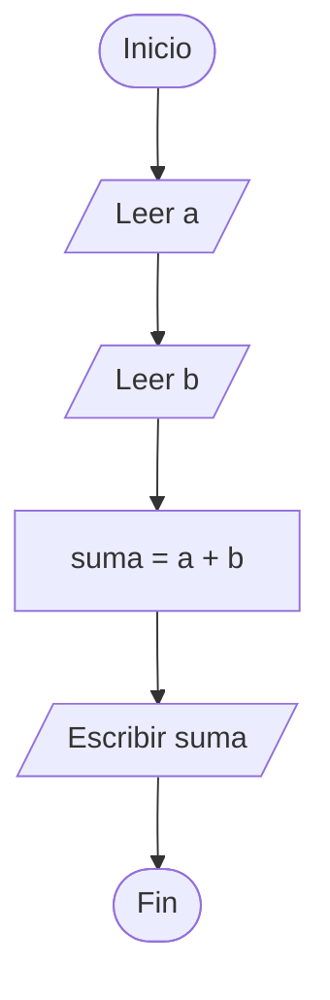
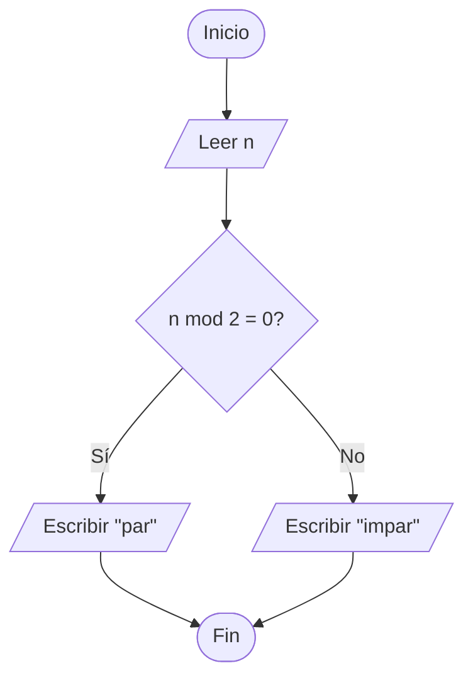

# 03 · Pseudocódigo


Los diagramas de flujo son imágenes. El pseudocódigo es **texto estructurado** que describe la misma lógica de forma que se lee casi como código — pero sin atarlo a ningún lenguaje real.

## Por qué existe el pseudocódigo

Los diagramas son excelentes para ver la **forma** de un algoritmo. Pero se vuelven torpes cuando la lógica se alarga, y nadie quiere dibujar 200 formas para un programa mediano.

El pseudocódigo llena el hueco:

- Te deja enfocarte en **lógica antes que sintaxis**.
- Describe algoritmos en formato limpio y legible que un revisor escanea rápido.
- Permite a equipos discutir soluciones **sin elegir aún un lenguaje**.
- Atrapa errores antes de comprometerte con código real.

> El pseudocódigo *no* es un lenguaje de programación. Ninguna computadora lo ejecuta. Su único trabajo es ser **inequívoco para humanos**.

---

## Convenciones de este curso

Cada curso tiene su dialecto de pseudocódigo. El nuestro es simple y bilingüe. Se muestran equivalencias inglés/español — elige un idioma y mantente consistente dentro de un mismo algoritmo.

### Estructura

- Una instrucción por línea.
- **Indenta** el cuerpo de un `SI`, `MIENTRAS`, `PARA` o `FUNCION` con 2 o 4 espacios.
- Cierra cada bloque con una línea `FIN …` que coincida con la apertura.
- Variables en minúsculas; `CONSTANTES_EN_MAYÚSCULAS`.

### Vocabulario central

| Español | English | Significado |
|---------|---------|-------------|
| `INICIO` / `FIN` | `START` / `END` | Fronteras del programa |
| `LEER x` | `READ x` | Obtener entrada del usuario, guardar en `x` |
| `ESCRIBIR x` | `WRITE x` | Mostrar `x` |
| `x = expresión` | `x = expression` | Asignación |
| `SI condición ENTONCES ... FIN SI` | `IF ... END IF` | Decisión |
| `SI ... SINO ... FIN SI` | `IF ... ELSE ... END IF` | Decisión con alternativa |
| `MIENTRAS condición HACER ... FIN MIENTRAS` | `WHILE ... END WHILE` | Ciclo condicional |
| `PARA i = a HASTA b HACER ... FIN PARA` | `FOR i = a TO b DO ... END FOR` | Ciclo con contador |
| `FUNCION nombre(params) ... RETORNAR x FIN FUNCION` | `FUNCTION ... END FUNCTION` | Subalgoritmo con nombre |

### Operadores

- Aritméticos: `+`, `-`, `*`, `/`, `mod` (residuo).
- Comparación: `=`, `!=`, `<`, `<=`, `>`, `>=`.
- Lógicos: `Y`, `O`, `NO` (o `AND`, `OR`, `NOT`).

---

## Ejemplo 1 — Suma de dos números

Lado a lado con el diagrama del Módulo 02.



```text
INICIO
  LEER a
  LEER b
  suma = a + b
  ESCRIBIR suma
FIN
```

**Correspondencia:**

- Píldoras `Inicio` / `Fin` → palabras `INICIO` / `FIN`.
- Paralelogramos → `LEER` / `ESCRIBIR`.
- Rectángulo → línea de asignación.

---

## Ejemplo 2 — Par o impar



```text
INICIO
  LEER n
  SI n mod 2 = 0 ENTONCES
    ESCRIBIR "par"
  SINO
    ESCRIBIR "impar"
  FIN SI
FIN
```

**Correspondencia:**

- Rombo → `SI ... SINO ... FIN SI`.
- Rama Sí → cuerpo del `SI`.
- Rama No → cuerpo del `SINO`.

---

## Ejemplo 3 — Mayor de tres números

```text
INICIO
  LEER a, b, c
  SI a >= b Y a >= c ENTONCES
    ESCRIBIR a
  SINO
    SI b >= c ENTONCES
      ESCRIBIR b
    SINO
      ESCRIBIR c
    FIN SI
  FIN SI
FIN
```

**Nota** — usamos `Y` para colapsar dos decisiones anidadas en una, lo cual es más claro cuando la lógica lo permite.

---

## Ejemplo 4 — Imprimir números del 1 al N

Dos formas del mismo ciclo: `MIENTRAS` (general) y `PARA` (contador).

### Versión `MIENTRAS`

```text
INICIO
  LEER N
  i = 1
  MIENTRAS i <= N HACER
    ESCRIBIR i
    i = i + 1
  FIN MIENTRAS
FIN
```

### Versión `PARA` (más compacta)

```text
INICIO
  LEER N
  PARA i = 1 HASTA N HACER
    ESCRIBIR i
  FIN PARA
FIN
```

**Regla práctica:** usa `PARA` cuando conoces el número exacto de iteraciones por adelantado; usa `MIENTRAS` cuando el ciclo termina por una condición (entrada del usuario, dato encontrado, timeout).

---

## Ejemplo 5 — Login con 3 intentos

```text
INICIO
  intentos = 0
  ingreso = falso
  MIENTRAS intentos < 3 Y ingreso = falso HACER
    LEER contraseña
    SI contraseña = "secret123" ENTONCES
      ESCRIBIR "Bienvenido"
      ingreso = verdadero
    SINO
      ESCRIBIR "Contraseña incorrecta"
      intentos = intentos + 1
    FIN SI
  FIN MIENTRAS
  SI ingreso = falso ENTONCES
    ESCRIBIR "Cuenta bloqueada"
  FIN SI
FIN
```

**Dos condiciones de salida del ciclo** en un solo `MIENTRAS`: agotar intentos O haber ingresado. Las condiciones compuestas mantienen el pseudocódigo compacto.

---

## Ejemplo 6 — Promedio de N números (con función)

Cuando un algoritmo crece, extrae piezas reutilizables en **funciones**.

```text
FUNCION promedio(suma, cantidad)
  SI cantidad > 0 ENTONCES
    RETORNAR suma / cantidad
  SINO
    RETORNAR 0
  FIN SI
FIN FUNCION

INICIO
  LEER N
  suma = 0
  PARA i = 1 HASTA N HACER
    LEER x
    suma = suma + x
  FIN PARA
  resultado = promedio(suma, N)
  SI N > 0 ENTONCES
    ESCRIBIR resultado
  SINO
    ESCRIBIR "N debe ser positivo"
  FIN SI
FIN
```

**¿Por qué extraer `promedio`?**

- Describe *intención* (calcular un promedio), no *mecanismo* (una división).
- Es reutilizable en otras partes de un programa más grande.
- Deja que el programa principal se lea como una narración de alto nivel.

---

## Correspondencia forma → palabra clave

| Forma | Construcción de pseudocódigo |
|-------|------------------------------|
| Óvalo (Inicio/Fin) | `INICIO` / `FIN` |
| Rectángulo (proceso) | asignación o llamada a procedimiento |
| Paralelogramo (E/S) | `LEER` / `ESCRIBIR` |
| Rombo (decisión) | `SI ... FIN SI` o `SI ... SINO ... FIN SI` |
| Rombo usado para ciclos | `MIENTRAS ... FIN MIENTRAS` |
| Ciclo con contador | `PARA i = a HASTA b HACER ... FIN PARA` |
| Caja de subrutina | `FUNCION ... FIN FUNCION` / `LLAMAR fn(args)` |

Aprende bien una representación; la otra se vuelve fácil.

---

## Errores comunes

1. **Mezclar pseudocódigo con sintaxis real.** `x++` es C / Java; escribe `x = x + 1`. El pseudocódigo se mantiene agnóstico al lenguaje.
2. **Faltar líneas `FIN`.** Cada `SI` / `MIENTRAS` / `PARA` / `FUNCION` necesita su cierre. Sin él la estructura es ambigua.
3. **Sin indentación.** La indentación permite ver el alcance de un bloque. Sin ella, la lógica anidada se convierte en un acertijo.
4. **Variables sin definir.** Toda variable leída o probada debe haberse inicializado antes.
5. **Errores por uno en ciclos.** `PARA i = 1 HASTA N` corre *N* veces (inclusive). `PARA i = 0 HASTA N` corre *N+1* veces. Elige y sé consistente.
6. **Condiciones vagas.** `SI dato es malo` — ¿qué es "malo"? `SI x < 0 O x > 100` es inequívoco.
7. **Detalles de implementación filtrándose.** "Asignar un `HashMap<String, Integer>`" pertenece al código real, no al pseudocódigo. Di "un mapeo de nombre a conteo".

---

## Problemas de práctica

Escribe pseudocódigo para cada uno. Luego (bonus) dibuja el diagrama correspondiente.

1. Leer un número; imprimir si es positivo, negativo o cero.
2. Convertir Fahrenheit a Celsius.
3. Leer 10 números e imprimir el mayor.
4. Leer números hasta que se ingrese -1. Imprimir la suma y la cantidad.
5. Verificar si una palabra es palíndromo (se lee igual al derecho y al revés).
6. Contar vocales en una oración.
7. Cálculo de impuestos: dado un ingreso, aplicar 10% hasta 10,000; 15% entre 10,001 y 30,000; 25% por encima de 30,000.
8. Juego de práctica de multiplicación: hacer 5 preguntas aleatorias, contar correctas, mostrar puntaje.
9. Fibonacci: imprimir los primeros N números de Fibonacci.
10. Búsqueda lineal: encontrar si un valor aparece en una lista de N números.

---

## Idea de cierre

El pseudocódigo es la **última parada antes del código real**. Para cuando lo escribes, el problema ya debe estar entendido (Módulo 01), la forma de la solución dibujada (Módulo 02) y la lógica apretada. Traducir buen pseudocódigo a un lenguaje es lo fácil; llegar a buen pseudocódigo es donde está el trabajo real.

**Siguiente:** [Módulo 04 — Fundamentos de programación](04-programming-foundations.md) — qué es programar y qué hace la computadora por debajo.
