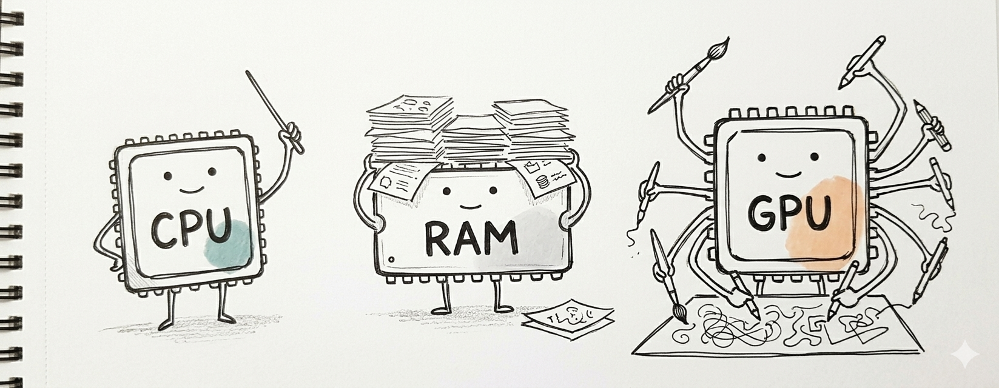
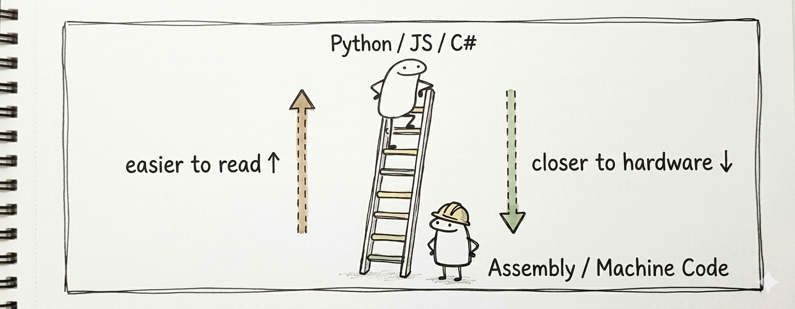
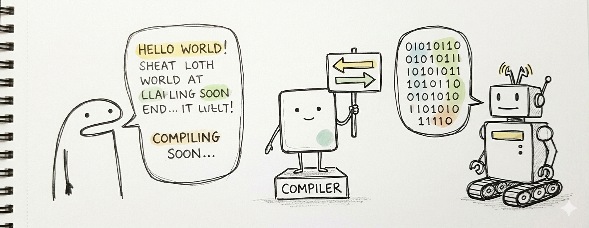
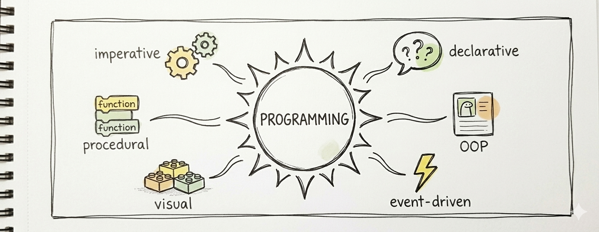

# 04 · Fundamentos de programación


Ya analizaste problemas (Módulo 01), los dibujaste como diagramas de flujo (Módulo 02) y los expresaste en pseudocódigo (Módulo 03). Ahora toca aprender qué es **programar**, qué hace la computadora, y qué tipos de lenguajes existen.

---

## 1. Programar

> **Definición:** proceso de crear software escribiendo instrucciones en un lenguaje que la computadora puede entender.

Programar es dar instrucciones **precisas** a una computadora para que ejecute una tarea paso a paso. El ciclo típico:

1. Decidir qué debe hacer la computadora.
2. Dividir el problema grande en partes pequeñas.
3. Diseñar la lógica de la solución.
4. Escribir la solución en un lenguaje de programación.
5. Ejecutar y probar el programa.
6. Depurar — encontrar y corregir errores.

Los pasos 1–3 son exactamente lo que practicaste en el Módulo 01. Programar es la *continuación* de la resolución de problemas, no una habilidad separada.

---

## 2. Lenguajes de programación

> **Definición:** sistemas formales de instrucciones y reglas que permiten a los humanos comunicarse con las computadoras.

Una computadora solo entiende binario (`0` y `1`). Los lenguajes de programación son el puente entre la lógica humana y la ejecución de la máquina.

### Algunos que oirás

- **Python** — legible, excelente para principiantes, datos, web, scripts.
- **JavaScript** — mueve la web, corre en todos los navegadores.
- **Java** — apps empresariales, Android.
- **C#** — ecosistema Microsoft, videojuegos (Unity), apps de escritorio.
- **C / C++** — sistemas, software crítico en rendimiento, motores.

Con estos lenguajes se construyen sitios web, apps móviles, software de escritorio, videojuegos, robótica, IA y mucho más.

---

## 3. Componentes de la computadora



Para entender sobre qué corre realmente tu programa, conoce las partes principales.

### Unidades de entrada

Dispositivos que **envían información hacia** la computadora.

- Teclado, ratón, pantalla táctil.
- Micrófono, cámara.
- Dispositivos USB, lectores de código de barras.

### Unidades de salida

Dispositivos que **presentan información procesada** al usuario.

- Monitor, impresora, audífonos.
- Dispositivos multimedia.
- Headsets VR / realidad mixta.
- Dispositivos de almacenamiento (cuando reciben datos para guardar).

### Unidad de memoria (RAM)

Almacenamiento temporal y rápido. Guarda los programas y datos que se están usando en este momento.

> **Analogía:** la RAM es tu escritorio — lo que estás trabajando ahora. El disco duro es el archivero — almacenamiento a largo plazo.

### Unidad Aritmético-Lógica (ALU)

Realiza operaciones aritméticas y lógicas: suma, resta, multiplicación, división, comparaciones, lógica booleana.

### Unidad Central de Procesamiento (CPU)

Coordina todo. Lee instrucciones, decide qué corre a continuación, delega en la ALU y la memoria. El director de la orquesta.

### Unidad de Procesamiento Gráfico (GPU)

Especializada en trabajo **altamente paralelo**: renderizado gráfico, entrenamiento e inferencia de IA moderna, simulaciones científicas.

---

## 4. Tipos de lenguajes



### Lenguajes de alto nivel

Más fáciles de leer y escribir para humanos.

- Más cercanos al lenguaje natural.
- Requieren traducción antes de ejecutarse.
- Ejemplos: Python, JavaScript, Java, C#.

### Lenguajes de bajo nivel

Más cercanos a las instrucciones de la máquina.

- Más rápidos, control más directo del hardware.
- Usualmente más difíciles de aprender y depurar.
- Ejemplos: Assembly, C (C queda en medio, pero más cerca de bajo nivel que Python).

### Cuál aprender primero

Empieza por alto nivel. Entenderás **qué** debe hacer la computadora antes de preocuparte por **cómo** exprimirla al máximo.

---

## 5. Compiladores



Un compilador es un **traductor** entre quien programa y la computadora.

### Qué hace un compilador

1. Lee tu código fuente.
2. Revisa estructura y gramática.
3. Traduce a un formato que la computadora puede ejecutar.
4. Optimiza el código traducido cuando es posible.
5. Produce un ejecutable.

Por eso se programa en lenguajes de alto nivel en lugar de escribir código máquina directo — el compilador hace la traducción.

> **Término relacionado:** un **intérprete** ejecuta el código directamente sin producir un ejecutable aparte (Python típicamente se interpreta). Un **compilador just-in-time (JIT)** compila fragmentos al vuelo mientras el programa corre.

---

## 6. Paradigmas de programación



> **Definición:** una forma de **estructurar y pensar** los programas.

No eliges uno y paras. Los lenguajes modernos permiten mezclar varios. Pero cada paradigma tiene una idea dominante que vale la pena entender por sí misma.

### Programación imperativa

Un programa es una **secuencia de instrucciones paso a paso** que controlan explícitamente la computadora.

```text
asignar x = 5
sumar 3 a x
imprimir x
```

### Programación procedural

Rama de la imperativa que organiza el código en **procedimientos** (funciones) reutilizables.

### Programación declarativa

Se enfoca en **qué resultado** se quiere, no **cómo** lograrlo. SQL es el ejemplo clásico: "dame todos los usuarios mayores de 18" — la base de datos averigua cómo.

### Programación orientada a objetos (POO)

Organiza los programas alrededor de **objetos** que agrupan datos y comportamiento. Un objeto `Auto` tiene un método `encender()` y una propiedad `nivel_combustible`. Más sobre esto en el curso de Python o CS.

### Programación orientada a eventos

El código reacciona a **eventos** — clics, teclas, movimientos del ratón, mensajes de red. La mayoría de apps GUI y web son orientadas a eventos.

### Programación visual

Usa **bloques gráficos** en lugar de texto. Scratch, Snap! y Unreal Blueprints son ejemplos. Bajan la barrera de entrada para principiantes.

---

## Integrando todo

Ya tienes el mapa completo:

1. Un **problema** real.
2. Analizado con el **proceso de 7 pasos** (Módulo 01).
3. Dibujado como **diagrama de flujo** (Módulo 02).
4. Expresado como **pseudocódigo** (Módulo 03).
5. Implementado en un **lenguaje de alto nivel** (este módulo).
6. Traducido por un **compilador / intérprete** a código máquina (este módulo).
7. Ejecutado por la **CPU**, usando **RAM** y la **ALU** (este módulo).

Siguiente curso en la escalera: **CS (C#)** — tomarás todo lo de este mapa y lo ejecutarás en un lenguaje real.

## Cierre del Módulo 04

Programar no es memorizar sintaxis. Es pensar claro, describir la solución con precisión y dejar que la computadora haga lo repetitivo. Entre más claro tu pensamiento, mejores tus programas — sin importar el lenguaje que termines usando.
