# Figure catalogue

Hand-sketched diagrams for the course decks, drawn by `kit/figures.py` on top of
`kit/doodle.py`. They are drawn rather than generated by an image model, because
a diagram whose label reads `ZeroDivisionErrar` is worse than no diagram. Labels
are exact, the palette matches the slides, and the SVG is diffable in git.

```bash
python -m kit.figures --all              # both languages, skips what exists
python -m kit.figures slicing --lang en --overwrite
```

Each figure lands in `ppts/img/<lang>/` as both `.svg` (the source of truth) and
`.png` (what the deck embeds). They sit outside any one subject folder because
most explain a language feature and get reused across sessions.

| Figure | Ratio | Lessons | Files |
|---|---|---|---|
| `flow-symbols` | 21:9 | w02 | es, en |
| `flow-connector` | 21:9 | w02 | es, en |
| `slicing` | 21:9 | w01.1 | es, en |
| `scope` | 21:9 | w01.1 | es, en |
| `reference-vs-copy` | 21:9 | w01.1 | es, en |
| `collections` | 21:9 | w01.1 | es, en |
| `exceptions` | 16:9 | w01.1 | es, en |
| `paradigms` | 21:9 | w02 | es, en |
| `parallel-lists` | 21:9 | w02 | es, en |
| `class-object` | 21:9 | w03 | es, en |
| `class-vs-instance` | 21:9 | w03 | es, en |
| `access-levels` | 21:9 | w04, w06 | es, en |
| `array-memory` | 21:9 | w10 | es, en |
| `pointer` | 21:9 | w12 | es, en |
| `stack-vs-heap` | 21:9 | w12 | es, en |
| `vtable` | 21:9 | w12 | es, en |
| `value-vs-reference` | 21:9 | w05 | es, en |
| `scope-cpp` | 21:9 | w05 | es, en |
| `access-levels-cpp` | 21:9 | w06, w09 | es, en |
| `uml-class-cpp` | 21:9 | w06 | es, en |
| `uml-class` | 21:9 | w05 | es, en |
| `hierarchy` | 21:9 | w07 | es, en |
| `polymorphism` | 21:9 | w08 | es, en |
| `recursion` | 21:9 | w09 | es, en |
| `file-lifecycle` | 21:9 | w12 | es, en |
| `seek-tell` | 21:9 | w13 | es, en |
| `event-loop` | 21:9 | w14 | es, en |
| `layouts` | 21:9 | w15 | es, en |
| `db-access` | 21:9 | w16 | es, en |
| `cpp-timeline` | 21:9 | w00 | es, en |
| `compilation` | 21:9 | w00, w01 | es, en |
| `ct-01` | 21:9 | ct | es, en |
| `ct-02` | 21:9 | ct | es, en |
| `ct-03` | 21:9 | ct | es, en |
| `ct-04` | 21:9 | ct | es, en |
| `ct-05` | 21:9 | ct | es, en |
| `ct-06` | 21:9 | ct | es, en |
| `ct-07` | 21:9 | ct | es, en |
| `ct-08` | 21:9 | ct | es, en |
| `ct-09` | 21:9 | ct | es, en |
| `ct-10` | 21:9 | ct | es, en |

---

## `flow-symbols`

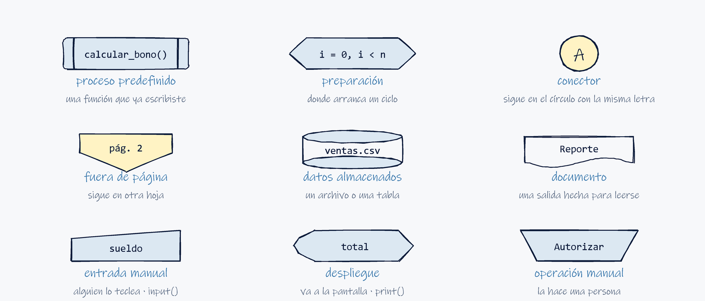

**Shows.** The nine flowchart symbols the basic four leave out, each with what it means: predefined process, preparation, the two connectors, stored data, document, manual input, display and manual operation.

**Reuse.** The three input and output shapes carry the week 5 distinction between what a person types, what the machine computes and what reaches the screen. Relabel the boxes for any example.

**Ratio** 21:9 · **lessons** w02 · **drawn by** `figures.flow_symbols`

## `flow-connector`

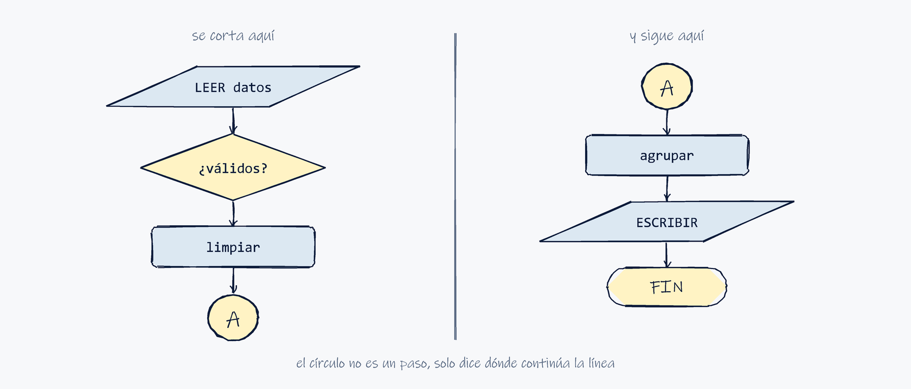

**Shows.** How a flowchart too long for one page gets cut with a lettered circle, and picked up again at the matching circle.

**Reuse.** Any long process diagram. The point is that the circle is not a step, which is what students assume the first time they meet it.

**Ratio** 21:9 · **lessons** w02 · **drawn by** `figures.flow_connector`

## `slicing`

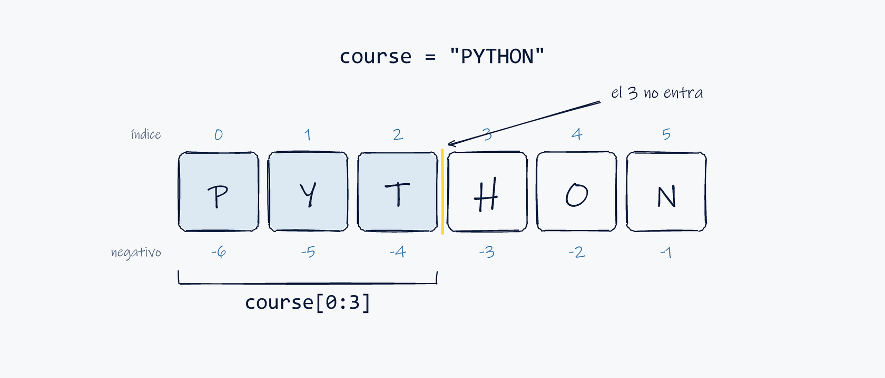

**Shows.** Why course[0:3] returns three characters, with the positive and negative index rulers lined up on the same tiles.

**Reuse.** Strings and lists share the rule, so the one drawing serves the string slide and the list slide. Change the word in the tiles for any example.

**Ratio** 21:9 · **lessons** w01.1 · **drawn by** `figures.slicing`

## `scope`

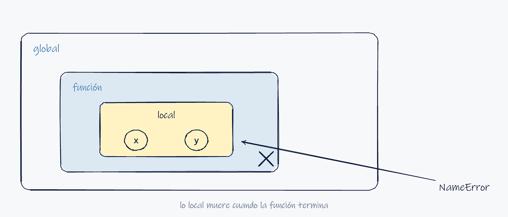

**Shows.** Local against global, and exactly what raises NameError.

**Reuse.** Week 3 reuses it: relabel the jar "self" and the same drawing explains why an attribute outlives a call and a local does not.

**Ratio** 21:9 · **lessons** w01.1 · **drawn by** `figures.scope`

## `reference-vs-copy`

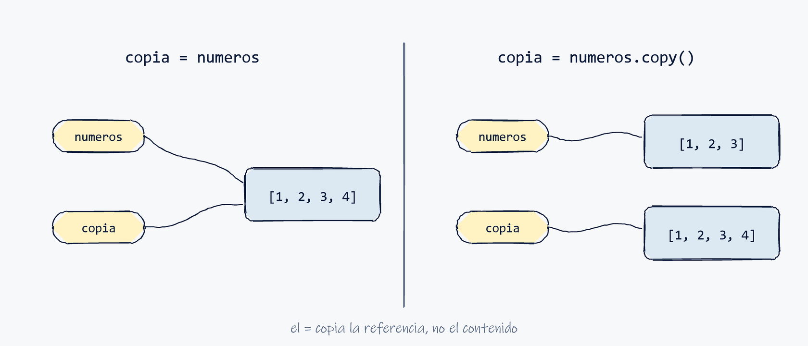

**Shows.** Aliasing. Two tags on one box against two tags on two boxes.

**Reuse.** The single most common surprise in the review quiz, and the same mechanism as the shared class attribute in week 3.

**Ratio** 21:9 · **lessons** w01.1 · **drawn by** `figures.reference_vs_copy`

## `collections`

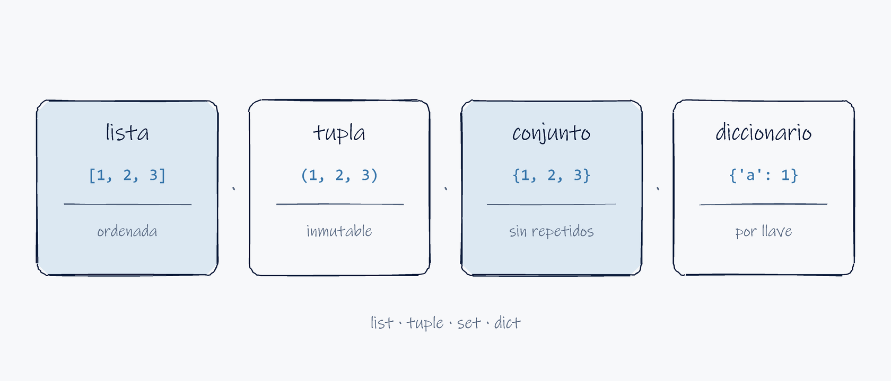

**Shows.** The four containers, each captioned with the property that separates it from the other three.

**Reuse.** The table on the same slide carries the syntax; this carries the choice. Any language with the same four structures.

**Ratio** 21:9 · **lessons** w01.1 · **drawn by** `figures.collections`

## `exceptions`

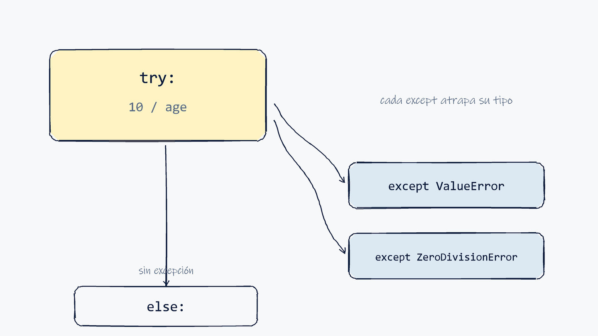

**Shows.** One except per type, and where the else clause sits in the flow.

**Reuse.** Week 11 covers exceptions properly and opens with the same drawing.

**Ratio** 16:9 · **lessons** w01.1 · **drawn by** `figures.exceptions`

## `paradigms`

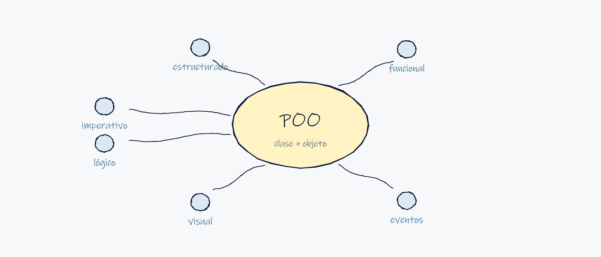

**Shows.** Object orientation as one paradigm among six, rather than the only way to write a program.

**Reuse.** Opens the paradigm session of every language course in the academy, unchanged.

**Ratio** 21:9 · **lessons** w02 · **drawn by** `figures.paradigms`

## `parallel-lists`

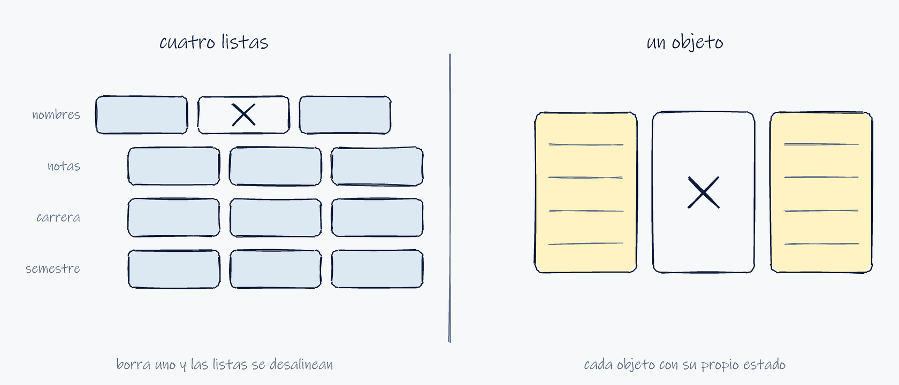

**Shows.** The failure that makes objects worth the extra lines: delete one student and four parallel lists go out of step, while three objects do not.

**Reuse.** This is the argument of the whole paradigm session, and it is structural, so it holds in any language.

**Ratio** 21:9 · **lessons** w02 · **drawn by** `figures.parallel_lists`

## `class-object`

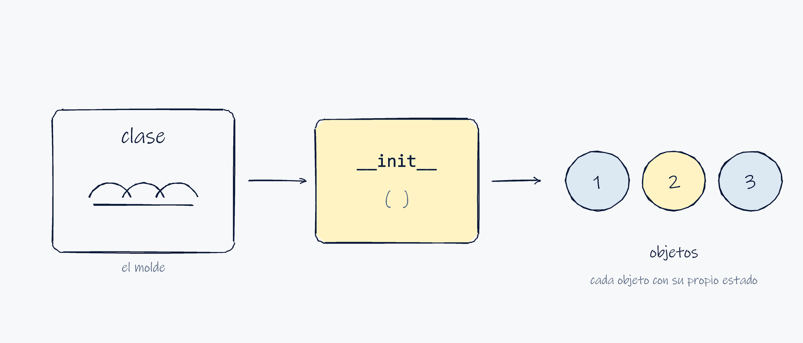

**Shows.** Class, constructor, objects, with the cutter-and-cookies analogy drawn out.

**Reuse.** The same analogy is already in docs/02-oop.md, so the drawing and the written notes reinforce each other.

**Ratio** 21:9 · **lessons** w03 · **drawn by** `figures.class_object`

## `class-vs-instance`

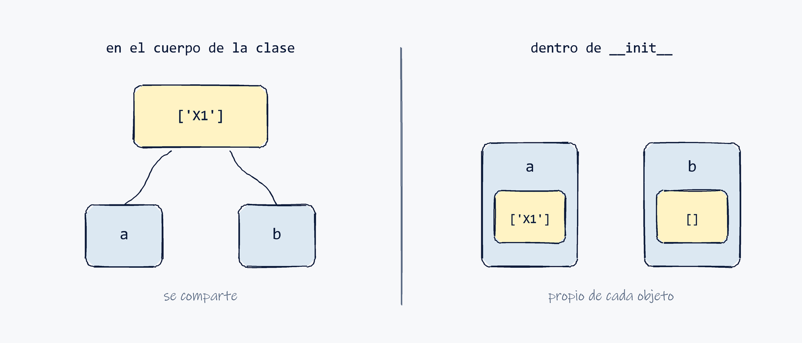

**Shows.** One list on the class shared by every object, against one list per object.

**Reuse.** Show it next to reference-vs-copy: same mechanism, one wearing a class costume.

**Ratio** 21:9 · **lessons** w03 · **drawn by** `figures.class_vs_instance`

## `access-levels`

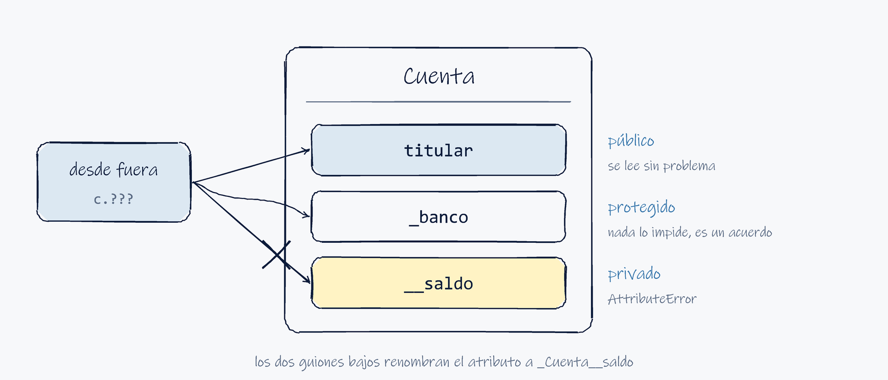

**Shows.** What actually happens when outside code reaches for a public, a protected and a private attribute, and which of the three Python enforces.

**Reuse.** Week 6 opens the encapsulation block with it. Any language with three access levels can use the same drawing by relabelling the three rows.

**Ratio** 21:9 · **lessons** w04, w06 · **drawn by** `figures.access_levels`

## `array-memory`

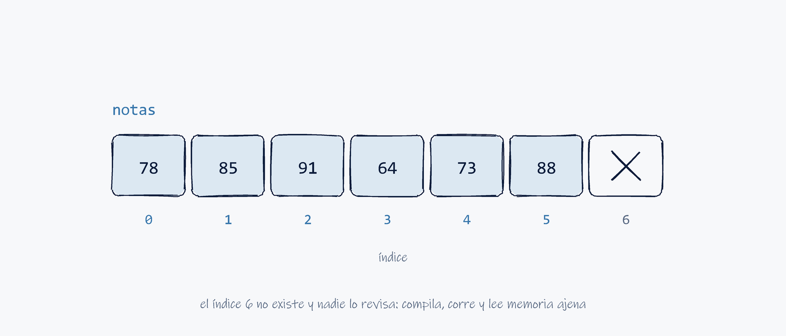

**Shows.** Contiguous cells with the index written under each, and one cell past the end that nothing stops you reading.

**Reuse.** Week 10 opens with it. The same drawing explains why the first index is zero and why the last one is size minus one, which is the same off-by-one twice.

**Ratio** 21:9 · **lessons** w10 · **drawn by** `figures.array_memory`

## `pointer`

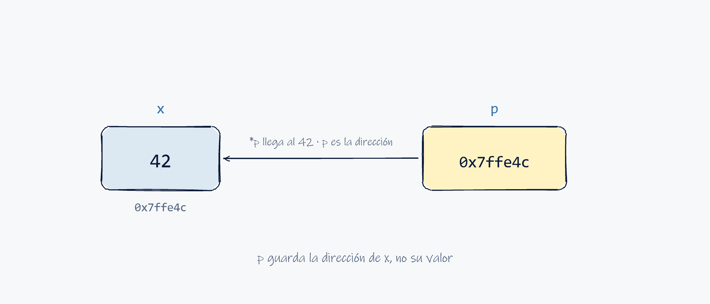

**Shows.** A variable, its address, and the second variable that holds that address.

**Reuse.** Week 12. Show it beside value-vs-reference: a reference is another name for the box, a pointer is a box holding where the first one lives.

**Ratio** 21:9 · **lessons** w12 · **drawn by** `figures.pointer`

## `stack-vs-heap`

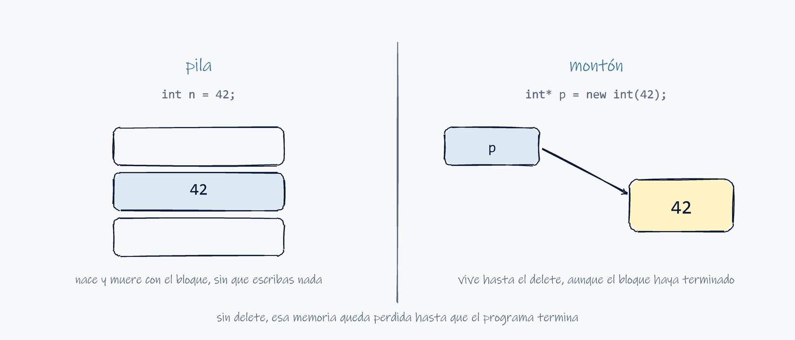

**Shows.** Automatic storage against dynamic, with the pointer on the stack and the object it owns on the heap, and where each lifetime ends.

**Reuse.** Week 12 needs it for new and delete. It is also the picture behind the leak: the left box disappears on its own, the right one does not.

**Ratio** 21:9 · **lessons** w12 · **drawn by** `figures.stack_vs_heap`

## `vtable`

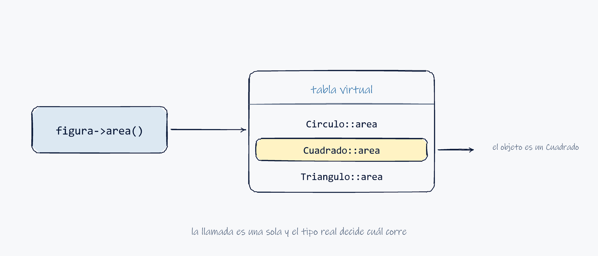

**Shows.** One call site, the table the call goes through, and the row the real type picks out.

**Reuse.** Week 12, once virtual is on the board. Pair it with polymorphism: one drawing is what the caller sees, this one is what actually happens.

**Ratio** 21:9 · **lessons** w12 · **drawn by** `figures.vtable`

## `value-vs-reference`

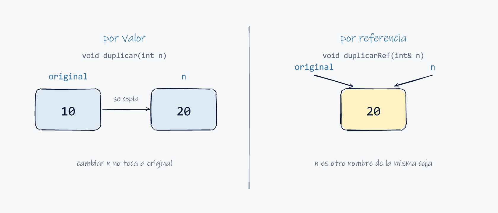

**Shows.** The same argument passed both ways, with the copy drawn on one side and the second name for one box on the other.

**Reuse.** Week 5 turns on this one drawing. It is also the picture to point back at in week 12, when the pointer arrives and the question becomes which of the three a parameter should be.

**Ratio** 21:9 · **lessons** w05 · **drawn by** `figures.value_vs_reference`

## `scope-cpp`

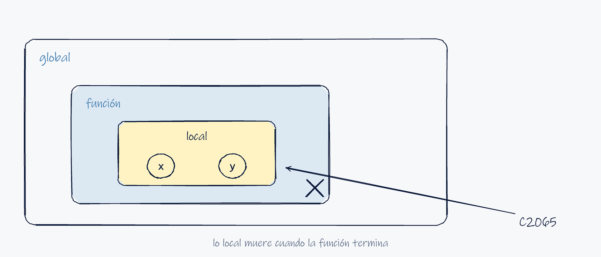

**Shows.** Local against global, and the error C++ gives for reaching a name that went out of scope.

**Reuse.** The COM103 twin of scope. The nesting is identical; only the label on the blocked arrow changes, because C++ refuses the name at compile time with C2065 where Python raises NameError while running.

**Ratio** 21:9 · **lessons** w05 · **drawn by** `figures.scope_cpp`

## `access-levels-cpp`

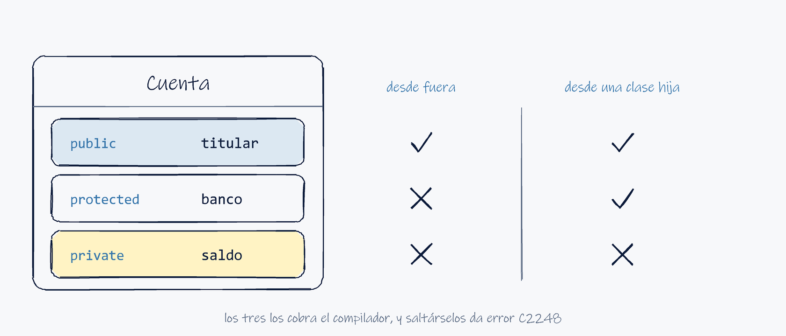

**Shows.** Which of public, protected and private can be reached from outside the class and from a derived class, with the compiler enforcing all three.

**Reuse.** Not a relabel of access-levels. Python enforces one of the three levels and treats protected as an agreement, so that drawing carries a single cross. Here the second column is the whole point: protected is the level a child can reach and an outsider cannot.

**Ratio** 21:9 · **lessons** w06, w09 · **drawn by** `figures.access_levels_cpp`

## `uml-class-cpp`

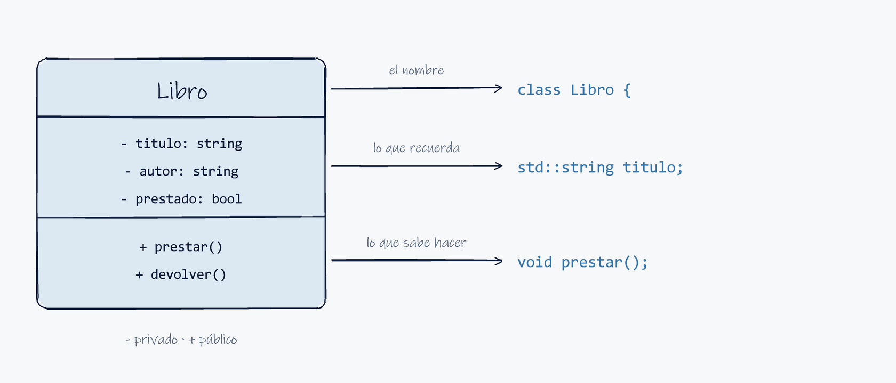

**Shows.** The three compartments of a UML class box, each wired to the line of C++ it turns into.

**Reuse.** The COM103 twin of uml-class. The notation is language independent, the three code lines beside it are not.

**Ratio** 21:9 · **lessons** w06 · **drawn by** `figures.uml_class_cpp`

## `uml-class`

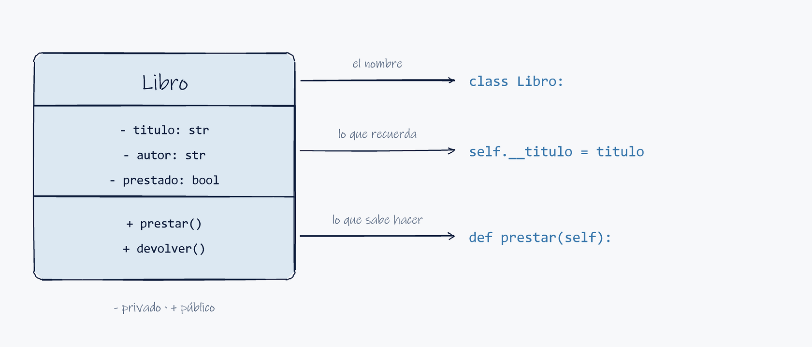

**Shows.** The three compartments of a UML class box, each wired to the line of Python it turns into.

**Reuse.** Week 5 models with it and week 16 reuses it when the model becomes a table. The notation is language independent, so every course can borrow it.

**Ratio** 21:9 · **lessons** w05 · **drawn by** `figures.uml_class`

## `hierarchy`

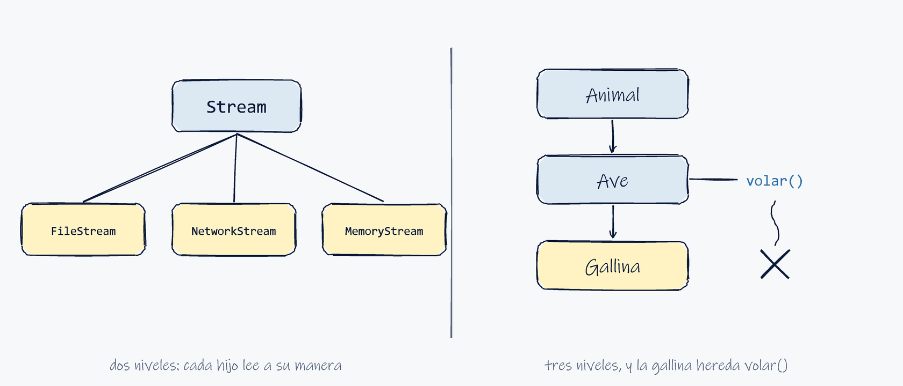

**Shows.** A two-level tree that works beside a four-level chain that produces a chicken which inherits fly().

**Reuse.** The argument for keeping inheritance shallow, and it is structural, so it holds in any language with classes.

**Ratio** 21:9 · **lessons** w07 · **drawn by** `figures.hierarchy`

## `polymorphism`

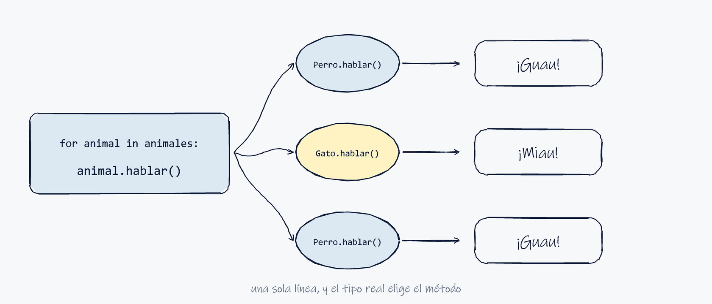

**Shows.** One call site sending the same message to three objects and getting three answers back, chosen by the real type.

**Reuse.** Week 8 opens with it. Pair it with hierarchy: one drawing is the tree, the other is what the tree buys you.

**Ratio** 21:9 · **lessons** w08 · **drawn by** `figures.polymorphism`

## `recursion`

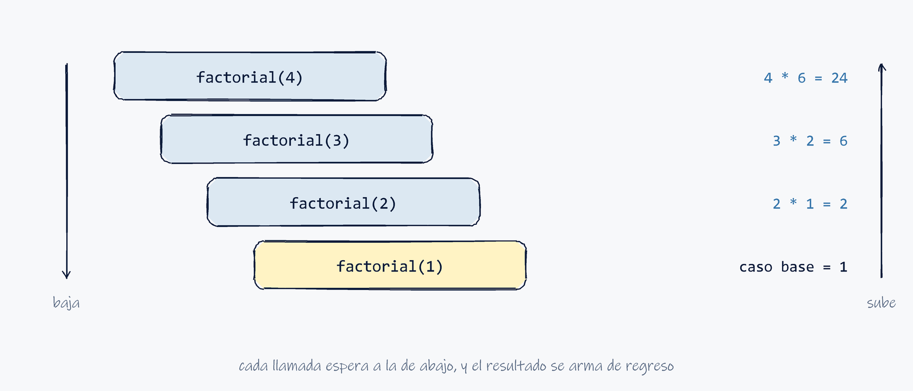

**Shows.** The call stack of factorial(4): four frames going down to the base case, and the result assembled on the way back up.

**Reuse.** Any recursive example fits by relabelling the four frames. The shape of the drawing is the shape of the mechanism.

**Ratio** 21:9 · **lessons** w09 · **drawn by** `figures.recursion`

## `file-lifecycle`

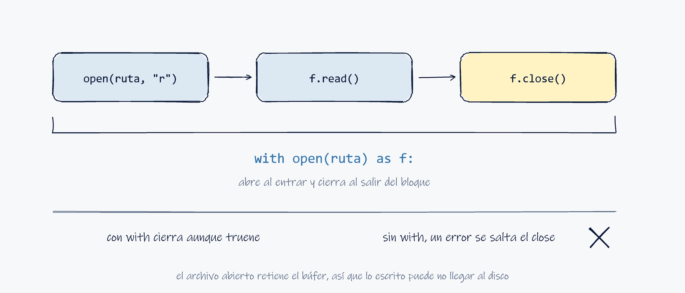

**Shows.** Open, work, close, and the with block that does the first and the last for you even when the middle raises.

**Reuse.** Week 16 reuses it for database connections, which have exactly the same lifecycle and the same failure mode.

**Ratio** 21:9 · **lessons** w12 · **drawn by** `figures.file_lifecycle`

## `seek-tell`

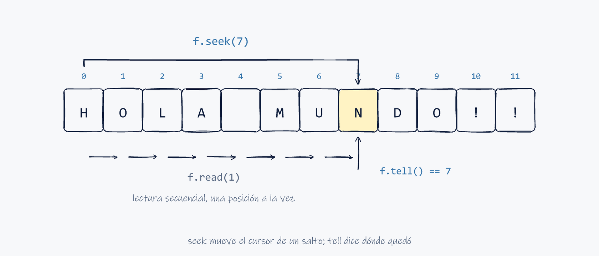

**Shows.** One cursor over a file laid out as numbered positions: reading walks it one step at a time, seek jumps it, tell reports where it stopped.

**Reuse.** The difference between sequential and random access, drawn once. Same drawing works for a text file, a binary file or a database page.

**Ratio** 21:9 · **lessons** w13 · **drawn by** `figures.seek_tell`

## `event-loop`

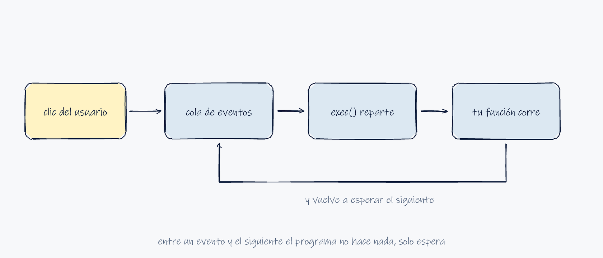

**Shows.** Why a GUI program looks idle: exec() is a loop that waits, dispatches one event to one function, and goes back to waiting.

**Reuse.** Any event-driven toolkit has this shape, so the drawing holds for Qt, for the web and for a game loop.

**Ratio** 21:9 · **lessons** w14 · **drawn by** `figures.event_loop`

## `layouts`

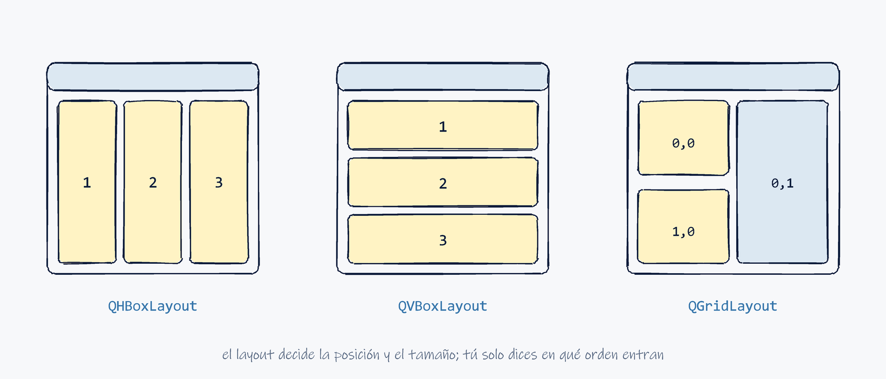

**Shows.** The same three widgets under a horizontal box, a vertical box and a grid, with the grid cell coordinates written in.

**Reuse.** Week 15 builds on it. The three arrangements are the same in Qt, in Tk and in CSS, only the class names change.

**Ratio** 21:9 · **lessons** w15 · **drawn by** `figures.layouts`

## `db-access`

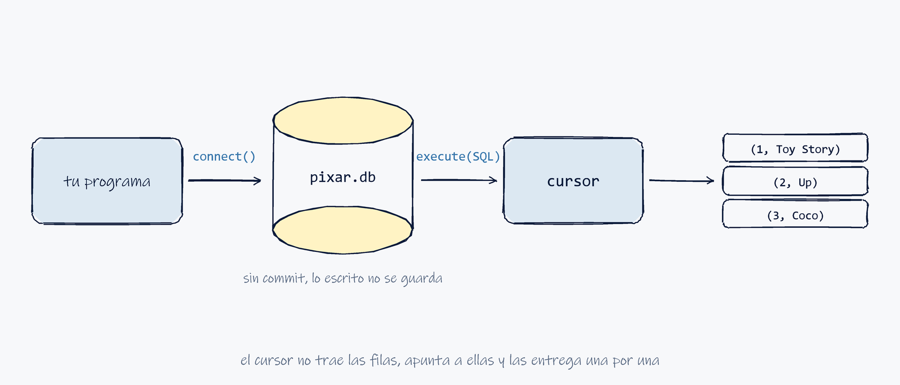

**Shows.** The path a query takes: connection, execute, cursor, rows, and where commit has to happen for a write to survive.

**Reuse.** Pair it with file-lifecycle: a connection is opened, used and closed exactly like a file, and forgetting the close costs the same.

**Ratio** 21:9 · **lessons** w16 · **drawn by** `figures.db_access`

## `cpp-timeline`

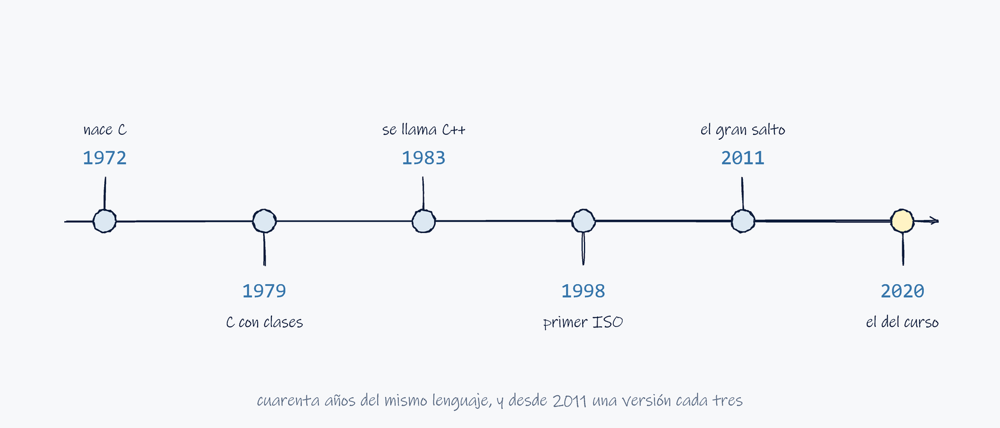

**Shows.** Forty years of C++ on one line, from C in 1972 to the standard this course pins, with the three-year release cadence visible at the right end.

**Reuse.** Opens COM103. Relabel the six stops and it serves any language that has a history worth telling.

**Ratio** 21:9 · **lessons** w00 · **drawn by** `figures.cpp_timeline`

## `compilation`

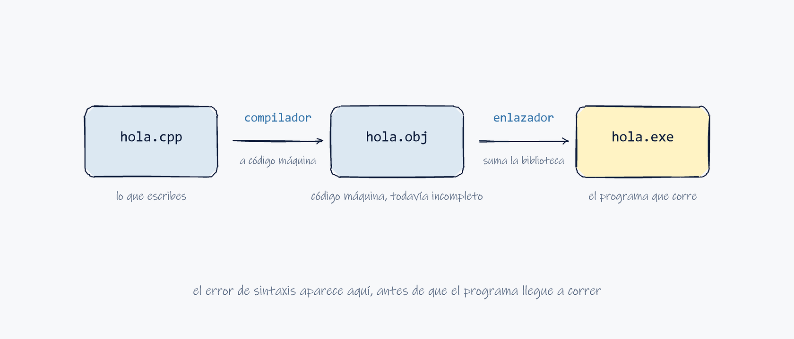

**Shows.** Source, object file, executable, with the compiler and the linker named on the arrows and the standard library entering at the second one.

**Reuse.** The figure that explains what a compiled language is, so it belongs in the first session of any compiled-language course.

**Ratio** 21:9 · **lessons** w00, w01 · **drawn by** `figures.compilation`

## `ct-01`

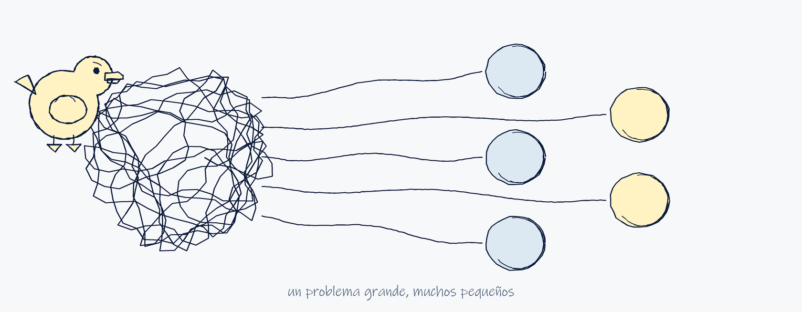

**Shows.** Decomposition, a tangle pulled apart into tidy coils

**Reuse.** Opens any session about breaking a problem down. w02 divider.

**Ratio** 21:9 · **lessons** ct · **drawn by** `figures.ct01`

## `ct-02`

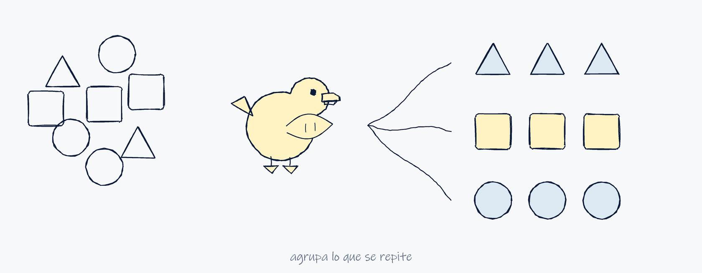

**Shows.** Pattern recognition, a heap of shapes sorted into groups

**Reuse.** Also serves "what a class is": grouping before syntax. w03.

**Ratio** 21:9 · **lessons** ct · **drawn by** `figures.ct02`

## `ct-03`

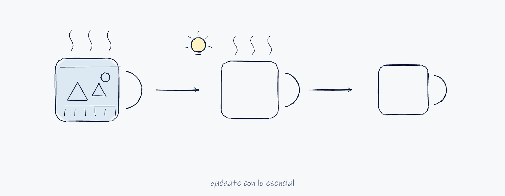

**Shows.** Abstraction, the same mug stripped to what matters

**Reuse.** The abstraction principle in w02, and modelling in w03.

**Ratio** 21:9 · **lessons** ct · **drawn by** `figures.ct03`

## `ct-04`

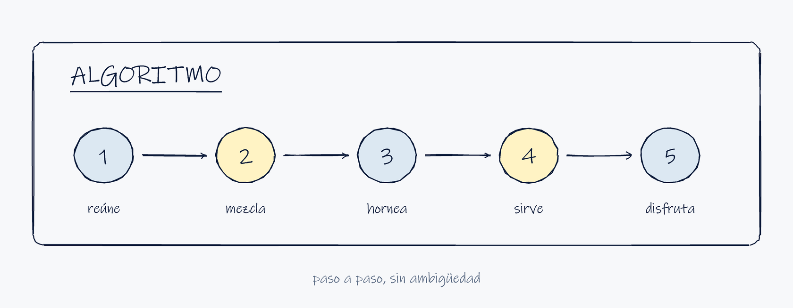

**Shows.** Algorithm, a numbered recipe with no ambiguity

**Reuse.** The method slide of w01.1, or any step-by-step.

**Ratio** 21:9 · **lessons** ct · **drawn by** `figures.ct04`

## `ct-05`

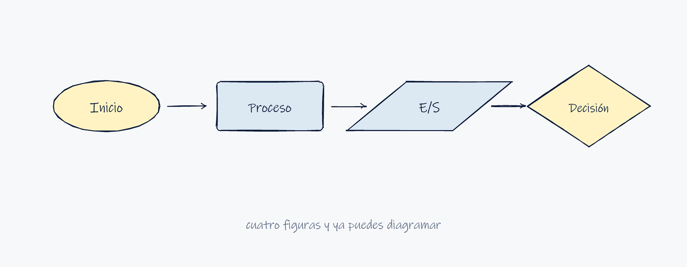

**Shows.** The four flowchart shapes

**Reuse.** Not used by COM102, kept so the set is complete.

**Ratio** 21:9 · **lessons** ct · **drawn by** `figures.ct05`

## `ct-06`

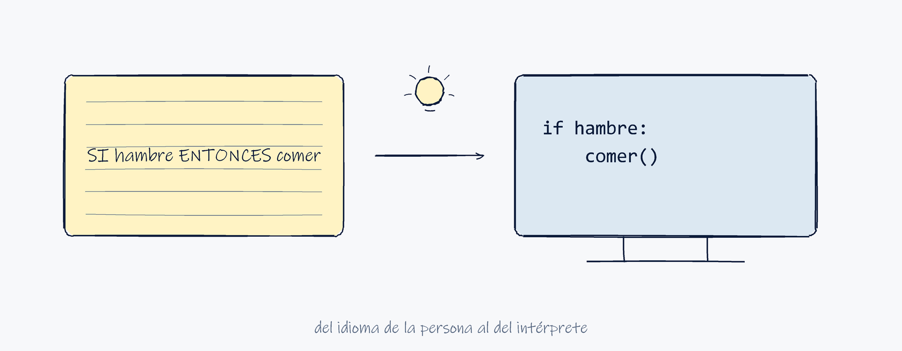

**Shows.** Pseudocode on paper becoming code on a screen

**Reuse.** w01.1, the bridge from a plan to a program.

**Ratio** 21:9 · **lessons** ct · **drawn by** `figures.ct06`

## `ct-07`

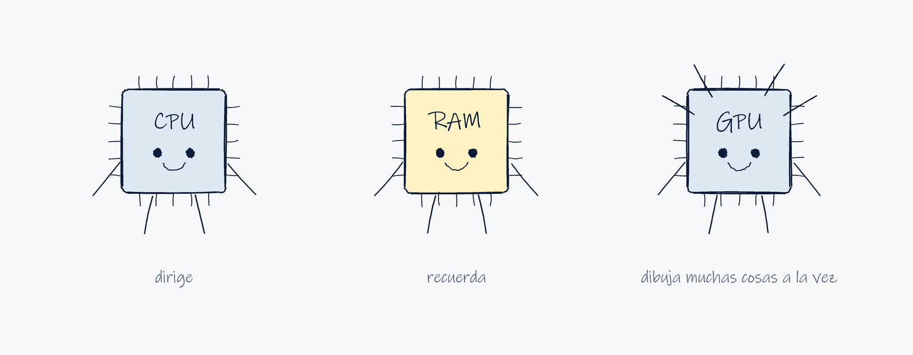

**Shows.** CPU, RAM and GPU as characters

**Reuse.** Not used by COM102, kept for the hardware session of other courses.

**Ratio** 21:9 · **lessons** ct · **drawn by** `figures.ct07`

## `ct-08`

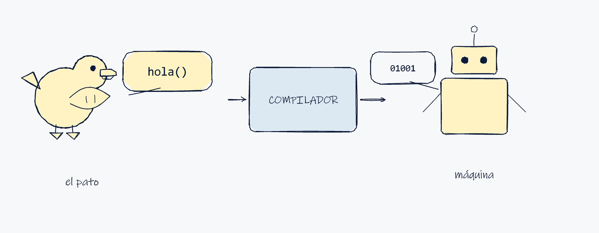

**Shows.** A human sentence, a compiler, and a machine that reads bits

**Reuse.** w02, when the question of what runs where comes up.

**Ratio** 21:9 · **lessons** ct · **drawn by** `figures.ct08`

## `ct-09`

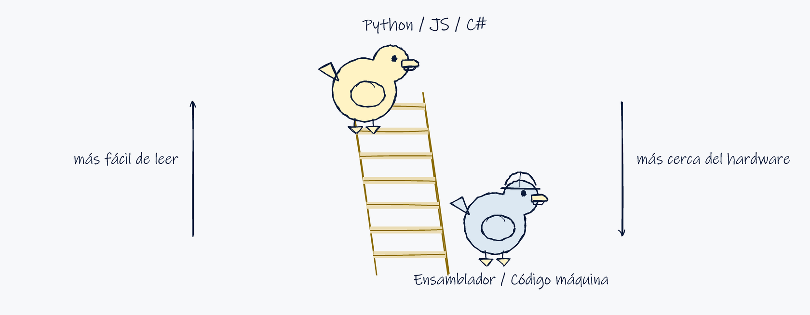

**Shows.** High level up the ladder, machine code at the foot

**Reuse.** w02, why Python. The original of this one is the favourite.

**Ratio** 21:9 · **lessons** ct · **drawn by** `figures.ct09`

## `ct-10`

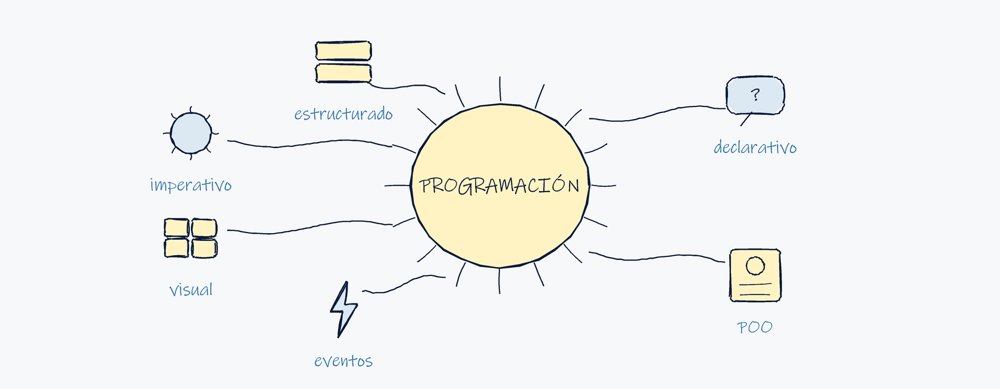

**Shows.** The paradigm map, six ways round one sun

**Reuse.** w02, the opening slide of the paradigm block.

**Ratio** 21:9 · **lessons** ct · **drawn by** `figures.ct10`

