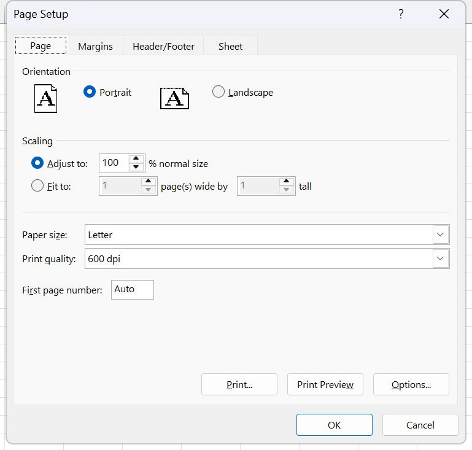
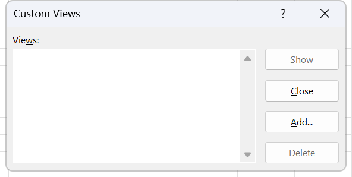
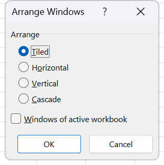

# Exercise 4 · Page setup, print area and workbook views

A sheet that prints on twenty pages, and a set of commands that brings it down to eight. The whole exercise is built on that one number, because print settings are the part of Excel students never look at until the moment something comes out of a printer wrong. It lands in week 17, session 33, the last teaching session before the final exam, and it is the practice file for most of that session. COBERTURA notes what it leaves out: zoom, new window, arrange windows and the Excel header and footer are all in the syllabus for the same session and none of them appears here.

**Objectives** MO-200 1.3.1, 1.4.2, 1.4.3, 1.4.4, 1.5.1, 1.5.3, 2.1.3, 2.2.2

## The data

One sheet, `World Data 2023`, with 195 countries and 35 columns. Too wide and too long for a table on a page, which is the point.

[data/ex04-world-data-2023.csv](data/ex04-world-data-2023.csv), 195 rows by 35 columns, UTF-8, header on the first line.

The columns, in order: Country, Density (P/Km2), Abbreviation, Agricultural Land( %), Land Area(Km2), Armed Forces size, Birth Rate, Calling Code, Capital/Major City, Co2-Emissions, CPI, CPI Change (%), Currency-Code, Fertility Rate, Forested Area (%), Gasoline Price, GDP, Gross primary education enrollment (%), Gross tertiary education enrollment (%), Infant mortality, Largest city, Life expectancy, Maternal mortality ratio, Minimum wage, Official language, Out of pocket health expenditure, Physicians per thousand, Population, Population: Labor force participation (%), Tax revenue (%), Total tax rate, Unemployment rate, Urban_population, Latitude, Longitude.

Two things about the values. Every percentage column stores a decimal fraction with a percent number format on top, so Afghanistan's agricultural land is `0.581` in the cell and `58.10%` on screen; the CSV carries the stored value, which is what reloads correctly into a spreadsheet. And the header for column B contains a line break in the workbook, `Density` then `(P/Km2)`, which the CSV flattens to a single line.

The first row, as a sample:

| Country | Density (P/Km2) | Abbreviation | Agricultural Land( %) | Land Area(Km2) | Armed Forces size | Birth Rate | Calling Code | Capital/Major City |
|---|---|---|---|---|---|---|---|---|
| Afghanistan | 60 | AF | 0.581 | 652230 | 323000 | 32.49 | 93 | Kabul |

There are gaps. Andorra has no armed forces size, no CPI and no life expectancy. That is real, and it does not need fixing for this exercise.

## What to do

1. Open the workbook and look at how it would print as it stands. **File** > **Print**, or `Ctrl+P`. Read the page counter under the preview: twenty pages. Route 1.5.3.
2. Insert two rows above row 1, type `WORLD INFORMATION` into A1, then select A1:J1 and centre the title across that selection. Route 2.1.3 for the rows, route 2.2.2 for the centring. Use **Center Across Selection** in the **Horizontal** list of the **Format Cells** dialog rather than **Merge & Center**, because merged cells refuse to sort and most filters refuse to run over them. The header row is now row 3 and the countries run from row 4 to row 198.
3. Set the print area to A1:J198, which is the title plus the first ten columns of data. **Page Layout** tab, **Page Setup** group, **Print Area**, **Set Print Area**. Route 1.5.1.
4. Look at the print preview again. Eight pages, down from twenty.
5. Repeat the headings on every printed page. **Page Layout** tab, **Page Setup** group, **Print Titles**, which opens the **Page Setup** dialog on its **Sheet** tab. Put `$1:$3` into **Rows to repeat at top:** and `$A:$A` into **Columns to repeat at left:**. Route 1.3.1.
6. Without closing the dialog, go to the **Page** tab. Set **Orientation** to **Landscape** and **Scaling** to **Fit to: 4 page(s) wide by 5 tall**. Click **OK**. Route 1.3.1, and doing both in one visit to the dialog is the point of the route.
7. Make three copies of `World Data 2023` and place them to the right of it. Right-click the tab, **Move or Copy**, select **(move to end)**, tick **Create a copy**, click **OK**, three times. The copies arrive as `World Data 2023 (2)`, `(3)` and `(4)`.
8. On `World Data 2023 (2)`, freeze the first column. **View** > **Window** > **Freeze Panes** > **Freeze First Column**. Route 1.4.3.
9. On `World Data 2023 (3)`, freeze the panes at B4, so the three top rows and the country names stay visible together. **View** > **Window** > **Freeze Panes** > **Freeze Panes**. Route 1.4.3. This is the entry that reads the selection; the two below it do not.
10. On `World Data 2023 (4)`, split the window instead of freezing it. **View** > **Window** > **Split**. Route 1.4.4.
11. Drag the vertical split bar until it sits to the right of column C, then scroll each quadrant and watch what happens. A split scrolls in both halves. A freeze does not. That is the difference the two sheets are there to show.
12. On the same sheet, clear the **Gridlines** check box in the **View** tab, **Show** group. This is the on-screen gridline, not the printed one; the printed one is the **Gridlines** check box on the **Sheet** tab of **Page Setup**, and the two are independent.
13. Go back to the first sheet and switch to **Page Break Preview**. **View** > **Workbook Views** > **Page Break Preview**. Route 1.4.2. Everything outside the print area is greyed, and the page breaks are drawn as lines: dashed where Excel put them, solid where a person did.
14. Return to **Normal** view.
15. Save as `Exercise 4 Excel_Your name.xlsx` and upload it to Moodle. The original instruction sheet stops at task 14 and never says how to hand the file in; this line follows the convention the other exercises use.

## Exam routes used here

**1.3.1 Modify page setup.** Select the worksheet, or `Ctrl`-click several tabs to apply one setup to a group. **Page Layout** tab, **Page Setup** group, click the dialog box launcher, the small arrow in the bottom right corner of the group. The **Page Setup** dialog opens with four tabs, **Page**, **Margins**, **Header/Footer**, **Sheet**, and everything below happens without closing it. On **Page**, set **Orientation** to **Portrait** or **Landscape**, and **Scaling** to **Adjust to: __ % normal size** or **Fit to: __ page(s) wide by __ tall**; **Paper size:**, **Print quality:** and **First page number:** are on the same tab. On **Margins**, set **Top:**, **Bottom:**, **Left:**, **Right:**, the **Header:** and **Footer:** distances, and the **Center on page** boxes **Horizontally** and **Vertically**. On **Sheet**, set **Rows to repeat at top:** and **Columns to repeat at left:** under **Print titles**, tick **Gridlines**, **Black and white**, **Draft quality** and **Row and column headings** under **Print**, set **Comments and notes:** and **Cell errors as:**, and choose **Down, then over** or **Over, then down** under **Page order**. The **Print area:** box at the top of that tab is the second route to 1.5.1. **Print Preview** inside the dialog checks the result before **OK** commits it. The galleries on the Page Layout tab, **Margins**, **Orientation**, **Size**, **Breaks**, and the **Width:**, **Height:** and **Scale:** boxes in Scale to Fit, are the short route: each one is a separate operation with its own undo step, and the exam asks for a page setup, singular. `Ctrl+P` reaches the same dialog through the **Page Setup** link at the bottom of the Settings column, with some Sheet tab options greyed out, which is why the ribbon launcher is the one to use. Key tips `Alt, P, S, P`.

*Orientation and Scaling are both on this tab, which is how task 6 sets Landscape and Fit to 4 by 5 in one visit. The print titles from task 5 are on the Sheet tab at the far right of the same dialog, and nothing commits until OK.*

**1.4.2 Display and modify workbook content in different views.** **View** tab, **Workbook Views** group, click **Normal**, **Page Break Preview** or **Page Layout**. In Page Break Preview, drag a blue page-break line to move it; dragging creates a manual break, drawn solid where the automatic one was dashed, and right-click plus **Reset All Page Breaks** returns to automatic. In Page Layout, click straight into the header and footer boxes to edit them and drag the rulers to change margins. To store a view rather than switch to one, set the sheet up as it should be remembered and click **Custom Views...** in the same group, then **Add...**, name it in the **Name:** box and tick **Print settings** and **Hidden rows, columns and filter settings** under **Include in view**. Recall it later with **Custom Views...**, select the name, **Show**. The three small buttons in the bottom right of the Status Bar are the short route and reach the three views but never **Custom Views...**. Key tips `Alt, W, L`, `Alt, W, I`, `Alt, W, P`.

*Add stores the sheet as it currently stands, Show puts it back later. The list starts empty, and the dialog refuses to open at all on a workbook that has never been saved.*

**1.4.3 Freeze worksheet rows and columns.** Excel freezes everything above and everything to the left of the selected cell, so three header rows plus one label column means the anchor is B4. Click that single cell, not the row heading and not the column heading. **View** tab, **Window** group, **Freeze Panes**, then **Freeze Panes** in the drop-down. **Freeze Top Row** and **Freeze First Column** ignore the selection entirely and freeze exactly one line each, which is what task 8 wants and what task 9 does not. **Unfreeze Panes** releases it. Key tips `Alt, W, F, F` at the selection, `Alt, W, F, R` top row, `Alt, W, F, C` first column.

**1.4.4 Change window views.** **View** tab, **Window** group. **New Window** opens a second window onto the same workbook, and the captions become `file.xlsx  -  1` and `file.xlsx  -  2`. **Arrange All** opens the **Arrange Windows** dialog with **Tiled**, **Horizontal**, **Vertical** and **Cascade**, plus the **Windows of active workbook** check box that limits the arrangement to the current file. **View Side by Side**, **Synchronous Scrolling** and **Reset Window Position** compare two workbooks. **Split** cuts one window into panes at the selected cell, and clicking **Split** again removes it. **Hide** takes a window out of the way and **Unhide...** brings it back. **Switch Windows** jumps between open windows. The **Zoom** group carries **Zoom...** with **200%**, **100%**, **75%**, **50%**, **25%**, **Fit selection** and **Custom: __ %**, plus **Zoom to Selection**. Dragging window borders by hand reaches the same picture and never creates a second window onto one workbook, which is the whole point of New Window. `Ctrl+F6` cycles windows, `Ctrl+W` closes one.

*Four arrangements and one check box. Windows of active workbook is the part that matters after New Window, because without it every other open file joins the tiling.*

**1.5.1 Set a print area.** Select the range, `Ctrl`-clicking each extra block if the area has several. **Page Layout** tab, **Page Setup** group, **Print Area**, **Set Print Area**. To extend one, select the extra range and click **Add to Print Area**, which gives that block its own page. **Clear Print Area** removes it. Printing with **Print Selection** in the Print backstage is the short route: it prints the right cells once and stores nothing, so the next print goes back to the whole sheet. Typing the reference into the **Print area:** box on the **Sheet** tab of **Page Setup** is a legitimate second path and the one to use when the task gives an address rather than a range. Key tips `Alt, P, R, S`.

**1.5.3 Configure print settings.** **File** tab, **Print**, or `Ctrl+P`. The Print backstage opens with the settings column on the left and the preview on the right. Set **Copies:** with the spinner. Choose the printer from the **Printer** list. Open the first **Settings** list for **Print Active Sheets**, **Print Entire Workbook** or **Print Selection**, and tick **Ignore Print Area** at the bottom of it when the task wants the print area bypassed. Limit the range with **Pages:** __ **to** __. The next lists carry **Print One Sided** or **Print on Both Sides**, **Collated** or **Uncollated**, **Portrait Orientation** or **Landscape Orientation**, the paper size, and **Normal Margins**, **Wide Margins**, **Narrow Margins** or **Custom Margins**. The last list carries **No Scaling**, **Fit Sheet on One Page**, **Fit All Columns on One Page**, **Fit All Rows on One Page** and **Custom Scaling Options...**, which opens **Page Setup** on its **Page** tab. Check the page counter under the preview, then **Print**. Orientation, margins and scaling chosen here write back to the sheet; copies, collation and the printer do not, and students expect all of it to be sticky. `Ctrl+P` or `Ctrl+F2`.

**2.1.3 Insert and delete multiple columns or rows.** Excel inserts exactly as many rows as are selected, so select rows 1 and 2 by dragging down the row headings to insert two rows above row 1. **Home** tab, **Cells** group, click the **arrow on the Insert button**, not the button face, then **Insert Sheet Rows**. New rows inherit the formatting of the row above; the **Insert Options** paintbrush offers **Clear Formatting** if that is wrong. After a delete, scan for `#REF!`. `Ctrl+Shift+plus` inserts with whole rows selected.

**2.2.2 Modify cell alignment, orientation, and indentation.** Select A1:J1. `Ctrl+1`, or **Home** tab, **Alignment** group, dialog box launcher. **Format Cells** opens on the **Alignment** tab. Open the **Horizontal** list and pick **Center Across Selection**, which centres the title over the ten columns and leaves them unmerged, so sorting and filtering still work. The other entries are **General**, **Left (Indent)**, **Center**, **Right (Indent)**, **Fill**, **Justify** and **Distributed (Indent)**. The **Vertical** list carries **Top**, **Center**, **Bottom**, **Justify**, **Distributed**. **Indent** only enables for the indent variants, so set Horizontal first. **Orientation** takes an angle from the red diamond on the half dial or from the **Degrees** box, and **Text control** carries **Wrap text**, **Shrink to fit** and **Merge cells**. Click **OK** once. Exam items worded "centre the title across A1:J1 without merging" want this list entry and nothing else.

*Center Across Selection is an entry in the Horizontal list and has no button anywhere on the ribbon. Merge cells is the check box in Text control lower down, and task 2 wants the list entry instead of that box.*

## Checks

- The print preview reads `1 of 8`, not `1 of 20`. Step through it with the arrows.
- Open **Formulas** > **Defined Names** > **Name Manager**. Setting a print area creates a sheet-scoped name `Print_Area`, and setting print titles adds `Print_Titles`. Both must be there, with `Print_Area` referring to `='World Data 2023'!$A$1:$J$198`. If those names are absent, no print area was set, whatever came out of the printer.
- Page 2 of the preview carries the title, the header row and the country names down its left edge. If it does not, the print titles went into the wrong boxes or into the Print backstage rather than the dialog.
- Switch to **Page Layout** view. Landscape orientation and the repeated title rows are visible on screen there.
- Reopen the **Page Setup** launcher and look at the **Page** tab. **Fit to:** is selected with 4 and 5 in the boxes, and **Adjust to:** is not. If **Adjust to:** still holds a percentage, the Fit to option never took.
- Four sheets, in the order `World Data 2023`, `(2)`, `(3)`, `(4)`.
- On sheet (2), scrolling right keeps column A on screen and scrolling down moves the headers away, because only the first column is frozen.
- On sheet (3), scrolling in either direction keeps rows 1 to 3 and column A on screen. A thin solid dark line marks the freeze at the B4 corner.
- On sheet (4), two thick grey bars cut the window and all four quadrants scroll independently. The **Freeze Panes** menu on that sheet still opens with **Freeze Panes** as its first entry, not **Unfreeze Panes**, which is the proof that a split is not a freeze.
- Sheet (4) shows no gridlines on screen. The other three still do, because the setting is per sheet.
- The first sheet, in Page Break Preview, is watermarked `Page 1`, `Page 2` and greys out everything from column K rightwards.

## Known problems in the source

- The instruction sheet says "center the text in that selection" without saying which command. Merge & Center and Center Across Selection produce the same picture and only one of them leaves the range sortable. Task 2 above picks Center Across Selection and says why.
- The instruction sheet never says which rows and columns go into the **Print Titles** boxes, only that you select the ones you want visible. Rows 1 to 3 and column A are what the sheet needs after the two rows are inserted.
- The exercise ends at "Return to Normal view" with no save or hand-in step, unlike Exercises 1, 2, 3 and 5.
- Column headers carry their own spacing quirks: `Agricultural Land( %)` has the space inside the bracket, `Urban_population` uses an underscore where the rest of the sheet uses spaces, and `Density` has a line break in the middle. The CSV keeps the text and flattens the line break.
- COBERTURA posts a material warning against this exercise for session 33: zoom, **New Window**, **Arrange All** and the Excel header and footer are all named in the syllabus for the same session and none of them is practised here. Objectives 1.4.4 and 1.3.3 have a session and no prepared exercise.
