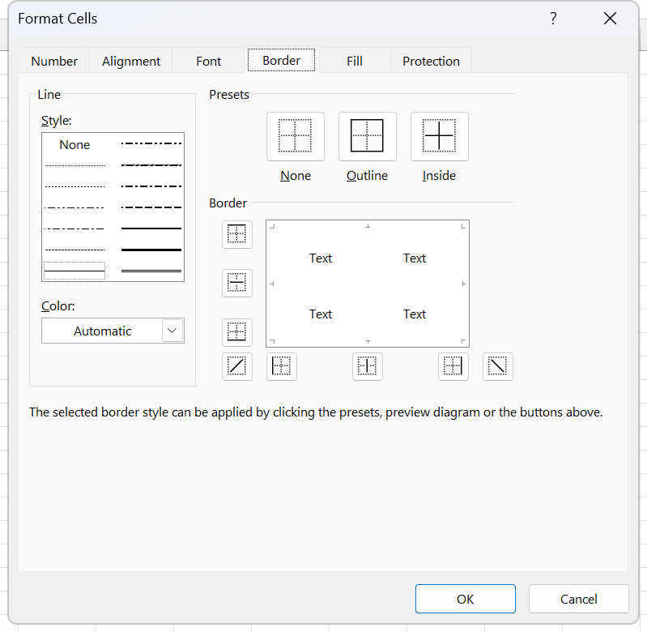
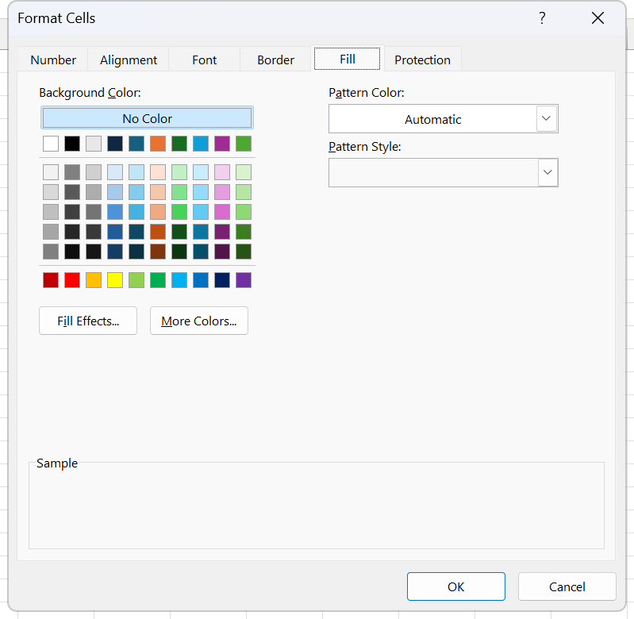

# Exercise 09 · SUMIF, COUNTIF and AVERAGEIF

Two sheets, both too big to answer by eye, and a column of plain-language questions beside each one. A beauty salon with 520 treatment records, and a laptop reseller with 88 sales over two months. The student answers every question with one function carrying one criterion, which is the point: this is the week before the plural family arrives, and the singular forms are what make the difference between the two visible. It lands in week 8, sessions 15 and 16, where the syllabus schedules the *IFS functions and `COBERTURA.md` adds SUMIF, COUNTIF and AVERAGEIF ahead of them. Hand in the workbook with `Exercise1` formatted, its `TOTAL CHARGED` column calculated, and both question blocks answered.

**Objectives** MO-201 3.1.1, MO-200 2.2.5, MO-200 2.2.6, MO-200 4.2.1, MO-200 4.2.2, MO-200 4.1.1

## The data

**Sheet `Exercise1`**, 520 treatment records in A1:H521 with the header on row 1. Eight columns: `DATE`, `CATEGORY`, `CLIENT`, `TREATMENT`, `ESTHETICIAN`, `PRICE`, `% DISCOUNT`, `TOTAL CHARGED`. Five estheticians, two categories, Body and Facial, and 38 records with no discount at all. `TOTAL CHARGED` is the answer column and is left out of the CSV.

The dates are stored as raw serial numbers with no date format applied, which is deliberate: formatting them is the first task. 44563 is 2 January 2022 and 44611 is 19 February 2022, so the file spans seven weeks either side of a month end.

File: [labs/data/ex09-exercise1.csv](data/ex09-exercise1.csv), 520 rows by 7 columns. Too long to reproduce here.

The question block sits in column J, rows 1 to 31, with the answers going in column K beside each label. The workbook leaves those cells unformatted, so nothing marks them; keep every answer in K and the block stays readable.

**Sheet `Exercise2`**, 88 sales in A1:H89 with the header on row 1. Eight columns: `#`, `Date`, `Vendor`, `Client`, `Brand`, `Cost`, `Selling price`, `% Profit`. Two vendors, Ben and Jacob, alternating one sale each; ten laptop brands; dates from 1 July to 31 August 2022. Every column is given, including `% Profit`, so there is no answer column to strip and the CSV holds all eight.

File: [labs/data/ex09-exercise2.csv](data/ex09-exercise2.csv), 88 rows by 8 columns. Too long to reproduce here.

The questions sit in J2, J5, J8, J12 and J15, with two sub-labels in K9 and K10. Put single answers in the cell one row below and one column right of the question, so K3, K6, K13 and K16, and put the two vendor answers in L9 and L10. The workbook marks none of this, so state where you put them.

## What to do

**On `Exercise1`.**

1. Format the table by data type, column by column. `DATE` needs a date format, `PRICE` a currency format, `% DISCOUNT` a percentage. Route MO-200 2.2.5, the **Number** group on the **Home** tab. Until this is done the date column reads as five-digit numbers.
2. Put borders on the whole table and a fill colour behind the header row. Route MO-200 2.2.6, the **Format Cells** dialog, both in one trip through the dialog rather than two clicks on the ribbon.
3. Calculate `TOTAL CHARGED` in H2:H521 as the price less the discount that column G expresses as a percentage: `=F2*(1-G2)`. The 38 rows with an empty discount cell come through at full price, because an empty cell reads as zero here.
4. Answer the questions in column J. Every one of them is a single function with a single criterion.

| Question | Cells | Formula shape |
|---|---|---|
| How many treatments did each esthetician perform? | K3:K7 | `=COUNTIF($E$2:$E$521,J3)` |
| What was the total charged for each of these eight treatments? | K9:K16 | `=SUMIF($D$2:$D$521,J9,$H$2:$H$521)` |
| What was the maximum discount applied in all records? | K17 | `=MAX(G2:G521)` |
| What is the average discount given by each esthetician? | K19:K23 | `=AVERAGEIF($E$2:$E$521,J19,$G$2:$G$521)` |
| On how many treatments was a discount not granted? | K25 | `=COUNTBLANK(G2:G521)` |
| What was the average price of the treatments performed by everyone except Rosa? | K27 | `=AVERAGEIF(E2:E521,"<>Rosa",F2:F521)` |
| What was the total amount received, rounded to zero decimal places? | K29 | `=ROUND(SUM(H2:H521),0)` |
| How many treatments were performed in January 2022? | K31 | `=COUNTIF(A2:A521,"<="&DATE(2022,1,31))` |

Lock the ranges with `F4` before filling any of these down a block of five or eight rows. Route MO-200 4.1.1. The criterion moves from row to row, the range must not.

**On `Exercise2`.**

5. Answer the five questions in column J, again one criterion each.

| Question | Cell | Formula shape |
|---|---|---|
| Total cost of the products sold that cost more than $1,000 | K3 | `=SUMIF(F2:F89,">1000")` |
| Total cost of the products sold that cost less than $1,000 | K6 | `=SUMIF(F2:F89,"<1000")` |
| Sales generated by Ben, and by Jacob | L9, L10 | `=SUMIF(C2:C89,"Ben",G2:G89)` and the same with `"Jacob"` |
| Total selling price of the Sony and Acer brands | K13 | `=SUMIF(E2:E89,"Sony",G2:G89)+SUMIF(E2:E89,"Acer",G2:G89)` |
| Total profit for the month of July | K16 | `=SUMIF(B2:B89,"<"&DATE(2022,8,1),G2:G89)-SUMIF(B2:B89,"<"&DATE(2022,8,1),F2:F89)` |

The first two show off the shorthand: when the range being tested is also the range being added, SUMIF takes two arguments and the third is left off. The last two show what a single criterion cannot do on its own, and both answers are built by combining two SUMIFs rather than by reaching for SUMIFS, which is next week.

## Exam routes used here

**MO-201 3.1.1, part A, one conditional function with no nesting.** Select the cell that will hold the formula. Go to the **Formulas** tab, **Function Library** group. The conditional-aggregation family is not in a top-level gallery: click **More Functions**, then **Statistical**, for COUNTIF and AVERAGEIF, and use **Math & Trig** for SUMIF. Click the function name; the **Function Arguments** dialog opens, titled with the function name. Click into the first argument box, read the description the dialog shows under the boxes, and either type the reference or click the collapse button at the right of the box and drag the range on the sheet. Press `Tab` to move on. Excel evaluates each argument live and shows its value to the right of the box; watch **Formula result =** at the bottom. Click **OK**.

The argument boxes, in order, read off the live dialog:

| Function | Boxes, in order |
|---|---|
| SUMIF | Range, Criteria, Sum_range |
| COUNTIF | Range, Criteria |
| AVERAGEIF | Range, Criteria, Average_range |

Note the trap the singular and plural families set, because this exercise is the last chance to see it before next week. SUMIF puts the range to add **last**. SUMIFS puts it **first**. The same holds for AVERAGEIF against AVERAGEIFS. The dialog is what makes that visible; typing hides it. Shortcut: `Shift+F3` opens **Insert Function** from an empty cell or from inside a formula, and `Ctrl+A` straight after typing a function name and its opening parenthesis opens **Function Arguments** for it.

**MO-200 2.2.5, apply number formats.** Select the numbers only, not the header. Go to the **Home** tab, **Number** group. Open the **Number Format** list at the top of the group, which reads **General** by default, and pick **Short Date** for the date column and **Percentage** for the discount column. Adjust with the buttons underneath: **Accounting Number Format** with its arrow for the currency symbol, **Percent Style**, **Increase Decimal**, **Decrease Decimal**. Currency and Accounting are not the same and the exam knows it: Currency puts the symbol tight against the digits, Accounting lines the symbols up on the left edge of the cell, lines the decimal points up, shows zero as a dash and puts negatives in parentheses. To check the route, select a formatted cell and confirm the **Number Format** list shows the name the task asked for, then read the formula bar, which shows the raw value and proves the number was formatted rather than retyped.

**MO-200 2.2.6, borders and fill from the Format Cells dialog.** Select the range and press **Ctrl+1**, or go to the **Home** tab and click the dialog box launcher, the small diagonal arrow in the bottom right corner of the **Font**, **Alignment** or **Number** group. The dialog has six tabs: **Number**, **Alignment**, **Font**, **Border**, **Fill**, **Protection**. On the **Border** tab, order matters and it is the most common way to lose the item: choose the **Style** from the Line box and the **Color** from the Color list **first**, then click a **Presets** button, **None**, **Outline** or **Inside**, or click the individual edges in the **Border** preview box. A border drawn before the style is set comes out in the previous style. Without closing the dialog, click the **Fill** tab and pick a swatch under **Background Color** for the header row. Click **OK** once; every tab that was touched is applied in a single operation. That is the tell: one press of **Ctrl+Z** takes back the border and the fill together if the dialog did it, and two presses if the ribbon did.

*The Border tab. Line Style and Color sit to the left of the three Presets buttons because they have to be set first, and the Fill tab, next along the top, is where the header colour goes on the same trip through the dialog.*

*The second half of the same trip. Background Color is the palette the header row takes its colour from, No Color above it is the way back to a plain cell, and nothing here is applied until OK is clicked once for both tabs.*

**MO-200 4.2.1 and 4.2.2, MAX, SUM and COUNTBLANK.** MAX and SUM come off the arrow under **AutoSum** on the **Formulas** tab, **Function Library** group. COUNTBLANK is under **More Functions**, **Statistical**, **COUNTBLANK**, and its single argument box is labelled **Range** rather than Value1.

**MO-200 4.1.1, absolute references.** Put the insertion point on the reference inside the formula bar and press `F4`. Each press cycles A1, $A$1, A$1, $A1. Do it to the range arguments before filling a block of answers down, then click the last cell of the block and read the formula bar to confirm the locked part did not move.

## Checks

`Exercise1`, treatments per esthetician. The five must add to 520.

| Esthetician | Treatments | Average discount |
|---|---|---|
| Ana | 97 | 5.76% |
| Camila | 100 | 5.15% |
| María | 115 | 4.94% |
| Rafaella | 97 | 5.76% |
| Rosa | 111 | 5.79% |

The average discounts are close enough that Ana and Rafaella agree to two decimal places and separate only at the fourth, 0.057582 against 0.057647. That is not a rounding error, it is what AVERAGEIF does with blanks: it ignores them, so each average runs over the records that actually carry a discount, not over all of that esthetician's work.

`Exercise1`, total charged per treatment:

| Treatment | Total charged |
|---|---|
| Chocotherapy | 2,984.48 |
| Detoxifying Algae | 2,121.00 |
| Exfoliation | 1,393.70 |
| Moisturizing | 1,833.50 |
| Reductive integral | 2,565.13 |
| Deep cleaning | 6,736.20 |
| Cleaning Treatment | 2,501.40 |
| Vaporization | 1,265.38 |

`Exercise1`, the rest:

| Question | Value |
|---|---|
| Maximum discount applied | 10% |
| Treatments with no discount | 38 |
| Average price, everyone except Rosa | 180.70 |
| Total amount received, rounded | 89,290 |
| Treatments performed in January 2022 | 316 |

`Exercise2`:

| Question | Value |
|---|---|
| Total cost of products costing more than $1,000 | 79,327.76 |
| Total cost of products costing less than $1,000 | 23,112.68 |
| Sales generated by Ben | 56,779.25 |
| Sales generated by Jacob | 56,646.50 |
| Total selling price, Sony and Acer | 31,082.50 |
| Total profit for July | 5,165.08 |

The two cost answers add to 102,440.44, which is the sum of the whole `Cost` column, because no laptop cost exactly $1,000. If your two answers do not add to that, one criterion used `>=` or `<=` and double counted a row.

## Notes on the source

- The `DATE` column on `Exercise1` holds unformatted serial numbers, which is why task 1 exists and why the CSV keeps them as numbers. Applying a date format to A2:A521 turns 44563 into 2 January 2022 without changing the underlying value, which is what the COUNTIF in K31 relies on.
- The header of the question block, J1, reads `Pregunta`. It is the one Spanish word left on an otherwise English sheet.
- The instructions define `TOTAL CHARGED` as "the difference between the price and the discount". Read literally that is `=F2-G2`, which subtracts a percentage from a currency amount and returns nonsense. The intended reading, and the one every later question depends on, is the price less the discount applied to it, `=F2*(1-G2)`.
- The discount column carries floating point noise from whatever generated it: G11 holds 0.04000000000000001 and G13 holds 0.029999999999999995. A percentage format hides it and the arithmetic is unaffected at this scale. The CSV rounds that column to four decimal places for readability.
- The instructions call the staff "beauticians" in one question and "estheticians" everywhere else, including the column header. They are the same five people.
- Neither sheet marks its answer cells with a border or a fill, so two students can put the same correct answers in different places. Say in your submission which column you used.
- `Exercise2` asks for "the total profit for the month of July" without saying whether profit means the money or the percentage in column H. Summing a column of percentages means nothing, so it is the money: selling price less cost, over the July rows.
