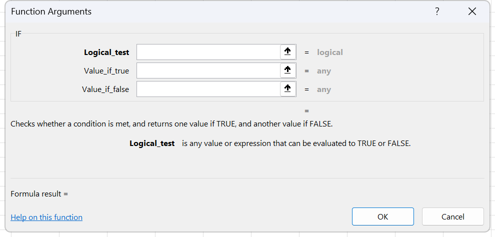

# Exercise 11 · Multi-criteria totals with SUMIFS, COUNTIFS and AVERAGEIFS

Week 8, sessions 15 and 16, where the syllabus opens the plural conditional functions. Exercise 9 already used the single-criterion forms SUMIF, COUNTIF and AVERAGEIF. Every question here needs two or more conditions satisfied at the same time, and that is the whole reason the plural family exists. Hand in the workbook with a formula in each answer cell listed below. A typed number scores nothing, because the grader changes a source value and watches whether the answer moves.

**Objectives** MO-201 3.1.1

The folder name is a trap worth naming out loud. This exercise practises the conditional aggregation family, `SUMIFS`, `COUNTIFS` and `AVERAGEIFS`, whose Spanish names end in `.SI.CONJUNTO`. Exercise 12 practises `IFS`, a logical function whose Spanish name is `SI.CONJUNTO`. Same words in Spanish, different functions, different week. Exercise 9 is the singular family, `SUMIF`, `COUNTIF` and `AVERAGEIF`.

## The data

Two sheets, both small enough to retype.

### Sheet Ex1, delivery orders

Twenty-four orders in `A2:G25`, with the column headers in row 1. The nine questions sit in `N2:N10` and the answers go in `O2:O10`, one per row. Also in [`labs/data/ex11-orders.csv`](data/ex11-orders.csv).

| Order no. | Date | Driver's name | Item | Number of items | Transport | Destination |
|---|---|---|---|--:|---|---|
| 100001 | 2023-02-01 | John May | TV | 25 | truck 4 | Boston |
| 100002 | 2023-02-01 | Peter White | washing machine | 30 | truck 3 | NY |
| 100003 | 2023-02-02 | Carl Nowak | washing machine | 15 | truck 3 | Philadelphia |
| 100004 | 2023-02-03 | Peter White | TV | 32 | truck 4 | NY |
| 100005 | 2023-02-03 | George Ramsay | refrigerator | 25 | truck 3 | Boston |
| 100006 | 2023-02-03 | Carl Nowak | washing machine | 18 | truck 1 | Baltimore |
| 100007 | 2023-02-03 | John May | refrigerator | 15 | truck 2 | Philadelphia |
| 100008 | 2023-02-04 | Carl Nowak | refrigerator | 25 | truck 3 | Baltimore |
| 100009 | 2023-02-04 | Peter White | TV | 30 | truck 1 | Pittsburgh |
| 100010 | 2023-02-04 | George Ramsay | refrigerator | 15 | truck 2 | NY |
| 100011 | 2023-02-04 | Mertl Pavel | microwave | 25 | truck 3 | Philadelphia |
| 100012 | 2023-02-04 | John May | washing machine | 14 | truck 4 | NY |
| 100013 | 2023-02-05 | John May | washing machine | 25 | airplane | Baltimore |
| 100014 | 2023-02-05 | Carl Nowak | TV | 30 | truck 4 | Philadelphia |
| 100015 | 2023-02-05 | George Ramsay | microwave | 15 | truck 3 | Boston |
| 100016 | 2023-02-05 | Peter White | TV | 15 | truck 1 | Pittsburgh |
| 100017 | 2023-02-06 | John May | microwave | 25 | truck 1 | NY |
| 100018 | 2023-02-07 | John May | TV | 30 | truck 4 | Philadelphia |
| 100019 | 2023-02-08 | George Ramsay | washing machine | 13 | truck 3 | Baltimore |
| 100020 | 2023-02-08 | Peter White | refrigerator | 25 | truck 2 | Philadelphia |
| 100021 | 2023-02-08 | Carl Nowak | microwave | 30 | truck 1 | Pittsburgh |
| 100022 | 2023-02-08 | Peter White | washing machine | 15 | airplane | NY |
| 100023 | 2023-02-08 | John May | microwave | 25 | truck 4 | Boston |
| 100024 | 2023-02-09 | George Ramsay | washing machine | 34 | truck 3 | Baltimore |

### Sheet Ex2, branch transactions

Thirty movements in `A4:E33`. The sheet title sits in the merged range `A1:E1` and the column headers are in row 3, which is worth noticing before any range gets selected. A row is either a deposit or a withdrawal, never both, so the other column is empty. The questions are in column G and each answer goes in column H on the same row as its question. The boxes at `H15`, `H16` and `H17` are already bordered, one per month. Also in [`labs/data/ex11-transactions.csv`](data/ex11-transactions.csv).

| Month | Day | Deposit | Withdrawal | Branch |
|---|--:|--:|--:|---|
| Jan | 1 | 5000 |   | Díaz Mirón |
| Jan | 5 |   | 2000 | Bolívar |
| Jan | 7 |   | 1500 | Díaz Mirón |
| Jan | 15 | 4500 |   | Bolívar |
| Jan | 17 |   | 1200 | Díaz Mirón |
| Jan | 20 |   | 1500 | Miguel Alemán |
| Jan | 25 |   | 1000 | Bolívar |
| Jan | 29 |   | 500 | Miguel Alemán |
| Jan | 31 | 7000 |   | Díaz Mirón |
| Jan | 31 |   | 1000 | Cuauhtémoc |
| Feb | 3 |   | 1000 | Bolívar |
| Feb | 6 |   | 1200 | Díaz Mirón |
| Feb | 10 |   | 2500 | Cuauhtémoc |
| Feb | 15 | 5500 |   | Miguel Alemán |
| Feb | 20 |   | 3000 | Díaz Mirón |
| Feb | 25 | 2000 |   | Bolívar |
| Feb | 28 | 5000 |   | Miguel Alemán |
| Mar | 5 |   | 1500 | Cuauhtémoc |
| Mar | 8 |   | 1000 | Díaz Mirón |
| Mar | 14 |   | 2000 | Bolívar |
| Mar | 16 | 5300 |   | Cuauhtémoc |
| Mar | 18 |   | 2000 | Cuauhtémoc |
| Mar | 21 | 1500 |   | Bolívar |
| Mar | 21 |   | 1000 | Díaz Mirón |
| Mar | 23 |   | 1500 | Cuauhtémoc |
| Mar | 25 | 2500 |   | Díaz Mirón |
| Mar | 25 |   | 1000 | Miguel Alemán |
| Mar | 27 |   | 1000 | Bolívar |
| Mar | 29 |   | 1500 | Díaz Mirón |
| Mar | 31 | 6250 |   | Díaz Mirón |

## What to do

### Sheet Ex1

1. `O2`, count the microwave orders delivered to Boston. `COUNTIFS` with one pair on `D2:D25` and one on `G2:G25`.
2. `O3`, count Peter White's trips on truck 1. `COUNTIFS` over the driver column and the transport column.
3. `O4`, count the orders to Boston dated after 3 February 2023. `COUNTIFS`, with the date criterion typed as `">"&DATE(2023,2,3)`. Strictly after, so 3 February itself does not count.
4. `O5`, count the orders placed between 3 and 6 February 2023, both ends included. Two criteria pairs on the same range, `B2:B25`, one `">="&DATE(2023,2,3)` and one `"<="&DATE(2023,2,6)`. The question in `N5` reads 3/Feb/2013 in the source workbook. It is a typing slip for 2023.
5. `O6`, sum the microwaves transported to NY. `SUMIFS`, and watch the argument order.
6. `O7`, sum the items carried to Pittsburgh on truck 1.
7. `O8`, sum the items ordered between 3 and 6 February 2023. Same date pair as task 4, different function.
8. `O9`, sum the items sent to NY, Baltimore and Philadelphia. One `SUMIFS` cannot answer this. Two criteria on the same range are joined with AND, and no order goes to two cities at once, so the plain version returns zero. Either add three `SUMIFS`, or wrap an array constant: `=SUM(SUMIFS(E2:E25,G2:G25,{"NY","Baltimore","Philadelphia"}))`.
9. `O10`, the average number of TVs going to Pittsburgh. `AVERAGEIFS`.
10. Addition, not in the professor's original. In `O12` put the largest single consignment sent to NY with `MAXIFS`, and in `O13` the smallest with `MINIFS`. COBERTURA.md flags these two as the only members of the family with no exercise anywhere in the pack, and week 8 has the room.

### Sheet Ex2

11. `H6`, how many deposits were made in January. `COUNTIFS` on the month column and on `C4:C33` with the criterion `">0"`, which is what excludes the empty cells left by the withdrawal rows.
12. `H8`, how much was deposited in January. `SUMIFS`.
13. `H10`, how much was withdrawn in February from the Díaz Mirón branch. Two criteria pairs, month and branch.
14. `H12`, how much was deposited at the Cuauhtémoc branch during March.
15. `H15`, `H16` and `H17`, the difference between total deposits and total withdrawals for January, February and March. One `SUMIFS` minus another, in a single formula per box.
16. `H19`, how many withdrawals above 1,000 were made between 15 and 30 March. Four criteria pairs: month equal to `Mar`, day `">=15"`, day `"<=30"`, and withdrawal `">1000"`.
17. `H21`, how many withdrawals were made at the Miguel Alemán branch during February and March. Same OR problem as task 8: `=SUM(COUNTIFS(E4:E33,"Miguel Alemán",A4:A33,{"Feb","Mar"},D4:D33,">0"))`, or two `COUNTIFS` added together.

## Exam routes used here

### MO-201 3.1.1, logical and conditional aggregation functions

The graded route never types the function blind. It goes through the Function Library and fills the argument boxes one at a time, because that is the only route that also proves the candidate knows which argument is which.

1. Select the cell that will hold the formula.
2. Go to the **Formulas** tab, **Function Library** group.
3. Click the category gallery that owns the function. The conditional aggregation family is not in a top-level gallery: click **More Functions**, then **Statistical** for `COUNTIFS`, `AVERAGEIFS`, `MAXIFS` and `MINIFS`, and use **Math & Trig** for `SUMIFS`.
4. Click the function name. The **Function Arguments** dialog opens, titled with the function name.
5. Click into the first argument box. Its label is the argument name, and the dialog shows that argument's description under the boxes as you move between them.
6. Type the reference, or click the collapse button at the right of the box and drag the range on the sheet, then click the button again to expand the dialog.
7. Press Tab to move to the next box. Excel evaluates each argument live and shows the value to the right of the box. Watch the **Formula result =** line at the bottom.
8. Click **OK**. The dialog writes the finished formula into the cell.

*The shot is Function Arguments loaded with IF, not with any function on this page, so its three boxes read Logical_test, Value_if_true and Value_if_false; open the same frame on SUMIFS and those three carry Sum_range, Criteria_range1 and Criteria1 instead. Everything here is untouched: the boxes are empty, the grey word beside each one is the argument type rather than a value, and Formula result at the foot is blank. Type into a box and that grey type gives way to the value Excel actually read, which is where a criterion written the wrong way shows itself before the formula reaches the cell.*

The argument boxes, in order, read off the live dialog:

| Function | Boxes, in order |
|---|---|
| SUMIFS | Sum_range, Criteria_range1, Criteria1 |
| COUNTIFS | Criteria_range1, Criteria1 |
| AVERAGEIFS | Average_range, Criteria_range1, Criteria1 |
| MAXIFS | Max_range, Criteria_range1, Criteria1 |
| MINIFS | Min_range, Criteria_range1, Criteria1 |

Note the trap the singular and plural families set. `SUMIF` puts the range to add **last**; `SUMIFS` puts it **first**. Same for `AVERAGEIF` against `AVERAGEIFS`. The dialog is what makes that visible; typing hides it.

**Short route, not graded.** Type the formula straight into the cell and let Formula AutoComplete finish the name, then read the yellow ScreenTip under the cell to know which argument you are on. It is faster, every working analyst does it, and it earns nothing extra, because the exam scores the formula that ends up in the cell and not the typing.

**Shortcut.** `Shift+F3` opens **Insert Function**, from an empty cell or from inside a formula. `Ctrl+A` pressed right after a function name and its opening parenthesis opens the Function Arguments dialog for that function.

**How to check it.** Click into the cell and press `Shift+F3`. If the formula was built cleanly, **Function Arguments** reopens with every box filled and each range in its own box. If the whole formula sits inside the first box, it was typed as text, and a grader that re-parses it will fail the item.

### Typing a date or a comparison as a criterion

The Criteria box takes text, so an operator and a value have to be joined before Excel sees them.

1. Click into the **Criteria** box of the **Function Arguments** dialog.
2. Type the operator inside quotation marks, then `&`, then the value: `">="&DATE(2023,2,3)`.
3. Read the value the dialog prints to the right of the box. It shows the criterion as Excel resolved it, which is where a wrong year shows up before it ever reaches the sheet.
4. Pointing at a cell that holds the date works too, `">="&$P$1`, and it survives the date changing.

Typing `">=03/02/2023"` reads as a date only when the machine's short date order matches, so it fails quietly on a machine set to month first. `DATE(2023,2,3)` never does.

## Checks

Sheet Ex1, cells `O2` to `O10` plus the two additions:

| Cell | Question | Answer |
|---|---|--:|
| O2 | Microwave orders to Boston | 2 |
| O3 | Peter White trips on truck 1 | 2 |
| O4 | Orders to Boston after 3 Feb 2023 | 2 |
| O5 | Orders between 3 and 6 Feb 2023 | 14 |
| O6 | Microwaves sent to NY | 25 |
| O7 | Items to Pittsburgh on truck 1 | 75 |
| O8 | Items ordered 3 to 6 Feb 2023 | 309 |
| O9 | Items to NY, Baltimore and Philadelphia | 386 |
| O10 | Average TVs to Pittsburgh | 22.5 |
| O12 | Largest consignment to NY, MAXIFS | 32 |
| O13 | Smallest consignment to NY, MINIFS | 14 |

Sheet Ex2, column H:

| Cell | Question | Answer |
|---|---|--:|
| H6 | January deposits, count | 3 |
| H8 | January deposits, total | 16,500 |
| H10 | February withdrawals, Díaz Mirón | 4,200 |
| H12 | March deposits, Cuauhtémoc | 5,300 |
| H15 | January, deposits minus withdrawals | 7,800 |
| H16 | February, deposits minus withdrawals | 4,800 |
| H17 | March, deposits minus withdrawals | 3,050 |
| H19 | Withdrawals over 1,000 between 15 and 30 March | 3 |
| H21 | Miguel Alemán withdrawals, February and March | 1 |

Three things to look at beyond the numbers.

- `O9` and `H21` are the two answers a single call cannot produce. If either one returns a number without a `SUM` wrapped around it, or without a second call added to it, the criteria were joined with AND and the answer is wrong even though it looks plausible.
- Change `G16` from Boston to NY. `O2` must drop to 1 and `O6` must rise. Anything that stays still was never a formula.
- `H6` returns 3, not 11. If it returns 11, the count ran on the month column alone and the empty deposit cells were never excluded.
