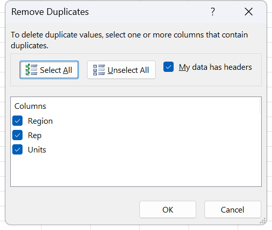
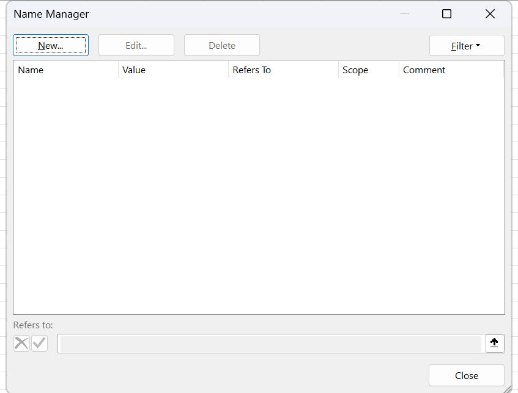
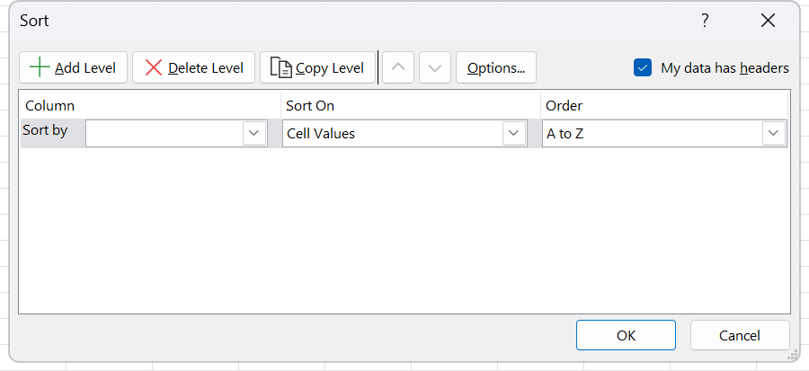

# Exercise 14 · Remove duplicates, import and sort, and data validation

Week 9, sessions 17 and 18, the Data tab week. Four commands, all of them from the same ribbon tab, and all of them destructive or restrictive in a way that rewards reading the dialog before clicking OK. COBERTURA.md points out that the word validation appears zero times in the syllabus and that this exercise already carries all five rule types, custom formula included, so most of that objective gets practised at home. Hand in the workbook with the three deduplicated blocks, the imported and sorted sheet plus its differently sorted copy, six employee rows entered through the validation rules, and the Document Inspector run.

**Objectives** MO-200 1.1.2, MO-200 3.1.3, MO-200 3.3.2, MO-200 1.5.4, MO-201 2.2.5, MO-201 2.2.2

## The data

Three sheets, plus one CSV that gets imported into the second of them.

### Sheet Duplicates

Three blocks on one sheet, each with its instruction in column A and its data starting in column C. The three exist to show that "duplicate" means whatever set of columns you tick, and nothing else.

Block one, `C3:C16`, thirteen names. Also in [`labs/data/ex14-duplicates-a.csv`](data/ex14-duplicates-a.csv).

| Name |
|---|
| José |
| Juan |
| María |
| Ana |
| Carlos |
| Víctor |
| Luis |
| Andrés |
| Enrique |
| Andrea |
| Sergio |
| Laura |
| Laura |

Block two, `C22:D35`, the same thirteen names with a state each. Also in [`labs/data/ex14-duplicates-b.csv`](data/ex14-duplicates-b.csv).

| Name | State |
|---|---|
| José | Arizona |
| Juan | Texas |
| María | New York |
| Ana | Washington |
| Carlos | Georgia |
| Víctor | California |
| Luis | North Carolina |
| Andrés | Oregon |
| Enrique | New York |
| Andrea | Washington |
| Sergio | Delaware |
| Laura | Arkansas |
| Laura | Florida |

Block three, `C39:E52`, name, state and car model. Also in [`labs/data/ex14-duplicates-c.csv`](data/ex14-duplicates-c.csv).

| Name | State | Car model |
|---|---|---|
| José | Arizona | Toyota |
| Juan | Texas | Dodge |
| María | New York | Honda |
| Ana | Washington | BMW |
| Carlos | Georgia | Ford |
| Víctor | California | Lexus |
| Luis | North Carolina | Seat |
| Andrés | Oregon | VW |
| José | New York | Toyota |
| Andrea | Washington | Audi |
| Sergio | Delaware | Mercedes |
| Laura | Arkansas | Mini |
| Laura | Florida | Porsche |

### Sheet Import,Sort

Empty. The data arrives from [`labs/data/ex14-students.csv`](data/ex14-students.csv), 26 rows and 7 columns, students with a country, a city, a university, a course average and an exam mark.

| NAME | LAST NAME | COUNTRY OF ORIGIN | CITY OF ORIGIN | UNIVERSITY OF ORIGIN | AVERAGE | EXAM |
|---|---|---|---|---|--:|--:|
| Iñaki | Erreconerrechea | España | Bilbao | Universidad de Navarra | 9.7 | 8 |
| Björn | Algosson | Suecia | Västerås | Uppsala University | 8.3 | 9.6 |
| Chales Oliver | Jones | Estados Unidos | Little Rock | Stanford University | 8 | 7.7 |
| Francois | Lacroix | Francia | Burdeos | La Sorbonne | 8.2 | 6.5 |
| Hermann | Von Richtofen | Alemania | Stuttgart | Ludwig Maximilians Universität München | 8.8 | 7.1 |
| Kepa | Arrizabalaga | España | Irún | Universitat de Barcelona | 8.2 | 7.9 |
| Mikhail | Yakovlev | Rusia | Novosibirsk | Lomonosov Moscow State University | 9.2 | 9.3 |
| Vittorio | Corleone | Italia | Nápoles | Universitá degli studi di Roma La Sapienza | 7.9 | 8.5 |
| Yitzhac | Rabin | Israel | Haifa | Tel Aviv University | 7.7 | 8.1 |
| Kim | Jong | Corea | Pusan | Seoul National University | 9.5 | 9.9 |
| Yasutaka | Uchiyama | Japón | Hiroshima | University of Tsukuba | 8 | 9.3 |
| Mahaveer | Raghunathan | India | Kolkata | University of Delhi | 9.6 | 6.9 |
| Zhizhen | Zhang | China | Shenyang | Shanghai Jiao Tong University | 9.9 | 8.4 |
| Pamela | Churchill | Inglaterra | Nottingham | University of Oxford | 10 | 10 |
| Roelof | Van der Vyver | Holanda | Almelo | Utrecht University | 8.4 | 7.4 |
| Baratunde | Aubameyang | Gabón | Libreville | Université de Masuku | 8.8 | 7.9 |
| Wade | Winston | Canadá | Saskatoon | University of Saskatchewan | 8.1 | 7.5 |
| Mackenzie | McDonald | Estados Unidos | Jacksonville | University of Florida | 9.5 | 8.5 |
| Joseph | Gordon | Estados Unidos | Biloxi | Johns Hopkins University | 9.3 | 6.9 |
| Joao | Santos | Brasil | Manaus | Universidade de Sao Paulo | 7.8 | 9.4 |
| Lisa | Simpson | Estados Unidos | Springfield | Yale University | 9.6 | 9.6 |
| Thomas | Wilson | Estados Unidos | Brooklyn | Purdue University | 9.5 | 8.9 |
| Angus | Young | Australia | Wagga wagga | University of Melbourne | 8 | 8 |
| Connor | McLeoud | Escocia | Glasgow | University of Edinburgh | 9.8 | 9 |
| Kim | Jong | Corea | Pusan | Seoul National University | 9.5 | 9.9 |
| Francois | Lacroix | Francia | Burdeos | La Sorbonne | 8.2 | 6.5 |

One warning about the original file. The copy that ships in the professor's folder, `Students_data.csv`, is encoded ISO-8859-1, not UTF-8, so `Iñaki`, `España` and `Västerås` arrive broken if **File Origin** is left on UTF-8. Set it to a Western European encoding for that copy. The copy in `labs/data` is UTF-8, so `65001: Unicode (UTF-8)` is the right answer there. Either way the point is the same: the encoding list is not decoration, and this is the file that proves it.

### Sheet Data Validation

Six employees in `A2:A7` and five empty columns beside them. The rules are written on the sheet in `H2:H7` and the department list sits in `I9:I12`. Also in [`labs/data/ex14-employees.csv`](data/ex14-employees.csv), headers plus the six names, every other column blank because the student types the values.

| Column | Header | Rule |
|---|---|---|
| A | Name | Given, six rows |
| B | Employee Number | Exactly 5 characters long |
| C | Salary | Between 6,000 and 20,000 |
| D | Bonus salary | Not more than 10 % of the salary in the same row |
| E | Date of entry | Today only |
| F | Department | One of the four values in `I9:I12` |

The department list, exactly as the workbook holds it: `IT`, `Marketing`, `Logística`, `Administración`.

## What to do

### Sheet Duplicates

1. Block one: remove the duplicates from the name column. Thirteen rows in, twelve out.
2. Block two: remove the whole row wherever the name repeats. Tick the Name column only and leave State unticked, which is what makes the command delete a row whose State is different from the row it kept.
3. Block three: remove rows only where the name and the car model both repeat. Tick Name and Car model, leave State unticked. José appears twice with a Toyota and two different states, so one José goes. Laura appears twice with two different cars, so both Lauras stay.

Copy the sheet before you start. **Remove Duplicates** deletes rows and there is nothing to put back after a save.

### Sheet Import,Sort

4. Import `ex14-students.csv` through **From Text/CSV**. Set the encoding and set **Data Type Detection** deliberately rather than accepting the default.
5. In the Power Query Editor, confirm the first row is being used as the header row.
6. Convert the loaded table back into an ordinary range, so the table style and the filter buttons go away.
7. Sort the range by Country of origin.
8. Make a copy of the worksheet. In the copy, sort on three levels: Last name first, then Country of origin ascending, then Average.

Levels two and three only ever fire on a tie in level one, and this file has exactly two: `Jong` appears twice and `Lacroix` appears twice, because two records are duplicated end to end. That is the only place in the file where the second and third sort levels do any work, so it is the only place worth checking.

### Sheet Data Validation

9. Put a validation rule on each of `B2:B7`, `C2:C7`, `D2:D7`, `E2:E7` and `F2:F7`, one column at a time, matching the table above. Fill the **Input Message** and **Error Alert** tabs for each one before clicking OK, because all three tabs belong to the same objective and the same single operation.
10. Fill the six rows with data. Try one invalid value per column on the way through and read what the error alert says.

The bonus rule is the one that needs a formula. Select `D2:D7`, choose **Custom**, and type `=D2<=C2*0.1`. Write it for the top cell of the selection and Excel shifts it down the rest, exactly as a copied formula shifts.

### Document inspection

11. Run the Document Inspector before handing in, and remove the personal information it finds. Inspecting a workbook is how you find and remove hidden data and personal information stored in the file before sharing it.

## Exam routes used here

### MO-201 2.2.5, remove duplicate records

1. Make a copy of the sheet first. Right-click the sheet tab, click **Move or Copy...**, select **Create a copy**, click **OK**. This command deletes rows and does not put them back after a save.
2. Click one cell inside the list. Excel expands to the whole block.
3. Go to the **Data** tab, **Data Tools** group, and click **Remove Duplicates**.
4. In the **Remove Duplicates** dialog, select **My data has headers** when the first row holds the column names. Watch the **Columns** list as you click it: the entries switch between `Column A, Column B` and the real header names, which is the quickest confirmation the check box is right.
5. Use **Select All** or **Unselect All**, then select only the columns that define a duplicate. Two rows count as duplicates only when every selected column matches. Selecting all columns is the strictest test, selecting one is the loosest, and the task says which.
6. Click **OK**. A message reports how many duplicate values were found and removed and how many unique values remain. Read it before clicking OK, because it is the only record of what happened.
7. Excel deletes the rows and the rows below move up. Nothing is hidden.

*The Columns list is the whole exercise, and the three headers in the shot come from a sample sheet rather than this one. On block two you tick Name alone and lose a row whose State was different; on block three you tick Name and Car model and only one José goes.*

**Short route, not graded.** Sort the column and delete the repeats by eye, or write a `COUNTIF` helper column and filter it. Both reach the same list. Neither is the command the objective names, and the helper column leaves a column behind that the task never asked for.

**How to check it.** Select the block and read the count on the status bar: it dropped by exactly the number the message reported. Then apply **Home** tab, **Styles** group, **Conditional Formatting**, **Highlight Cells Rules**, **Duplicate Values** to the same range. Nothing highlights.

### MO-200 1.1.2, import data from .csv files

1. Click the cell where the data is to land.
2. Go to the **Data** tab, **Get & Transform Data** group, and click **From Text/CSV**.
3. In the browser dialog, select the .csv file and click **Import**.
4. The preview window opens with the file name as its title. Open the **File Origin** list and set the encoding. `65001: Unicode (UTF-8)` is the one that repairs accented characters arriving as mojibake.
5. Open the **Delimiter** list and set the separator: **Comma**, **Semicolon**, **Tab**, **Space**, **Colon**, or **Custom**. Watch the preview grid re-split before moving on.
6. Open the **Data Type Detection** list and choose **Based on first 200 rows**, **Based on entire dataset**, or **Do not detect data types**. Choose **Do not detect data types** whenever the task mentions codes, IDs or postal codes.
7. Click **Transform Data**, which opens the Power Query Editor.
8. In the editor, go to the **Home** tab, **Transform** group, and click **Use First Row as Headers** if the header row is still sitting in the data as `Column1`, `Column2` and so on. (Caption **TO CONFIRM**: this step is not recorded in `procedures.en.md`, which stops at the Transform Data button.)
9. Click **Close & Load** to send the result to the sheet, or the arrow beneath it and **Close & Load To...** to choose where it lands.
10. In the **Import Data** dialog, choose how to view the data (**Table**, **PivotTable Report**, **PivotChart**, or **Only Create Connection**), then under **Where do you want to put the data?** choose **Existing worksheet:** with the reference, or **New worksheet**. Click **OK**.

**Short route, not graded.** Double-click the .csv. It opens as a workbook, one sheet, no query, no encoding choice, and the machine locale decides whether `1,5` is one number or two. **File**, **Open** does the same. Both produce a sheet full of data and neither demonstrates one of the three lists the exam is watching. The third short route is clicking plain **Load** instead of **Load To...**, and it is the one students fall into most: it works, but it drops the table on a new sheet without ever showing that you know where else it could have gone.

**Shortcut.** None. The command has no key assignment. `Alt`, `A`, `F`, `T` reaches it by key tips.

**How to check it.** Go to the **Data** tab and open **Queries & Connections**. A query named after the file must be listed, with a row count under it. Then click inside the imported block: the **Table Design** contextual tab appears, because the From Text/CSV route lands the data as an Excel table by default. If neither the query nor the contextual tab is there, the file was opened, not imported. To check the encoding specifically, look at `Iñaki` in the first data row.

### MO-200 3.1.3, convert tables to cell ranges

1. Click any cell inside the table.
2. Go to the **Table Design** tab, **Tools** group, and click **Convert to Range**.
3. A message box asks whether you want to convert the table to a normal range. Click **Yes**.
4. Confirm what changed: the filter buttons disappear, the **Table Design** tab disappears, and every structured reference in the workbook rewrites itself into ordinary A1 references.
5. Note what did not change: the table style stays behind as direct formatting. The task asks for the table style gone, so clear it with **Home** tab, **Editing** group, **Clear**, **Clear Formats**.

**Short route, not graded.** Turn off the filter buttons, clear the banding check boxes, and call it done. The object is still a table, Name Manager still lists it, structured references still work. Nothing was converted.

**How to check it.** Open **Formulas** tab, **Defined Names** group, **Name Manager**. The table name must be gone.

*Name Manager with nothing in the list. The empty list is the whole check: the table name sat in here for as long as the object was a table, so a list with no rows left in it is the proof that Convert to Range did its work.*

### MO-200 3.3.2, sort data by multiple columns

1. Click any single cell inside the range or table. Do not preselect one column, which is how you tear the rows apart.
2. Go to the **Data** tab, **Sort & Filter** group, and click **Sort**.
3. The **Sort** dialog opens. Select the **My data has headers** check box so the header row stays put and the lists show column names instead of letters.
4. Fill the first level: open the **Sort by** list and pick `LAST NAME`; open the **Sort On** list and pick **Cell Values**; open the **Order** list and pick **A to Z**.
5. Click **Add Level**.
6. Fill the second level the same way, `COUNTRY OF ORIGIN`, **A to Z**. Its first list is labelled **Then by**.
7. Add the third level, `AVERAGE`, **Smallest to Largest**.
8. Use the arrow buttons at the top of the dialog to move a level up or down, because the order of the levels is the priority.
9. Click **Options...** if the task asks for case sensitivity or for left-to-right sorting.
10. Click **OK**.

*One level is showing here. Add Level builds the second and the third, the arrows above decide which level is read first, and My data has headers is what puts column names in the lists instead of letters.*

**Short route, not graded.** Click in the column and use **Home** tab, **Editing** group, **Sort & Filter**, **Sort A to Z**, then repeat on the other columns. Sorting three times in reverse priority order does reach the same arrangement, and it leaves no sort levels behind for the grader to read.

**How to check it.** Reopen the **Sort** dialog. The three levels are still listed, in order.

### MO-201 2.2.2, configure data validation

1. Select the cells that will carry the rule.
2. Go to the **Data** tab, **Data Tools** group, and click **Data Validation**, the top half of the split button, which opens **Data Validation...**.
3. The dialog opens on the **Settings** tab. Open the **Allow** list: **Any value**, **Whole number**, **Decimal**, **List**, **Date**, **Time**, **Text length**, **Custom**.
4. Choose the type. A **Data** list appears with **between**, **not between**, **equal to**, **not equal to**, **greater than**, **less than**, **greater than or equal to**, **less than or equal to**. Fill the boxes it produces: **Minimum** and **Maximum**, or **Start date** and **End date**, or **Length**.
5. For **List**, type the entries in the **Source** box separated by commas, or click the collapse button at the right of the box and select `$I$9:$I$12` on the sheet, or type `=` followed by a defined name. Keep the **In-cell dropdown** check box selected or there is no list to pick from.
6. For **Custom**, type a formula in the **Formula** box that returns TRUE for what is allowed. Write it for the top left cell of the selection and Excel shifts it across the rest, exactly as a copied formula shifts. Here that is `=D2<=C2*0.1`.
7. Leave **Ignore blank** selected unless empty cells must be rejected too.
8. WITHOUT closing the dialog, go to the **Input Message** tab. Keep **Show input message when cell is selected**. Type a **Title** and an **Input message**.
9. WITHOUT closing the dialog, go to the **Error Alert** tab. Keep **Show error alert after invalid data is entered**. Open the **Style** list and pick **Stop**, **Warning** or **Information**. Stop refuses the entry, Warning asks, Information only tells. Type a **Title** and an **Error message**.
10. Click **OK**. Three tabs were configured in one operation, which is the point of the objective.
11. To push a change onto every cell that already shares the rule, reopen the dialog on one of them and select **Apply these changes to all other cells with the same settings** on the Settings tab before clicking OK.
12. To expose values typed before the rule existed, go to the **Data** tab, **Data Tools** group, click the **Data Validation** arrow, and click **Circle Invalid Data**. Red ovals appear around every offender. Clear them with **Clear Validation Circles** on the same menu.
13. To remove a rule, select the cells, open the dialog and click **Clear All**, then **OK**.

*The dialog opens on Settings with Allow reading Any value, the state each of the five rules starts from. The other two tabs across the top belong to the same operation, which is why the input message and the error alert are filled in before OK is ever clicked.*

The five rules on this sheet map to the **Allow** list like this:

| Column | Allow | Data | Boxes |
|---|---|---|---|
| B, Employee Number | Text length | equal to | Length `5` |
| C, Salary | Whole number | between | Minimum `6000`, Maximum `20000` |
| D, Bonus salary | Custom | none | Formula `=D2<=C2*0.1` |
| E, Date of entry | Date | equal to | Start date `=TODAY()` |
| F, Department | List | none | Source `=$I$9:$I$12` |

**Short route, not graded.** Type the allowed values into a spare column and tell people to copy from it. Or add a conditional format that turns bad entries red. Both communicate the rule and neither stops anyone typing whatever they like, so nothing is validated and nothing is graded.

**Shortcut.** `Alt+Down Arrow` opens the in-cell dropdown once the rule exists, which is the shortcut the exam actually rewards when it asks you to enter a value from the list. The dialog itself is reached with the key tips `Alt`, `A`, `V`, `V`, **TO CONFIRM** on the lab build.

**How to check it.** Select a validated cell: the dropdown arrow appears if In-cell dropdown was kept, the input message balloon appears if the Input Message tab was filled, and typing an invalid value raises the titled box with the icon that matches the Style you chose. Go to **Home** tab, **Editing** group, **Find & Select**, **Data Validation** to select every cell carrying any rule.

### MO-200 1.5.4, inspect workbooks for issues

Three tools sit behind this objective. This exercise uses the first one.

1. Go to the **File** tab and click **Info**.
2. Click **Check for Issues**.
3. Click **Inspect Document**. Save the file first if prompted, because the removals cannot be undone.
4. In the **Document Inspector** dialog, tick only the categories the task names and untick the rest: **Comments and Notes**; **Document Properties and Personal Information**; **Data Model**; **Content Add-ins**; **Task Pane Add-ins**; **PivotTables, PivotCharts, Cube Formulas, Slicers, and Timelines**; **Custom XML Data**; **Headers and Footers**; **Hidden Rows and Columns**; **Hidden Worksheets**; **Invisible Content**. (Category wording: **TO CONFIRM** against the open dialog. The set is stable across recent builds but the object model does not expose the strings.)
5. Click **Inspect**.
6. Read the results. Each section that found something offers a **Remove All** button. Click it only for the sections the task names, because removal is permanent.
7. Click **Reinspect** to confirm, then **Close**.

**Short route, not graded.** Delete comments by hand, unhide sheets by hand, and clear the Author field in the Properties panel. All three reach the same end state for the items you happened to notice, which is the problem: the objective is about finding what you did not notice.

**Shortcut.** `Alt+F`, `I` reaches the Info pane. None of the dialogs has a Ctrl combination.

**How to check it.** Run **Inspect Document** a second time. Any category you removed must come back clean, and any you left alone must still report its count, which is the proof that only the named categories were touched.

## Checks

### Sheet Duplicates

All three blocks end with twelve rows, and each one gets there a different way.

| Block | Range | Columns ticked | Rows removed | Which |
|---|---|---|--:|---|
| One | `C3:C16` | Name | 1 | The second Laura |
| Two | `C22:D35` | Name only | 1 | Laura / Florida, because Laura / Arkansas came first |
| Three | `C39:E52` | Name and Car model | 1 | José / New York / Toyota |

The message box reports "1 duplicate value found and removed; 12 unique values remain" each time. Block three is the one that proves the point: if all three columns were ticked, nothing is removed at all, because José's two rows differ on State.

### Sheet Import,Sort

Twenty-six rows and seven columns land on the sheet. `Iñaki`, `España`, `Västerås` and `Ludwig Maximilians Universität München` must all read correctly; anything that shows `ñ` or `ä` means the encoding was left wrong.

Sorted by Country of origin, ascending, the first row is Hermann Von Richtofen of Alemania and the last is Björn Algosson of Suecia. Estados Unidos holds five rows in the middle, España and Corea and Francia two each.

On the copy, sorted by Last name then Country then Average, the first row is Algosson and the last is Zhang. Look at the two `Jong` rows and the two `Lacroix` rows: they are identical end to end, so the second and third levels cannot separate them. Nothing else in the file ties.

### Sheet Data Validation

Six rows filled, and each rule refuses at least one thing:

- `B2`: `1234` is refused, `12345` is accepted, `ABCDE` is accepted too, because the rule counts characters and does not care what they are.
- `C2`: `5999` is refused, `6000` is accepted, `20001` is refused.
- `D2`: with a salary of 10,000 in `C2`, a bonus of `1000` is accepted and `1001` is refused. Change `C2` to 8,000 and the same `1000` becomes invalid, which is what a Custom rule buys over a fixed range.
- `E2`: today's date is accepted, yesterday's is refused, and the rule keeps moving because it is built on `=TODAY()`.
- `F2`: the dropdown arrow appears and offers four values. Typing `Ventas` is refused.

Select any validated cell and press `Ctrl+1`. The cell's own formatting is untouched, which proves the restriction is a rule and not a note somebody typed in the margin.

### Whole workbook

Run **Inspect Document** twice. The second run reports the categories you removed as clean. If Document Properties still names an author, **Remove All** was never clicked on that section.
