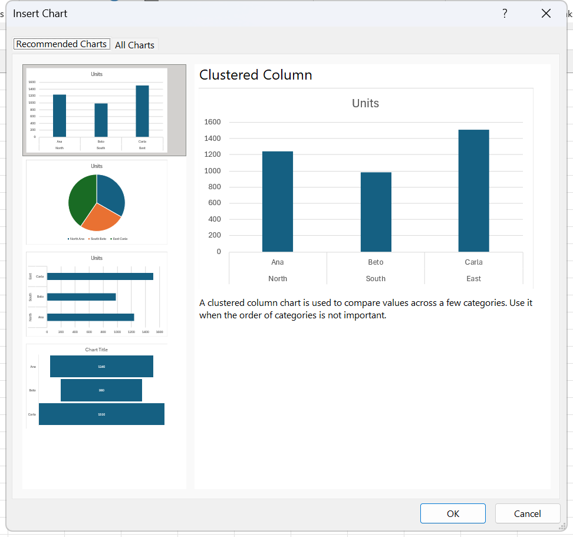

# Exercise 17 · Charts, twenty of them

A bookshop and ice cream company called La Alegría keeps five unrelated sheets of data and wants each of them seen rather than read. The exercise walks twenty numbered chart builds plus a stock chart, from a pie through to a filled map, and it is the widest chart practice in the whole pack. It lands in week 10, session 20, and it pays for itself again in week 11, session 21, where the syllabus asks students to criticise chart types and say when each one fits; every advanced type that session names has already been built here. Hand in one workbook with the charts sitting on the sheets that feed them.

**Objectives** MO-200 5.1.1, 5.2.3, 5.3.1, 5.3.2, MO-201 4.1.1, 4.1.2

## The data

Source workbook `Excel 17_Charts.xlsx`. Five sheets, none of them longer than eighteen rows, all of them small enough to retype. No formulas are supplied except one SUM, and no charts: the file ships empty of charts and every one of them is yours to build.

### Classification

[data/ex17-classification.csv](data/ex17-classification.csv), 5 rows. Book sales by genre for the first quarter.

| Genre | January | February | March |
|---|---|---|---|
| Classics | 18580 | 49225 | 16326 |
| Mistery | 78970 | 82262 | 48640 |
| Romance | 24236 | 131390 | 79022 |
| Sci-Fi | 16730 | 19730 | 12109 |
| Young readers | 35358 | 42685 | 20893 |

### Weekly sales

[data/ex17-weekly-sales.csv](data/ex17-weekly-sales.csv), 18 rows. Income by month, branch and genre. The blanks in the first two columns are deliberate: a hierarchy chart wants the parent level named once and left empty on the rows underneath.

| Month | Branch | Type | Income |
|---|---|---|---|
| January | A | Classics | 7942 |
| | | Mistery | 8666 |
| | | Romance | 7098 |
| | B | Classics | 9688 |
| | | Sci-Fi | 8085 |
| | | Young readers | 6459 |
| | C | Classics | 7731 |
| | | Mistery | 8353 |
| | | Romance | 9808 |
| February | A | Classics | 5843 |
| | | Sci-Fi | 7529 |
| | | Young readers | 6048 |
| | B | Classics | 9425 |
| | | Sci-Fi | 9994 |
| | | Young readers | 8148 |
| | C | Classics | 5635 |
| | | Mistery | 9625 |
| | | Romance | 9470 |

### Results

[data/ex17-results.csv](data/ex17-results.csv), 6 rows. Three revenue lines and three cost lines, costs entered as negative numbers so that they subtract.

| Concept | Amount |
|---|---|
| Classics | 39841 |
| Mistery | 3498 |
| Romance | 3312 |
| Direct costs | -13095 |
| Fixed Costs | -15834 |
| Taxes | -10181 |

A seventh row, Total profit, is not in the CSV because it is `=SUM(B2:B7)` and you write it. Its value is 7541.

### Stock Market

[data/ex17-stock-market.csv](data/ex17-stock-market.csv), 10 rows. Ten trading days of the company's own share, in the volume, open, high, low, close order that the Stock chart family expects.

| Day | Volume | Open | Max | Low | Close |
|---|---|---|---|---|---|
| I-Apr | 423454 | 12.12 | 12.89 | 12 | 12.18 |
| 2-Apr | 534535 | 13.12 | 13.55 | 12.98 | 13.2 |
| 3-Apr | 464255 | 11.16 | 12.04 | 11.11 | 11.3 |
| 4-Apr | 462163 | 17.12 | 17.12 | 17.06 | 17.1 |
| 5-Apr | 724552 | 16.24 | 16.25 | 15.95 | 16.24 |
| 6-Apr | 452426 | 20.28 | 20.28 | 19.35 | 20.28 |
| 7-Apr | 623562 | 14.12 | 14.53 | 13.75 | 14.2 |
| 8-Apr | 245621 | 10.89 | 12.36 | 10.85 | 11.3 |
| 9-Apr | 631531 | 20.1 | 20.1 | 18.69 | 20.04 |
| IO-Apr | 222455 | 12.11 | 13.65 | 11.94 | 12.3 |

### Sales by State

[data/ex17-sales-by-state.csv](data/ex17-sales-by-state.csv), 12 rows. Average temperature against ice cream and book sales for twelve Mexican states.

| State | Temperature | Ice Cream | Books |
|---|---|---|---|
| Aguascalientes | 14.2 | 215 | 948 |
| Baja California | 16.4 | 325 | 835 |
| BajaCalifornia Sur | 11.9 | 185 | 835 |
| Campeche | 15.2 | 332 | 810 |
| Coahuila | 18.5 | 406 | 600 |
| Colima | 22.1 | 522 | 847 |
| Chiapas | 19.4 | 412 | 728 |
| Chihuahua | 25.1 | 614 | 840 |
| Ciudadde México | 23.4 | 544 | 905 |
| Durango | 18.1 | 421 | 703 |
| Guanajuato | 22.6 | 445 | 830 |
| Guerrero | 17.2 | 408 | 565 |

## Which chart for which job

The instruction sheet opens with a reference table, and it is the part of the exercise worth keeping after the charts are drawn. Reproduced here with the four blank cells of the original filled in from the row above them.

| Chart type | Suitable for |
|---|---|
| Pie, or circular | Seeing the ratio, the relative frequency, among a few items |
| Clustered columns | Several categories, or one category tracked at discrete intervals |
| Stacked columns | Several series that add up to a whole, when the total is what matters |
| 100% stacked columns | Two or more series whose contribution to the total is the point, especially when the total is the same for each category |
| Clustered bars | The same as columns, horizontally. Better when there are many categories |
| Stacked bars | The stacked column read horizontally |
| 100% stacked bars | The 100% stacked column read horizontally |
| Lines | The path of one or more variables, continuous data over time |
| Stacked lines | The line chart with the series stacked on each other |
| 100% stacked lines | The stacked line chart scaled so every point sums to 100 per cent |
| Areas | The same reading as Lines, with the space under the line filled |
| Treemap | The ratio between many items |
| Sunburst | Hierarchical data. One ring per level, the innermost ring the top of the hierarchy. With a single level it is a doughnut |
| Histogram | A frequency distribution |
| Pareto | A cumulative frequency distribution |
| Box and whisker | The spread of the data in quartiles |
| Scatter | The degree of correlation between two variables on a Cartesian plane |
| Bubbles | A scatter plot with a third dimension carried in the size of the point |
| Waterfall | A running total as values are added and subtracted, so an opening figure can be traced to a closing one |
| Funnel | Values through the phases of a process, normally falling, so the bars narrow |
| Stock | Financial data with up to four values per point: high, low, open, close |
| Surface | The optimal combination between two datasets. Like a topographic map, colour marks the bands |
| Radar | Comparing entities across a set of attributes |
| Combo | Fields whose magnitudes differ so widely that one axis cannot hold both |
| Map | Geographic regions compared against each other |

## What to do

### On the Classification sheet

1. A pie chart of the book distribution in January. Call it Chart 1.
2. A clustered column chart. Chart 2.
3. A stacked column chart. Chart 3.
4. A 100% stacked column chart. Chart 4.
5. Reproduce charts 2 to 4 as bars: clustered bars, stacked bars, 100% stacked bars.
6. Reproduce charts 2 to 4 as lines: lines, stacked lines, 100% stacked lines.
7. Reproduce charts 2 to 4 as areas: areas, stacked areas, 100% stacked areas.
8. Change Chart 1 into a treemap.

Steps 5 to 8 are conversions, so the route is **Change Chart Type**, not a new chart. Copy the chart first if you want to keep the earlier version beside it.

### On the Weekly sales sheet

9. A sunburst chart. Select all four columns. The blanks in Month and Branch are what tell Excel where one ring ends and the next begins.
10. A histogram of Income.
11. Turn it into a Pareto. Pareto is a subtype inside the Histogram category, not a separate family.
12. Show the same data as a box and whisker chart.

### On the Results sheet

13. Write the total in the row under Taxes as `=SUM(B2:B7)`.
14. A waterfall chart over the seven rows.
15. Mark the total column as a total so it drops to the baseline, then adjust the chart into a funnel.

### On the Stock Market sheet

16. A stock chart from the price data. The company is listed and this sheet is its share price. Volume, Open, Max, Low and Close in that column order is what the Volume-Open-High-Low-Close subtype expects.

### On the Sales by State sheet

17. A scatter chart of ice cream sales against temperature.
18. Turn it into a bubble chart.
19. A surface chart over ice cream and book sales.
20. A radar chart of ice cream and book sales by state.
21. A combo chart that shows temperature and ice cream sales together, with temperature on a secondary axis.
22. A filled map of temperature by state.

Colour, layout and style are yours throughout. Give every chart a title that says what it shows.

## Exam routes used here

**5.1.1 Create charts.** Select the source data including the header row and the category column; for non-adjacent columns select the first block, hold `Ctrl` and select the second. **Insert** tab, **Charts** group, click the **dialog box launcher**, the small arrow at the bottom right corner of the group. The **Insert Chart** dialog opens with two tabs, **Recommended Charts** and **All Charts**. Click **All Charts**. In the list on the left pick the family: **Column**, **Bar**, **Line**, **Pie**, **Doughnut**, **Area**, **X Y (Scatter)**, **Map**, **Stock**, **Surface**, **Radar**, **Treemap**, **Sunburst**, **Histogram**, **Box & Whisker**, **Waterfall**, **Funnel**, **Combo**. Along the top of the right pane click the subtype icon and read its tooltip. Check the preview underneath, which draws with your real data. Click **OK**. `Alt+F1` makes a default chart on the same sheet and never lets you compare subtypes, which is the whole point when the task names one.

*Insert Chart opens on Recommended Charts, as it has here, with All Charts as the tab beside it. The preview on the right draws with the real data, which is what makes it worth comparing subtypes here rather than pressing `Alt+F1`.*

**Expert 4.1.2 Create and modify charts including Box & Whisker, Combo, Funnel, Histogram, Map, Sunburst, and Waterfall.** Select the data with headers. Sunburst and Treemap want one column per hierarchy level, outermost level last, with blanks where a level does not apply. Funnel wants a single series already sorted largest to smallest. **Insert** tab, **Charts** group, then the gallery that owns the type: **Insert Statistic Chart** for Histogram, Pareto and Box and Whisker; **Insert Hierarchy Chart** for Treemap and Sunburst; the Waterfall, Funnel, Stock, Surface and Radar gallery for Waterfall and Funnel (**TO CONFIRM** the full button caption); **Insert Combo Chart** for Combo; **Maps**, then **Filled Map**, for Map. The dialog route reaches all of them and is safer when the subtype is hard to find in a gallery. Three type-specific settings the exam asks for: histogram bins are set by clicking the horizontal axis, pressing `Ctrl+1`, and choosing **By Category**, **Automatic**, **Bin width** or **Number of bins** in the **Format Axis** pane under **Axis Options**; a waterfall total is set by clicking the series once to select all columns, clicking the single column again to select it alone, right-clicking it and clicking **Set as Total**, which drops it to the baseline; Pareto is a subtype of Histogram and adds its cumulative line and secondary axis on its own.

**Change Chart Type.** Click the chart once. **Chart Design** tab, **Type** group, **Change Chart Type...**, **All Charts** tab, pick the new category and subtype, **OK**. This is the route for steps 5 to 8 and 11 and 18, where an existing chart has to become another type rather than a second chart being drawn.

**Expert 4.1.1 Create and modify dual axis charts.** For step 21. Select the range holding both series with their headers. **Insert** tab, **Charts** group, **Insert Combo Chart**, and at the bottom of the gallery click **Create Custom Combo Chart...**. The **Insert Chart** dialog opens on **All Charts** with **Combo** already selected. Under "Choose the chart type and axis for your data series", find the row for the temperature series, open its **Chart Type** list and pick **Line** or **Line with Markers**, and in the same row select the **Secondary Axis** check box. Both changes before the dialog closes, in one operation. Click **OK**. Label the second axis from **Chart Design** > **Chart Layouts** > **Add Chart Element** > **Axis Titles** > **Secondary Vertical**. To move a series that already exists onto the secondary axis, go to the **Format** tab, **Current Selection** group, open the **Chart Elements** list, choose the series by name, click **Format Selection**, and in **Format Data Series** > **Series Options** > **Plot Series On** select **Secondary Axis**.

**5.2.3 Add and modify chart elements.** Click the chart border to select the whole chart. **Chart Design** tab, **Chart Layouts** group, **Add Chart Element**. Point at the element: **Axes**, **Axis Titles**, **Chart Title**, **Data Labels**, **Data Table**, **Error Bars**, **Gridlines**, **Legend**, **Lines**, **Trendline**, **Up/Down Bars**, with availability depending on the chart type. Click the position in the submenu, not just the element name. Chart Title offers **Above Chart** and **Centered Overlay**; Legend offers **Right**, **Top**, **Left**, **Bottom**; Data Labels offers **Center**, **Inside End**, **Inside Base**, **Outside End**, **Data Callout**; Axis Titles offers **Primary Horizontal** and **Primary Vertical**; **None** removes the element. To set the text, click the element once to select it, click again to put the cursor in it, and type. To tie the title to a cell instead, select it, type `=` in the formula bar, click the cell, press `Enter`. The floating plus sign at the top right of a selected chart reaches the same elements and never reaches the position submenu.

**5.3.1 Apply chart layouts.** Click the chart border. **Chart Design** tab, **Chart Layouts** group, **Quick Layout**. The gallery holds the layouts available for that chart type, numbered from **Layout 1** upward; point at each for the number and the live preview. Click the one the task names. A layout is a package: it can add a data table, move the legend, drop the gridlines or add placeholder axis titles, and it overwrites element positions set by hand earlier. Apply the layout first, then edit individual elements.

**5.3.2 Apply chart styles.** Click the chart border. **Chart Design** tab, **Chart Styles** group, click the **More** arrow at the bottom right to open the whole set. Tooltips read **Style 1**, **Style 2** and so on. Click the one the task names. For the colours, stay in the same group and click **Change Colors**, then pick a row from **Colorful** or **Monochromatic**; that is a separate graded action from the style. If hand formatting is fighting the style, select the element and use **Format** tab, **Current Selection** group, **Reset to Match Style**.

## Checks

- Every chart is on the sheet that holds its data, and clicking one brings up the **Chart Design** and **Format** contextual tabs.
- For any chart, **Chart Design** > **Data** > **Select Data** shows a **Chart data range** that matches the block the task named. **Change Chart Type** shows the right category highlighted and the right subtype selected.
- The pie and the treemap use January only, one series. The column, bar, line and area charts use all three months, three series.
- The 100% stacked variants run their value axis from 0 to 100 per cent, and every column reaches the top. If the tallest column stops short, the plain stacked subtype was picked.
- The sunburst shows one ring per source column, three rings deep, month in the middle.
- The histogram shows bin ranges on the category axis, not the original labels. The Pareto adds a cumulative line and a second axis on the right.
- The waterfall shows Total profit anchored to zero, not floating. If it floats, **Set as Total** was not applied.
- The scatter puts temperature on the horizontal axis and ice cream on the vertical, and the points trend upward. The bubble version carries a third series in the point sizes.
- The combo chart shows two value axes with different scales. Select the temperature series, click **Format Selection**, and **Plot Series On** reads **Secondary Axis**.
- The map resolves twelve states and shades them by temperature. It needs an internet connection, because Excel resolves the place names through Bing.

## Known problems in the source

- The genre is spelled `Mistery` on both the Classification sheet and the Results sheet. It is Mystery.
- Two labels on the Stock Market sheet were scanned rather than typed: `I-Apr` is 1 April with a capital i, and `IO-Apr` is 10 April with a capital i and a capital o. Both sort as text, which puts them in the wrong place on the category axis. Fix them before charting.
- Two state names on Sales by State are missing a space, `BajaCalifornia Sur` and `Ciudadde México`. The filled map will not resolve either of them until they are fixed.
- The Results sheet has a header in A1 that reads `Amount`, sitting over the concept names rather than over the numbers. Column B has no header at all.
- The instruction sheet spells the chart type `Suburst`. The gallery entry is Sunburst.
- The reference table leaves four cells empty, under Stacked bars, 100% stacked bars, Stacked lines and 100% stacked lines. The version above fills them from the row each one belongs to.
- COBERTURA flags this exercise for what it does not ask. Session 20 of the syllabus names three things that never appear here: putting a chart on its own chart sheet, objective 5.1.2; switching rows and columns in the source data, objective 5.2.2; and adding alternative text to a chart, objective 5.3.3. Twenty charts and not one of them exercises those three. They need a task written for them, or a demonstration in class on top of this file.
