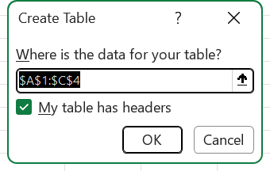
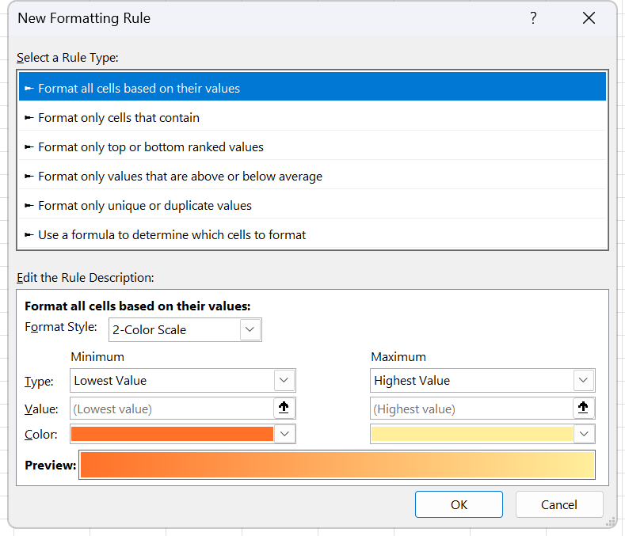
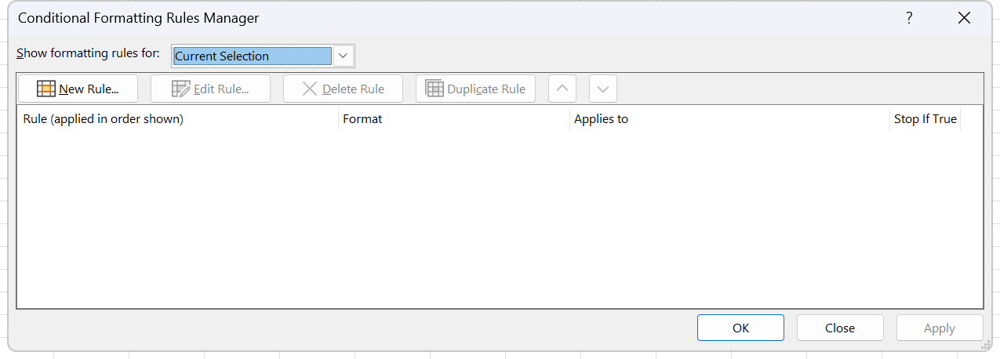

# Exercise 19 · VLOOKUP inside a payroll model

Ten salespeople, three reference tables, and nineteen columns of which fourteen are yours to build. This is the first exercise where a lookup is not the answer but a step: the base salary and the sales goal come out of a table with an exact VLOOKUP, the bonus band and the seniority band come out of two more tables with an approximate one, and everything downstream is arithmetic, date maths and two compound conditions. It is set as homework in week 12, session 24, the half session that opens VLOOKUP after the second midterm, and collected in week 13. Hand in the workbook with all three reference tables formatted as tables, the report formatted as a table, and every one of the fourteen calculated columns filled.

**Objectives** MO-200 2.2.5, 2.4.2, 3.1.1, 3.1.2, MO-201 2.3.1, 3.1.1, 3.2.1, 3.3.1

## The data

Source workbook `Excel 19 (BuscarV).xlsx`, two sheets. The `Table` sheet holds three reference tables stacked in column A with blank rows between them. The `Report` sheet holds the ten salespeople and the empty columns.

### Bonus for sales above goal

[data/ex19-bonus-above-goal.csv](data/ex19-bonus-above-goal.csv), 4 rows. At A1:B5 on the `Table` sheet. The instruction sheet calls the three reference tables A, B and C, in the order they appear down the sheet, so this one is Table A.

| Band | % on difference |
|---|---|
| Up to 5% above goal | 0.005 |
| Up to 10% above goal | 0.01 |
| Up to 15% above goal | 0.015 |
| More than 15% above goal | 0.02 |

### Seniority bonus

[data/ex19-seniority-bonus.csv](data/ex19-seniority-bonus.csv), 5 rows. At A7:B12. Table B.

| Band | Bonus |
|---|---|
| Less than 5 years | Zero |
| From 5 to 9 years | 1/4 monthly salary |
| From 10 to 14 years | 1/2 monthly salary |
| From 15 to 20 years | 3/4 monthly salary |
| More than 20 years | 1 monthly salary |

### Vendor type

[data/ex19-vendor-type.csv](data/ex19-vendor-type.csv), 4 rows. At A14:C18. Table C, and the only one of the three that a VLOOKUP can read as it stands.

| Vendor type | Base salary | Sales goal |
|---|---|---|
| A | 50000 | 20000000 |
| B | 40000 | 15000000 |
| C | 30000 | 10000000 |
| D | 20000 | 5000000 |

### Report

[data/ex19-report.csv](data/ex19-report.csv), 10 rows. The five columns that are given. The header row sits on row 2, the data on rows 3 to 12.

| NUMBER | EMPLOYEE | ENTRANCE DATE | TYPE OF SALESPERSON | AMOUNT SOLD |
|---|---|---|---|---|
| 1 | Javier López | 1990-01-01 | A | 22000000 |
| 2 | Alejandra Guzmán | 2004-06-01 | B | 16000000 |
| 3 | Bruno Díaz | 1998-03-01 | A | 19500000 |
| 4 | Ricardo Tapia | 2012-09-01 | C | 11500000 |
| 5 | Jorge Negrete | 2017-10-01 | D | 8000000 |
| 6 | Juan Camaney | 2014-08-01 | C | 10500000 |
| 7 | María Félix | 2016-02-01 | D | 4500000 |
| 8 | Diego Luna | 2007-11-01 | B | 16500000 |
| 9 | Andrea Legarreta | 2018-07-01 | D | 2000000 |
| 10 | Amauri Pérez | 2019-03-01 | D | 10500000 |

Two loose numbers sit above the header row and neither of them is labelled. `I1` holds `0.02`, the sales commission rate. `N1` holds `43985`, which is 3 June 2020 and is the date seniority is counted to. Label them both before you use them.

The fourteen columns you build, F to S:

| Column | Header | What it is |
|---|---|---|
| F | BASE SALARY (MONTHLY) | From Table C, by type of salesperson |
| G | BASE SALARY (ANNUAL) | F times twelve |
| H | SALES GOAL | From Table C, by type of salesperson |
| I | SALES COMISSION | Amount sold times the rate in `$I$1` |
| J | DIFFERENCE ($) | Amount sold minus sales goal |
| K | DIFFERENCE (%) | J over the sales goal |
| L | BONUS ABOVE GOAL (%) | From Table A, by the percentage in K |
| M | BONUS ABOVE GOAL ($) | J times L |
| N | NO. YEARS | Years from the entrance date to `$N$1` |
| O | SENIORITY BONUS | From Table B, by the years in N, times the monthly base salary |
| P | TOTAL (ANNUAL) | G plus I plus M plus O |
| Q | NET MONTHLY INCOME | P over twelve |
| R | AWARD WINNER | Yes when K is over 5% and N is over 10 |
| S | THANK YOU LETTER | Yes when the amount sold is over ten million or N is over 15 |

## What to do

1. Format all three reference tables on the `Table` sheet as Excel tables, one table each, and format the report on the `Report` sheet as a table. Routes 3.1.1 and 3.1.2. Give each one a name that says what it holds, because the lookups read better with names than with addresses.
2. Apply the right number format to every column. Route 2.2.5. Entrance date is stored as a serial number and shows as five digits until it is formatted as **Short Date**. Money goes to Currency or Accounting, and the two percentage columns to Percentage. `N1` is a date and shows as `43985` until you format it.
3. Rebuild Table A so an approximate VLOOKUP can read it. The bands are written as sentences, and an approximate lookup needs a first column of numbers sorted ascending. Add a column holding the lower bound of each band, `0`, `0.05`, `0.1`, `0.15`, and put the percentage beside it. Do the same to Table B, whose lower bounds are `0`, `5`, `10`, `15`, `20`, and whose bonus values become the multipliers `0`, `0.25`, `0.5`, `0.75`, `1`.
4. Column F, the monthly base salary, with an exact VLOOKUP against Table C. Route Expert 3.2.1. Lock the table array with `F4`.
5. Column G, the annual base salary, from F.
6. Column H, the sales goal, also from Table C. Same lookup, different column index.
7. Columns I and J, the sales commission and the difference in pesos. The commission rate is in `I1`, so the reference has to be absolute, `$I$1`, or it walks down the column as the formula fills.
8. Column K, the difference as a percentage of the goal.
9. Apply conditional formatting to column K: red where it is below 0%, green where it is above 50%. Route 2.4.2 for the presets, Expert 2.3.1 if the colours the task wants are not in the **with** list.
10. Column L, the bonus percentage, with an approximate VLOOKUP against your rebuilt Table A. Three salespeople sold less than their goal, so K is negative for them and the lookup has nowhere to land. Decide what a below-goal bonus is, wrap the lookup so it returns that, and say in a comment what you decided.
11. Column M, the bonus in pesos. The header of Table A reads "% on difference", so the percentage applies to column J, not to the amount sold.
12. Column N, seniority in years, counted from the entrance date to the date in `$N$1`. Route Expert 3.3.1 for the date function, and `=INT(YEARFRAC(C3,$N$1))` for the whole years.
13. Column O, the seniority bonus: the multiplier from your rebuilt Table B, times the monthly base salary in column F.
14. Columns P and Q, the annual total and the net monthly income.
15. Column R, the award. Yes when the percentage above goal is greater than 5% **and** the salesperson has more than ten years of service. Route Expert 3.1.1, an IF with an AND nested in its first argument.
16. Column S, the thank you letter. Yes when the amount sold is greater than ten million **or** the salesperson has more than fifteen years of service. Same route with OR.

## Exam routes used here

**Expert 3.2.1 Look up data by using the VLOOKUP(), HLOOKUP(), MATCH(), and INDEX() functions.** Select the cell. **Formulas** tab, **Function Library** group, **Lookup & Reference**, then **VLOOKUP**. In **Lookup_value** put the cell holding the key and leave it relative, because the formula fills down. In **Table_array** select the whole reference table including its first column, then press `F4` to lock it to `$A$15:$C$18`. This is the step candidates lose the item on: a relative table array walks down the sheet as the formula fills. In **Col_index_num** type the column number counted from the first column of Table_array, not from column A of the sheet, so the sales goal in Table C is 3 and not 8. In **Range_lookup** type `FALSE` for an exact match or `TRUE` for the banded approximate one. Leaving the box empty is not the same as FALSE; empty means TRUE. Click **OK**. The approximate form needs the first column sorted ascending, and it returns the row whose key is the largest one not greater than the lookup value, which is why the band tables have to be rewritten as numbers first.

**Expert 3.1.1 Perform logical operations by using nested functions.** The graded route builds the nest through the dialog. **Formulas** tab, **Function Library** group, **Logical**, **IF**. The **Function Arguments** dialog opens with **Logical_test**, **Value_if_true**, **Value_if_false**. Click into **Logical_test** and leave it empty. Look at the **Name Box** at the left end of the formula bar: while a Function Arguments dialog is open it stops showing the cell reference and becomes a function drop-down. Open it and pick **AND**, or **More Functions...** to reach **Insert Function**. The IF dialog is replaced by AND's own, with **Logical1**, **Logical2** and so on. Fill them, then click the word `IF` in the formula bar to come back out; the outer dialog returns with the nested call in place. Fill **Value_if_true** and **Value_if_false**. Click **OK** once, at the outer level. One OK commits the whole nest. Afterwards, click the cell and press `Shift+F3`: if the formula was built cleanly, Function Arguments reopens on IF with every box filled, and if the whole formula is sitting inside the first box it was typed as text.

*The three boxes columns R and S are built through, shown empty as the dialog first opens. The grey words to the right of them are the argument types IF expects, and each turns into the live value of that box once something is typed in.*

**Expert 3.3.1 Reference date and time.** **Formulas** tab, **Function Library** group, **Date & Time**. `TODAY` and `NOW` open a Function Arguments dialog with no argument boxes at all, because neither takes any. This exercise counts to the date in `$N$1` rather than to today, so the seniority formula is `=INT(YEARFRAC(C3,$N$1))`: **Date & Time**, **YEARFRAC**, fill **Start_date** and **End_date**, then wrap it in INT. Set the result cell to the **General** or **Number** category, never Date, or Excel renders the difference as a date in 1900.

**3.1.1 Create Excel tables from cell ranges.** Click one cell inside the block. **Insert** tab, **Tables** group, **Table**. Read the address the **Create Table** dialog proposes under **Where is the data for your table?** before accepting it, which matters on the `Table` sheet because the three blocks are separated by single blank rows and Excel's guess can swallow the wrong one. Select **My table has headers**. Click **OK**.

*The proposed address and the headers check box, the two things worth reading before OK. On the `Table` sheet the three blocks are separated by one blank row each, so the range Excel offers is the part that can quietly be wrong.*

**3.1.2 Apply table styles.** Click inside the table, **Table Design** tab, **Table Styles** group, **More** arrow at the bottom right of the gallery. Tooltips give the literal style name. Click one. If the table still reads Blue, Table Style Medium 2, nothing was applied.

**2.2.5 Apply number formats.** Select the numbers only, not the header. **Home** tab, **Number** group. Open the **Number Format** list at the top of the group and pick **General**, **Number**, **Currency**, **Accounting**, **Short Date**, **Long Date**, **Time**, **Percentage**, **Fraction**, **Scientific** or **Text**, then adjust with **Accounting Number Format** and its arrow, **Percent Style**, **Comma Style**, **Increase Decimal** and **Decrease Decimal**. Currency and Accounting are not the same and the exam knows it: Currency puts the symbol against the digits, Accounting lines the symbols up on the left edge, lines up the decimal points, shows zero as a dash and puts negatives in parentheses. Typing `50%` into a cell that already holds `50` turns the value into 0.5 and every formula downstream changes with it, which is why the format is applied rather than the number retyped.

**2.4.2 Apply built-in conditional formatting.** Select column K's data cells only. **Home** tab, **Styles** group, **Conditional Formatting**, point at **Highlight Cells Rules**, click **Less Than...** for the red rule and **Greater Than...** for the green one. Type the value in the left box, or click the collapse arrow and point at a cell that holds it, which is what makes the rule follow the number when it changes. Open the **with** list on the right and pick **Light Red Fill with Dark Red Text** and **Green Fill with Dark Green Text**. Click **OK**.

**Expert 2.3.1 Create custom conditional formatting rules.** If the required colours are not in the **with** list, select the range first, then **Home** > **Styles** > **Conditional Formatting** > **New Rule...**. In **Select a Rule Type** pick **Format only cells that contain**, fill **Edit the Rule Description**, and click **Format...**. A cut-down Format Cells opens with four tabs only, **Number**, **Font**, **Border**, **Fill**, because a rule cannot change alignment or protection. Set the font colour on **Font**, then without closing the dialog go to **Fill** and set the background, so both land in one operation. Click **OK**, then **OK** again. Check the result in **Conditional Formatting** > **Manage Rules...** with **Show formatting rules for** set to **This Worksheet**.

*Column K opens this box twice, once for the red rule below 0% and once for the green one above 50%, because the built-in with list does not carry the pair of colours the task asks for. What is loaded in the shot is a 2-Color Scale, which spreads a gradient across every value and is the wrong answer for a difference column where only the two ends of the range mean anything.*

*Where the last line of the route lands, with Show formatting rules for set to This Worksheet so both of column K's rules are listed together. Applies to is the column to read, since a rule built against the wrong selection lands on a range that is not K and repaints nothing.*

## Checks

- All four blocks are Excel tables. **Formulas** > **Name Manager** lists four table names with table icons.
- Column C shows dates, not five-digit numbers, and `N1` shows 3 June 2020.
- Read the formula bar on any cell in F or H. The table array carries dollar signs and `Range_lookup` is written out as `FALSE`, not left blank. Fill the formula down two more rows and the answers still track the right table.
- Base salaries come out 50000, 40000, 50000, 30000, 20000, 30000, 20000, 40000, 20000, 20000 for the ten rows in order.
- Column K reads 10%, 6.67%, -2.5%, 15%, 60%, 5%, -10%, 10%, -60%, 110%.
- Three cells in K are red, rows 3, 7 and 9. Two are green, rows 5 and 10. Nothing else is coloured. Change one value so it crosses a threshold and the colour repaints on its own; change it back.
- Column N reads 30, 16, 22, 7, 2, 5, 4, 12, 1, 1 when counted to 3 June 2020 in whole years.
- Column R says Yes on exactly three rows, 1, 2 and 8. Row 4 sold 15% above goal but has only seven years, row 5 sold 60% above goal with two years, and row 6 has exactly 5% rather than more than 5%. All three are No, and that is the point of the AND.
- Column S says Yes on exactly seven rows, 1, 2, 3, 4, 6, 8 and 10. Row 3 missed its goal and still gets a letter, because it sold 19.5 million and the OR only needs one side to be true.
- Press `Shift+F3` on any cell in R or S. Function Arguments reopens on IF with the nested AND or OR sitting inside **Logical_test**, not pasted beside it.

## Known problems in the source

- The instruction sheet says the base salary and the sales share come "from Table C", and nothing on the sheet is labelled Table A, Table B or Table C. The order down the sheet is the only clue, and it makes the vendor type block the third one.
- Neither band table can be read by a VLOOKUP as it ships. Table A's first column holds sentences such as `Up to 5% above goal`, and Table B's holds `From 10 to 14 years`, so an approximate lookup has nothing numeric to compare against. Both have to be rewritten before the exercise's own instruction to use an approximate VLOOKUP can be followed. Table B's second column is worse: `1/4 monthly salary` is a phrase, not a number, so it has to become `0.25` before it can multiply anything.
- Table A has no band for a salesperson who misses the goal, and three of the ten do. An approximate VLOOKUP on a negative percentage returns `#N/A` against a table whose lowest bound is zero. The exercise needs a decision made about it, which is why task 10 asks for one.
- Both parameter cells are unlabelled. `I1` holds a bare `0.02` and `N1` a bare `43985`, sitting in the row above the header with nothing to say what they are.
- Every cell in the workbook carries the **General** number format, dates and money alike. That is the reason task 2 exists, and it also means a student who skips it will read entrance dates as five-digit numbers all the way through.
- `SALES COMISSION` in the header of column I is missing an `m`. It is commission.
- The instruction sheet reads "La sales share is also obtained from Table C", a half-translated line. The column it means is `SALES GOAL`.
- All ten entrance dates fall on the first day of a month. The dates were generated rather than observed, so nothing in the seniority column will look like real payroll data, and a student who expects rounding trouble at the year boundary will not find any here.
