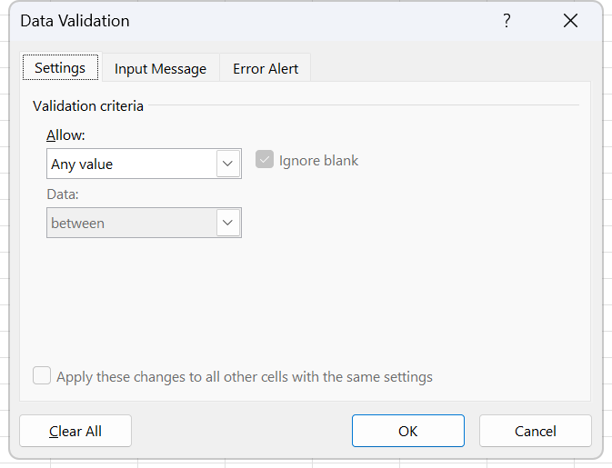

# Exercise 20 · VLOOKUP over a student record

A university register of 288 students, a fee schedule, a grade scale and a short list of test results. The exercise builds a small lookup form at the top of the register, driven by a drop-down list, and then fills two columns of the register itself from two different sheets. It is the exercise that pairs an exact VLOOKUP with an approximate one on the same file, and it is the one that forces a decision about what to show when the lookup finds nothing. It lands in week 13, sessions 25 and 26, the VLOOKUP-in-depth week. Hand in the workbook with the drop-down working, both lookup columns filled and column L showing `N/A` where a student has no test result.

**Objectives** MO-200 2.2.5, 4.3.3, MO-201 2.2.2, 3.1.1, 3.2.1

## The data

Source workbook `Excel 20 (BuscarV).xlsx`, four sheets. This is the only exercise in the pack with no instruction document: the five tasks live on a sheet called `Instructions` inside the workbook itself.

### Instructions

The fourth sheet holds the task list. It is prose sitting in cells rather than data, so no CSV was cut from it, and it is quoted here in full. The wording is the sheet's own, misspellings included; the working version of the list, with the exam routes attached, is under What to do below.

> INSTRUCTIONS
>
> 1. On the `Students` worksheet, create a Vlookup funccion that will return the student's full name when a University ID is selected. The ID's must be displayed as a list.
> 2. On the column FEES, use a Vlookup function to determine the amount of fees according to the major. Format as currency.
> 3. In the cell `A3` write the heading `Residence Hall` and in cell `B3` create a Vlookup function to show the corresponding residence hall.
> 4. On the `TestScores` sheet, complete the column `Grade` with the correct letter according to each student's score.
> 5. On the `Students` sheet, complete the column L with the test grade obtained in the sheet `TestScores`. If the student does not have a grade, it must be displayed `N/A`.

Five lines is everything the workbook says about itself. The sheet names no ranges, no table arrays and no column numbers, it does not say which lookups are exact and which approximate, and it does not say where on the `Students` sheet the drop-down goes; all of that is read off the sheets themselves and written into the task list below.

### Students

[data/ex20-students.csv](data/ex20-students.csv), 288 rows. Headers on row 5, data on rows 6 to 293, university IDs running 9100 to 9387 with no gaps. Too long to print here.

The CSV carries the nine columns that are given. Three more columns exist on the sheet and none of them is in the file, because all three are formulas:

| Column | Header | Status |
|---|---|---|
| A | University ID | Given, the key for everything |
| B | Last Name | Given |
| C | First Name | Given |
| D | MI | Given, middle initial, blank for most rows |
| E | Full Name | Formula, first name and last name joined |
| F | Prog Code | Given, `BL-BUS`, `BL-EDUC` and so on |
| G | Major | Given, 23 distinct majors matching the Fees sheet exactly |
| H | Fees | Empty, task 2 |
| I | Class | Given, Sophomore through Doctorate |
| J | FT/PT | Given, Full time or Part time |
| K | Residence Hall | Given, eight halls plus `off-campus` |
| L | Test Grade | Empty, task 5 |

Above the header row sits a three-cell form. `A1` reads `University ID` and `B1` is where the drop-down goes. `A2` reads `Full Name` and `B2` is the first lookup. `A3` and `B3` are empty and are task 3.

### Fees

[data/ex20-fees.csv](data/ex20-fees.csv), 23 rows. One fee per programme, in alphabetical order, which is what lets an approximate lookup work here by accident and is not a reason to use one.

| Program | Fee |
|---|---|
| Anthropology | 23 |
| Apparel Merchandising | 25 |
| Biology | 27 |
| Business | 86 |
| Communication | 21 |
| Criminal Justice | 60 |
| East Asian Language and Culture | 58 |
| Education | 74 |
| English | 26 |
| Fine Arts | 49 |
| Geology | 36 |
| Health | 58 |
| Informatics | 85 |
| Journalism | 81 |
| Law | 68 |
| Mathematics | 42 |
| Music | 46 |
| Optometry | 75 |
| Political Science | 20 |
| Psychology | 24 |
| Public and Environmental Affairs | 35 |
| Telecommunications | 41 |
| Theatre | 64 |

### TestScores

[data/ex20-testscores.csv](data/ex20-testscores.csv), 38 rows. Thirty-eight results for thirty-three distinct students, out of 288 on the register. Column C, Grade, is empty and is task 4.

| Student ID | Test Score |
|---|---|
| 9186 | 86 |
| 9144 | 97 |
| 9132 | 90 |
| 9147 | 79 |
| 9149 | 97 |
| 9153 | 95 |
| 9197 | 90 |
| 9117 | 77 |
| 9211 | 75 |
| 9144 | 100 |
| 9183 | 81 |
| 9154 | 99 |
| 9203 | 86 |
| 9194 | 84 |
| 9174 | 84 |
| 9142 | 89 |
| 9124 | 51 |
| 9120 | 58 |
| 9178 | 95 |
| 9211 | 62 |
| 9169 | 69 |
| 9158 | 83 |
| 9194 | 94 |
| 9197 | 92 |
| 9137 | 85 |
| 9146 | 78 |
| 9181 | 56 |
| 9152 | 98 |
| 9133 | 78 |
| 9154 | 59 |
| 9204 | 62 |
| 9201 | 89 |
| 9115 | 93 |
| 9166 | 98 |
| 9206 | 91 |
| 9141 | 82 |
| 9164 | 99 |
| 9161 | 90 |

### Grade scale

[data/ex20-grade-scale.csv](data/ex20-grade-scale.csv), 5 rows. It sits at F3:G8 of the `TestScores` sheet, beside the results, sorted ascending, which is exactly the shape an approximate VLOOKUP needs.

| Score | Grade |
|---|---|
| 50 | F |
| 60 | D |
| 70 | C |
| 80 | B |
| 90 | A |

Read it as lower bounds: 50 to 59 is F, 60 to 69 is D, and so on up to 90 and above being A.

## What to do

1. On the `Students` sheet, put a drop-down in `B1` listing the university IDs, and in `B2` write a VLOOKUP that returns the full name of whichever ID is selected. Routes Expert 2.2.2 for the list and Expert 3.2.1 for the lookup. The lookup key has to be in the first column of the table array, and `University ID` is column A, so the array starts there and the full name is column 5.
2. Fill column H, Fees, with a VLOOKUP that reads the major in column G and returns the fee from the `Fees` sheet. Exact match. Format the column as Currency. Route 2.2.5.
3. Type `Residence Hall` in `A3` and write a VLOOKUP in `B3` that returns the hall for the selected ID. Same key, same table array, column 11.
4. On the `TestScores` sheet, fill column C, Grade, with the letter that matches each score. This is the approximate VLOOKUP, against the grade scale at F3:G8. Range_lookup is `TRUE`, and the scale has to stay sorted ascending or the answers go quietly wrong rather than erroring.
5. Back on `Students`, fill column L, Test Grade, with the grade the student got on the `TestScores` sheet. Most students never sat the test, so an exact VLOOKUP returns `#N/A` for 255 of the 288 rows. Wrap it so those rows read `N/A` as text instead. Route Expert 3.1.1 for the nesting.

## Exam routes used here

**Expert 3.2.1 Look up data by using the VLOOKUP(), HLOOKUP(), MATCH(), and INDEX() functions.** Select the cell that will hold the lookup. **Formulas** tab, **Function Library** group, **Lookup & Reference**, then **VLOOKUP**. In **Lookup_value** put the cell holding the key; leave it relative when the formula fills down a column, and absolute when it reads a single form cell such as `$B$1`. In **Table_array** select the whole reference table including its first column, then press `F4` to lock it. A relative table array walks down the sheet as the formula fills, and that is the single commonest lost mark on this objective. In **Col_index_num** type the column number counted from the first column of Table_array, not from column A of the sheet: with the array starting at `A6`, Full Name is 5 and Residence Hall is 11. In **Range_lookup** type `FALSE` for exact or `TRUE` for the banded approximate match. An empty box is not FALSE; empty means TRUE. Click **OK**.

The approximate form returns the row whose key is the largest one that is not greater than the lookup value, which is why the grade scale is written as lower bounds and why it has to stay sorted ascending. `XLOOKUP` reaches the same answers on this build with no column number and exact match by default. Learn it as the modern habit, and keep VLOOKUP as the exam vocabulary, because MO-201 names these four functions by name.

**Expert 2.2.2 Configure data validation.** Select `B1`. **Data** tab, **Data Tools** group, click **Data Validation**, the top half of the split button, which opens **Data Validation...**. The dialog opens on the **Settings** tab. Open the **Allow** list and choose **List**. In the **Source** box, click the collapse button at the right and drag over `A6:A293`, or type `=` followed by a defined name covering that range. Keep the **In-cell dropdown** check box selected, or there is a rule and no list to pick from. Leave **Ignore blank** selected. Without closing the dialog, go to the **Input Message** tab, keep **Show input message when cell is selected**, and type a **Title** and an **Input message**. Still without closing it, go to the **Error Alert** tab, keep **Show error alert after invalid data is entered**, open the **Style** list and pick **Stop**, **Warning** or **Information**, then type a **Title** and an **Error message**. Click **OK**. Three tabs configured in one operation is the point of the objective. `Alt+Down Arrow` opens the in-cell drop-down once the rule exists.

*The three tabs the route configures without closing the box once. It opens on Settings with Allow reading Any value, which is the state `B1` ships in; the list rule starts by changing that one box.*

**Expert 3.1.1 Perform logical operations by using nested functions.** For task 5, the outer function wraps the lookup. **Formulas** tab, **Function Library** group, **Logical**, then **IFERROR** (it sits with the logical functions on this build; `IFNA` is the narrower version, catching `#N/A` only and letting a genuine `#REF!` through, which is the better answer when the task is worded around a missing value). The **Function Arguments** dialog opens with **Value** and **Value_if_error**. Click into **Value** and leave it empty, then look at the **Name Box** at the left end of the formula bar: while a Function Arguments dialog is open it stops showing the cell reference and becomes a function drop-down. Open it and pick **VLOOKUP**, or **More Functions...** to reach **Insert Function**. Fill VLOOKUP's four boxes, then click the word `IFERROR` in the formula bar to come back out to the outer dialog with the nested call already in place. Type `"N/A"` in **Value_if_error**. Click **OK** once, at the outer level.

**2.2.5 Apply number formats.** Select the Fees column's data cells only, not the header. **Home** tab, **Number** group. Open the **Number Format** list at the top of the group and pick **Currency**, then set the decimals with **Increase Decimal** and **Decrease Decimal**. Currency and Accounting are not the same: Currency puts the symbol against the digits, Accounting lines the symbols up on the left edge of the cell, lines the decimal points up, shows zero as a dash and puts negatives in parentheses. The task says currency, so pick Currency. Typing `$27` into the cell and letting Excel infer the format lets Excel choose which format and how many decimals, which is not the same thing.

**4.3.3 Format text by using the CONCAT() and TEXTJOIN() functions.** Column E is already written, and it uses `CONCATENATE`, the retired predecessor of `CONCAT`. If you rebuild the column, use **Formulas** tab, **Function Library** group, **Text**, **CONCAT**, and put the whole range in **Text1** rather than one cell per box, adding the space as its own argument. `=A2&" "&B2` joins correctly and is not a function, so a task worded "use the CONCAT function" fails on it, and `CONCATENATE` fails it for the same reason.

## Checks

- Click `B1`. A drop-down arrow appears on its right edge, the list holds 288 IDs, and typing `9999` raises the titled error box rather than being accepted.
- Pick `9102` in `B1`. `B2` reads `Raffi Echevarría Agosto` and `B3` reads `Abernathy`. Pick `9387` and they change to `Mugito Shikikawa` and `Evers`.
- Read the formula bar in `B2` and `B3`. The table array carries dollar signs and `Range_lookup` reads `FALSE`, written out rather than left blank.
- Column H is filled for all 288 rows with no `#N/A`, and every value is one of the 23 fees. Business students pay 86, Political Science students pay 20.
- Column H shows a currency symbol. Click a cell and the formula bar shows a bare number, which proves the format was applied and the number was not retyped.
- Column C of `TestScores` is filled for all 38 rows. The lowest score in the file is 51 and it comes out `F`; the 100 comes out `A`; the 79 comes out `C` and the 81 comes out `B`, which is the pair to check, because an exact match would have failed on both.
- Column L of `Students` shows a letter for 33 students and `N/A` for the other 255. No cell in the column shows `#N/A` with the hash, which is the difference between a handled error and an unhandled one.
- Student 9144 appears twice on `TestScores`, with 97 and with 100. Column L shows the grade for the first one the lookup meets. Confirm you know which, and that it is what you meant.

## Known problems in the source

- There is no instruction document. Every other exercise in the pack ships a `.docx`; this one carries five lines on a sheet called `Instructions` inside the workbook, and nothing else. Whatever the professor says in class about it is not written down anywhere.
- Those five lines contain three errors of their own: `funccion` for function, `The ID's` for the IDs, and a task 3 that says to write the heading in `A3` without saying that `A1` and `A2` already hold the same kind of heading.
- Two headers carry stray spaces. `G5` reads `" Major"` with a leading space and `J5` reads `"FT/PT "` with a trailing one. A lookup that matches on the header text will miss both. The CSV strips them.
- One value in column I carries a trailing space, `"Professional Fourth "`. It looks like the others and does not group with them.
- The Prog Code and the Major disagree on one row. Student 9115, Rebecca J Woosley, is `BL-BI`, the Biology code, with `Health` as her major. Every other row is consistent, which makes this one a trap for anyone who decides to look the fee up by programme code instead of by major name.
- Column E uses `CONCATENATE`, which Microsoft retired in favour of `CONCAT`. It still calculates. It is also the exact function the Associate objective 4.3.3 tells students not to use.
- The `TestScores` sheet holds thirty-eight rows for thirty-three students. Five IDs appear twice, 9144, 9154, 9194, 9197 and 9211, and each pair carries two different scores. VLOOKUP returns the first match it finds and says nothing about the second, so a student who never scrolls the sheet will never know the second score exists. Worth ten minutes of class time, because it is the failure mode that silently produces wrong numbers rather than errors.
- The folder is named `Ejercicio20_BuscarV` and so is folder 19, although the two exercises teach different halves of the objective. COBERTURA recommends renaming both before they are handed out.
