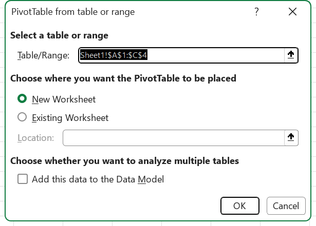
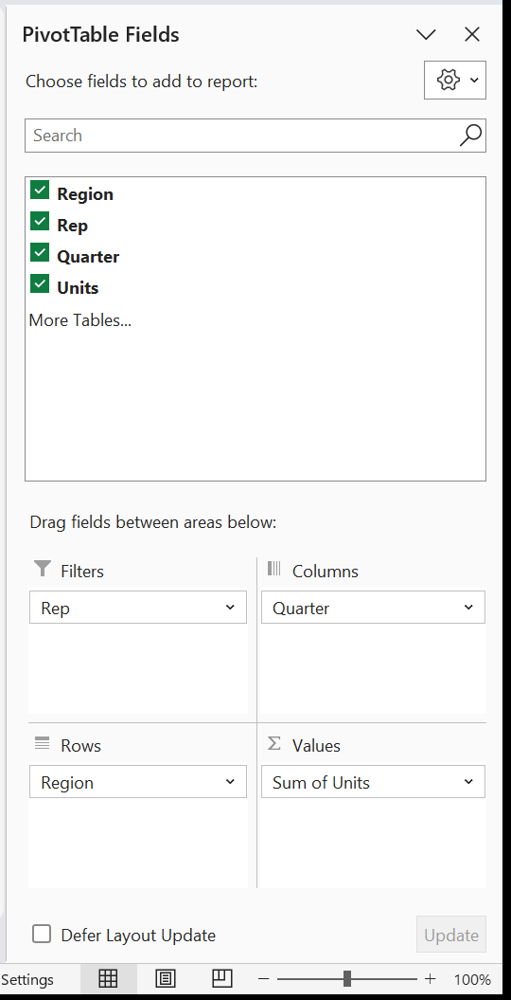
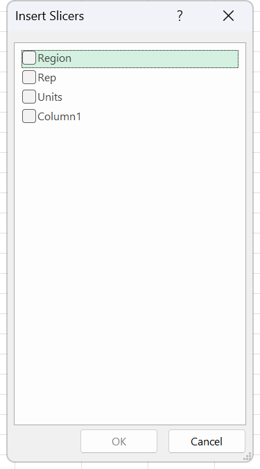

# Exercise 23 · PivotTables, from a warm-up to a full report

Exercise 23 exists twice. The two folders hold the same theory and two completely different practice sets: 31 rows of recruitment spend in version 1, and 26,608 lines of restaurant tickets in version 2. Both are converted here, as part A and part B of one exercise, because they are not alternatives. Part A takes twenty minutes in week 14, sessions 27 and 28, on the day PivotTables are introduced. Part B is the file that carries the whole Expert PivotTable domain and belongs in week 15, sessions 29 and 30, where COBERTURA.md puts slicers, timelines and PivotCharts. If only one version is kept, keep version 2: it is the only file in the package with enough rows for a drill-through sheet or a timeline to mean anything. The student hands in one workbook per part, each with its reports on their own sheets.

**Objectives** MO-200 2.4.2, MO-200 3.1.1, MO-200 3.2.3, MO-201 4.2.1, MO-201 4.2.2, MO-201 4.2.3, MO-201 4.2.4, MO-201 4.2.5, MO-201 4.2.6, MO-201 4.3.1, MO-201 4.3.2, MO-201 4.3.3, MO-201 4.3.4

## The data

### Part A · recruitment spend, 31 rows

One sheet, `Hoja1`, six columns, data in `A2:F32`. Four recruitment platforms, seven or eight campaigns each. Small enough to retype, which is the point: the student can see every number that lands in the report.

The file is [`labs/data/ex23-recruitment.csv`](data/ex23-recruitment.csv), 31 rows plus a header.

| Recruitment platform | Budget | No. of applicants | No. of candidates | No. of candidates hired | Process time (days) |
|---|---|---|---|---|---|
| LinkedIn | 4600 | 125 | 5 | 2 | 76 |
| Promeritum | 5200 | 346 | 16 | 6 | 51 |
| HotJobs | 1600 | 84 | 6 | 6 | 71 |
| OCC | 11800 | 276 | 48 | 30 | 41 |
| LinkedIn | 6200 | 318 | 37 | 31 | 45 |
| Promeritum | 8000 | 195 | 11 | 4 | 59 |
| HotJobs | 2400 | 125 | 9 | 1 | 73 |
| OCC | 11400 | 190 | 6 | 5 | 33 |
| LinkedIn | 7000 | 273 | 13 | 9 | 76 |
| Promeritum | 9800 | 233 | 32 | 20 | 52 |
| HotJobs | 3000 | 70 | 11 | 3 | 78 |
| OCC | 10200 | 361 | 35 | 33 | 44 |
| LinkedIn | 4800 | 266 | 53 | 13 | 63 |
| Promeritum | 6600 | 329 | 15 | 14 | 41 |
| HotJobs | 2000 | 159 | 22 | 2 | 73 |
| OCC | 8600 | 197 | 33 | 9 | 47 |
| LinkedIn | 4000 | 302 | 27 | 23 | 41 |
| Promeritum | 7800 | 357 | 26 | 24 | 47 |
| HotJobs | 3000 | 172 | 26 | 26 | 40 |
| OCC | 8400 | 311 | 38 | 8 | 31 |
| LinkedIn | 7000 | 295 | 37 | 2 | 87 |
| Promeritum | 6200 | 305 | 30 | 13 | 43 |
| HotJobs | 2000 | 190 | 12 | 4 | 86 |
| OCC | 11200 | 521 | 77 | 50 | 37 |
| LinkedIn | 6400 | 115 | 15 | 12 | 80 |
| Promeritum | 7400 | 125 | 7 | 3 | 31 |
| HotJobs | 2200 | 186 | 15 | 10 | 45 |
| OCC | 8000 | 192 | 22 | 8 | 60 |
| LinkedIn | 4400 | 146 | 5 | 5 | 64 |
| Promeritum | 5200 | 185 | 31 | 3 | 40 |
| HotJobs | 2800 | 108 | 18 | 1 | 58 |

The headers on the sheet read "No. Of applicants" with a capital O in the middle. The CSV keeps them as they are so the field names in the report match the source; correct them in the workbook if you prefer, and the PivotTable field list follows.

### Part B · restaurant tickets, 26,608 rows

One sheet, `Datos restaurante`, twelve columns, data in `A2:L26609`. One row per line item, so an order of six dishes is six rows sharing an order number, a date, a time, a table, a waiter and a tip rate.

The file is [`labs/data/ex23-orders.csv`](data/ex23-orders.csv), 26,608 rows plus a header, UTF-8, about 2.1 MB. Dates are written `YYYY-MM-DD` and times `HH:MM`, both unambiguous on import.

| Column | Heading | Contents |
|---|---|---|
| A | Order No. | 1 to 2500, repeated once per line of the ticket |
| B | Date | 1 February 2014 to 31 January 2015, 364 distinct days |
| C | Time | 48 distinct times, from 00:00 to 23:59 |
| D | Table | 1 to 17 |
| E | Waiter | 9 names |
| F | Type | Beverages, Food |
| G | Product | 69 items |
| H | Category | 10 groups |
| I | Price | what the customer pays, 18 to 758 |
| J | Cost | what the kitchen pays, 12.60 to 553.34 |
| K | Tip | a rate, 0.05 to 0.20, one per order |
| L | Client Tye | New, Recurrent |

No blanks anywhere in the twelve columns, and every product maps to exactly one category at exactly one price and one cost, so the report has nothing to trip over. The ten categories are Beer, Desserts, Entrees, Main course, Non-alcoholic beverages, Pasta, Pizza, Salads, Tacos and Wine. The nine waiters are Alejandro, Ernesto, Joel, Mariana, Mauricio, Omar, Rodolfo, Saul and Valentina.

Two things about column L. Its heading is misspelled in the source, `Client Tye` for Client Type, and it is left that way in the CSV so the field name in the report matches the sheet. And `Tip` is a percentage stored as a decimal, one value per order rather than per line, so summing it is meaningless. Use it as a rate or leave it out.

## What to do

### Part A

1. Rename `Hoja1` to `OriginalData` and convert `A1:F32` to a table. Route: MO-200 3.1.1.
2. Show a total for each of the five numeric columns using the table's own total row. Route: MO-200 3.2.3.
3. Build a PivotTable on a new sheet that sums all five columns by Recruitment platform. Route: MO-201 4.2.1.
4. Apply a green, yellow, red colour scale to the values of that report. Route: MO-200 2.4.2.
5. Insert a clustered column PivotChart from the report. Route: MO-201 4.3.1.
6. Change the chart colours to the second palette in **Change Colors**. Route: MO-201 4.3.3.
7. Build a second PivotTable on another sheet showing the same figures as a percentage of the grand total. Route: MO-201 4.2.2, the **Show Values As** tab.

### Part B

Seven reports, each on its own sheet, each named for what it shows.

1. **Revenue per product by waiter.** Waiter in Rows, Product in Rows underneath it, Sum of Price in Values. Sort the products from best selling to worst. Route: MO-201 4.2.1 for the report, MO-200 3.3.2 for the sort.
2. **The same report as a share of turnover.** Copy report 1, then open **Value Field Settings** and set **Show values as** to **% of Grand Total**. Sort by product. Route: MO-201 4.2.2.
3. **Sales per waiter per product, filtered by category.** Category goes into the **Filters** area, not into Rows. Choose the soft drinks category. Route: MO-201 4.2.1 for the Filters area, MO-200 3.3.1 for the filter itself.
4. **Average sale per category per month.** Category in Rows, Date in Columns grouped by Months, Average of Price in Values. The grouping is the graded step, not the average. Route: MO-201 4.2.4 for the grouping, MO-201 4.2.2 for the function.
5. **Profit per category, with slicers.** Add a calculated field named `Profit` with the formula `= Price - Cost`, put it in Values by category, then insert two slicers, one on Waiter and one on Type. Route: MO-201 4.2.5 for the field, MO-201 4.2.3 for the slicers.
6. **Share of turnover per waiter per product, with a timeline.** Waiter in Rows, Product in Columns, Sum of Price shown as **% of Grand Total**, and a timeline on Date set to Months so one month can be picked off the bar. Route: MO-201 4.2.2 and MO-201 4.2.3, timeline half.
7. **Sales by month split by type, as a chart.** A PivotChart with Date grouped by Months on the axis, Type as the series, and Client Tye in the **Filters** area. Route: MO-201 4.3.1, with MO-201 4.3.2 for the field buttons and MO-201 4.3.3 for the style.

Then, on report 7, drag Product into **Axis (Categories)** underneath Type and collapse it, so the chart has two levels to drill through. Double-click one value cell in the underlying report and read the sheet Excel writes. Route: MO-201 4.3.4.

## Exam routes used here

**Create an Excel table. MO-200 3.1.1**

1. Click any single cell inside the block. Do not select the range by hand yet.
2. **Insert** tab, **Tables** group, click **Table**.
3. The **Create Table** dialog opens. Read the address under **Where is the data for your table?** and check it covers the header row and the last row of data.
4. Select **My table has headers**.
5. Click **OK**. The contextual **Table Design** tab appears and the range takes the name `Table1`.

*Where is the data for your table? holds the address to check against the header row and the last row of data, and My table has headers is the box step 4 asks for.*

Ctrl+T opens the same dialog. Pressing Ctrl+T then Enter accepts Excel's guess without reading it, which is the habit that loses marks when the data touches a stray cell.

**Insert a total row. MO-200 3.2.3**

1. Click any cell inside the table.
2. **Table Design** tab, **Table Style Options** group, select the **Total Row** check box.
3. A row appears at the bottom. Its last column already carries `=SUBTOTAL(109,[Process time (days)])`.
4. Click the total cell under each of the other four numeric columns. A drop-down arrow appears on the right edge of the cell. Click it.
5. Pick **Sum** from the list. The list also offers None, Average, Count, Count Numbers, Max, Min, StdDev, Var and More Functions.
6. Excel writes `=SUBTOTAL(109,[Budget])` and so on for each column.

Typing `=SUM(B2:B32)` under the table gives the right number and is not a total row: the table does not own it, and it does not react to a filter.

**Create a PivotTable. MO-201 4.2.1**

1. Click one single cell inside the source data. Do not select the whole column or the whole sheet.
2. **Insert** tab, **Tables** group, click **PivotTable**. If the button opens a menu, click **From Table/Range**.
3. In the dialog, check the **Table/Range** box shows the whole block including the header row, for example `'Datos restaurante'!$A$1:$L$26609`.
4. Under "Choose where you want the PivotTable to be placed", select **New Worksheet**.
5. Click **OK**. An empty frame appears with the **PivotTable Fields** pane on the right.
6. **Drag** each field into **Filters**, **Columns**, **Rows** or **Values**. Drag even when the default would be right: ticking a check box sends text to Rows and numbers to Values, and the task normally names an area that is not the default.
7. Name the report. **PivotTable Analyze** tab, **PivotTable** group, click into **PivotTable Name:**, type the name, press Enter.

*Table/Range has to cover the header row and every row of data before New Worksheet is chosen. The empty frame and the field pane only appear once this box is accepted.*

*The pane that arrives with the empty frame at step 5, with the field list above and the four drop areas Filters, Columns, Rows and Values below it. Step 6 drags into those four boxes, and a number dropped into Values turns into Sum of something, as it has here.*

**Value Field Settings. MO-201 4.2.2**

1. Click any cell inside the **Values** area. That field becomes the active field.
2. **PivotTable Analyze** tab, **Active Field** group, click **Field Settings**. With a value field active this opens **Value Field Settings** (TO CONFIRM that the dialog title reads exactly that; the right-click menu entry does).
3. On the **Summarize Values By** tab pick the function: Sum, Count, Average, Max, Min, and the rest.
4. Without closing the dialog, go to the **Show Values As** tab. Open the list and pick **% of Grand Total**, or **% of Column Total**, **% of Parent Row Total**, **Difference From**, **Running Total In**.
5. Still without closing, click into **Custom Name** and correct the caption. Changing the function rewrites this box on its own.
6. Still in the same dialog, click **Number Format**. A cut-down Format Cells opens on its **Number** tab. Set the **Category** and **Decimal places**, click **OK**.
7. Click **OK**. Function, calculation, caption and number format all set in one pass.

Right-clicking the value cell and picking **Summarize Values By** then **Show Values As** then Percent Style on the Home tab is three passes through three menus, and the number format ends up stuck to cells rather than to the field.

**Create slicers and a timeline. MO-201 4.2.3**

1. Click any cell inside the PivotTable.
2. **PivotTable Analyze** tab, **Filter** group, click **Insert Slicer**.
3. In the **Insert Slicers** dialog tick **Waiter** and **Type**. Ticking both gives two slicers in one operation.
4. Click **OK**. One slicer object per ticked field lands on the sheet, stacked.
5. Size them: click a slicer, **Slicer** contextual tab, **Size** group, type the **Height** and **Width**. Do not drag if the task gives measurements.
6. Lay the buttons out: **Slicer** tab, **Buttons** group, set **Columns**.
7. To drive several reports from one slicer: **Slicer** tab, **Slicer** group, **Report Connections**, tick each PivotTable, click **OK**. They have to share the same PivotCache.

*Every field in the report gets its own check box in this list, so ticking Waiter and Type before clicking OK lands two slicer objects on the sheet in one go.*

For the date field, a timeline instead:

1. Click inside the PivotTable, **PivotTable Analyze** tab, **Filter** group, click **Timeline**.
2. In **Insert Timelines** tick **Date**, click **OK**.
3. Use the level list in the top right corner of the timeline to switch to **Months**, then drag across the bar to pick the span.

Using the field's own filter arrow filters the same report and leaves no object on the sheet, so a task that says "insert a slicer" scores nothing.

**Group PivotTable data by date. MO-201 4.2.4**

1. Click any cell holding a date item inside Rows or Columns. Click the item, not the field header.
2. **PivotTable Analyze** tab, **Group** group, click **Group Field**.
3. The **Grouping** dialog opens with **Starting at** and **Ending at** filled from the data.
4. In the **By** list click **Months**. The list toggles, so clicking Months then Years leaves both highlighted and Ctrl is not needed.
5. Click **OK**.
6. Read the **PivotTable Fields** pane. Excel has added a **Years** field above the original and left the original holding the months. Drag them into the order the task asks for.

In Microsoft 365, dropping a date field into Rows auto-groups it into Years, Quarters and Months without anyone touching a dialog. The screen shows the right answer and the graded step never happened.

**Add a calculated field. MO-201 4.2.5**

1. Click any cell inside the PivotTable.
2. **PivotTable Analyze** tab, **Calculations** group, click **Fields, Items, & Sets**.
3. Click **Calculated Field...**.
4. The **Insert Calculated Field** dialog opens. Type `Profit` in the **Name** box.
5. Click into the **Formula** box. It contains `= 0`. Delete the zero, leaving the equals sign.
6. Build the formula from the **Fields** list at the bottom: click `Price`, click **Insert Field**, type `-`, click `Cost`, click **Insert Field**. The box reads `= Price - Cost`.
7. Click **Add**, then **OK**. The field appears at the bottom of the Fields pane and lands in Values as **Sum of Profit**.

One warning that matters everywhere except here. A calculated field is evaluated against the totals of each field inside each cell, not row by row. `Price - Cost` is a subtraction, so the sum of the differences equals the difference of the sums and the answer is right. Had the exercise asked for `Price * Quantity`, the field would have multiplied two totals and returned a number that is not the sum of the line amounts. Cross-check one cell against a helper column before trusting any calculated field that multiplies.

Adding a helper column to the source with `=Price-Cost` and refreshing is more arithmetically robust and earns nothing when the task says calculated field.

**Format a PivotTable. MO-201 4.2.6**

1. Click any cell inside the report.
2. Go to the **Design** contextual tab, next to PivotTable Analyze.
3. **PivotTable Styles** group: click the More arrow at the bottom right of the gallery, hover to preview, click the style.
4. **PivotTable Style Options** group: tick or clear **Row Headers**, **Column Headers**, **Banded Rows**, **Banded Columns**. These four do nothing until a style is applied.
5. **Layout** group, **Report Layout**: **Show in Compact Form**, **Show in Outline Form**, **Show in Tabular Form**, plus **Repeat All Item Labels**.
6. **Layout** group, **Subtotals** and **Grand Totals** carry their own menus.
7. For the numbers themselves, go back through **Field Settings**, **Number Format**. The format then belongs to the field and survives a refresh, which selecting cells and clicking Percent Style on the Home tab does not.

**Apply built-in conditional formatting. MO-200 2.4.2**

1. Select the value cells of the report. Data cells only, no headers and no grand total row if the task did not ask for it.
2. **Home** tab, **Styles** group, click **Conditional Formatting**.
3. Point at **Color Scales** and hover the gallery for live preview.
4. Click the green, yellow, red three-colour variant.
5. For control over the thresholds, click **More Rules...** at the bottom of the gallery instead, which opens **New Formatting Rule** where the stops can be typed as Number, Percent, Formula or Percentile.

Colouring the cells by hand with a fill looks identical the moment it is done and is not conditional formatting. This is the most common way to lose points in the objective.

**Create a PivotChart. MO-201 4.3.1**

1. Click any cell inside the PivotTable.
2. **PivotTable Analyze** tab, **Tools** group, click **PivotChart**.
3. The **Insert Chart** dialog opens. Pick **Column** in the left list and **Clustered Column** from the thumbnails.
4. Click **OK**. The chart lands on the same sheet, wired to the report, carrying field buttons in its corners.
5. Drag fields between **Filters**, **Legend (Series)**, **Axis (Categories)** and **Values** in the **PivotChart Fields** pane. On a PivotChart the pane names the areas this way, not Rows and Columns.

*The dialog opens on Recommended Charts. The Column list and its Clustered Column thumbnail live on the All Charts tab beside it, which is where step 3 goes.*

**PivotChart options. MO-201 4.3.2**

1. Click the chart once.
2. Field buttons: **PivotChart Analyze** tab, **Show/Hide** group, click **Field Buttons**. The menu carries the four kinds separately plus **Hide All** (TO CONFIRM the five captions). Clear only the kind the task names.
3. Change the type: **Chart Design** tab, **Type** group, **Change Chart Type...**, **All Charts** tab, pick, **OK**. XY (Scatter), Bubble and Stock are unavailable for a PivotChart.
4. Swap axis and legend: **Chart Design** tab, **Data** group, **Switch Row/Column**. On a PivotChart this swaps the Rows and Columns areas of the report underneath, which is the difference from a plain chart and exactly what gets checked.

**PivotChart styles. MO-201 4.3.3**

1. Click the chart once.
2. **Chart Design** contextual tab, **Chart Styles** group. Click the More arrow to open the gallery, hover to preview, click the style.
3. Same group, click **Change Colors** and pick the second palette under Colorful (TO CONFIRM the button caption on a PivotChart; on an ordinary chart it is verified at MO-200 5.3.2).
4. **Chart Layouts** group, **Quick Layout** decides which elements are present; the style decides how they look. A task naming both wants both, in that order.

The paintbrush icon floating beside a selected chart reaches the same styles in two clicks, and the ribbon path the task described was never opened.

**Drill down. MO-201 4.3.4**

1. Give the chart two levels: drag a second field into **Axis (Categories)** underneath the first.
2. Collapse or expand the level: click the chart, **PivotChart Analyze** tab, **Active Field** group, check that **Active Field:** names the axis field, then click **Collapse Field** or **Expand Field**.
3. One item at a time: use the small plus and minus buttons on the category axis. If they are missing, turn them on from **PivotChart Analyze** tab, **Show/Hide** group, **+/- Buttons** (TO CONFIRM caption).
4. To reach the source rows behind one number, switch to the PivotTable and double-click the value cell. Excel writes a new worksheet holding only the rows that produced it, formatted as a table.

## Checks

### Part A

The table exists: click inside `A1:F32` and the **Table Design** tab appears on the ribbon.

The total row reads `SUBTOTAL` in the formula bar, not `SUM`, and the five totals are Budget **189,200**, applicants **7,057**, candidates **738**, hired **380**, process time **1,713**.

The PivotTable by platform:

| Recruitment platform | Budget | Applicants | Candidates | Hired | Process time |
|---|---|---|---|---|---|
| HotJobs | 19,000 | 1,094 | 119 | 53 | 524 |
| LinkedIn | 44,400 | 1,840 | 192 | 97 | 532 |
| OCC | 69,600 | 2,048 | 259 | 143 | 293 |
| Promeritum | 56,200 | 2,075 | 168 | 87 | 364 |
| **Grand Total** | **189,200** | **7,057** | **738** | **380** | **1,713** |

Those five totals match the table's total row exactly. If they do not, the PivotTable range stopped short of row 32.

The colour scale is a rule and not paint. Change one budget figure so it becomes the largest in its column and the colours repaint instantly; change it back. Then open **Home** tab, **Styles** group, **Conditional Formatting**, **Manage Rules...**, set **Show formatting rules for** to **This Worksheet**, and the rule is listed with the right **Applies to** range.

The second report shows the same figures as percentages. Reading down the Budget column: HotJobs **10.04%**, LinkedIn **23.47%**, OCC **36.79%**, Promeritum **29.70%**, grand total **100.00%**. Reopen **Field Settings** and **% of Grand Total** is still selected on the **Show Values As** tab.

The chart is a PivotChart and not a picture of one. Field buttons sit in its corners, clicking it raises the **PivotChart Analyze** tab, and changing the report layout moves the chart with it.

### Part B

Whole-file totals, which every report has to add back to. Turnover **1,867,129**. Cost **1,429,987.25**. Profit **437,141.75**. Line items **26,608** across **2,500** orders.

Report 1, revenue by waiter. Joel is highest at **231,718** and Mauricio lowest at **147,413**; the nine add to 1,867,129.

| Waiter | Sum of Price |
|---|---|
| Joel | 231,718 |
| Ernesto | 228,745 |
| Omar | 223,505 |
| Alejandro | 219,907 |
| Saul | 208,531 |
| Rodolfo | 207,292 |
| Mariana | 203,834 |
| Valentina | 196,184 |
| Mauricio | 147,413 |

Top products by revenue, which is what the sort in report 1 has to bring to the top: Margret de Pato **66,330**, Atún Encostrado **62,300**, Vacío **58,712**, Salmón al Pesto **57,246**, Del Cheff **47,520**.

Report 2 shows the same picture with a percent sign. Joel reads **12.41%**, Mauricio **7.90%**, and the grand total reads **100.00%**.

Report 4, the grouping. Twelve columns, January through December, instead of the 364 separate days the ungrouped field produces. Reopen **Group Field** and **Months** is still highlighted in the **By** list. If **Years** was ticked as well, the **PivotTable Fields** pane holds a **Years** field that is not a column in the source data, and the report splits into 2014 with eleven months and 2015 with one. Either answer is defensible; 364 columns is not.

Report 5, the calculated field. `Profit` is listed in the Fields pane and is not a column in the source data. By category:

| Category | Profit |
|---|---|
| Main course | 79,577.08 |
| Pizza | 78,070.24 |
| Wine | 77,903.10 |
| Non-alcoholic beverages | 42,426.20 |
| Entrees | 38,840.43 |
| Beer | 35,335.50 |
| Salads | 32,755.34 |
| Desserts | 20,154.90 |
| Pasta | 17,927.60 |
| Tacos | 14,151.36 |
| **Grand Total** | **437,141.75** |

That grand total equals 1,867,129 minus 1,429,987.25, which is the proof that the calculated field summed line by line rather than multiplying totals.

The two slicers are objects floating above the grid with `Waiter` and `Type` in their headers. Click a waiter button and the profit total falls; the funnel-with-a-cross icon in the slicer header becomes available.

Report 6, the timeline. It is an object on the sheet with the level list reading **Months**. Drag it to one month and the percentages recalculate to 100% within that month.

Report 7, the chart. Field buttons in the corners, **PivotChart Analyze** on the ribbon, twelve points along the axis and two series. Filter Client Tye to Recurrent and both the chart and its report move together.

The drill-through. Double-click one value cell and count the rows on the sheet Excel writes, or sum its Price column against the number you double-clicked. They have to agree, and the workbook has one more sheet than it did a second ago.

## Notes on the source

**Two versions, one exercise.** `Excel 23_PivotTables.xlsx` holds 31 rows, `Excel 23_PivotTables v.2.xlsx` holds 26,608. The two instruction documents share an identical theory section and differ only in their exercise list: version 1 gives seven prose steps, version 2 gives a seven-row table pairing each instruction with the ribbon path it needs. Both are converted here. Version 2 is the graded one and the one that retires the binaries; version 1 stays because week 14 needs something a student can check by eye.

**Category names.** Version 2 asks the student to filter by "soft drinks". No such category exists in the data. The closest is **Non-alcoholic beverages**, which holds the product `Refresco` along with the coffees and teas. Use Non-alcoholic beverages and say so, or add a soft drinks category to the source.

**Header spelling.** Column L is headed `Client Tye`. Column headers in the recruitment file read `No. Of applicants`, `No. Of candidates` and `No. Of candidates hired`, with a stray capital O. Both are preserved in the CSVs so that field names in the reports match the sheets. Both are worth fixing in the source, and fixing them changes nothing but the labels.

**One stray space.** Product `Vino 9 ` carries a trailing space in the source. There is no `Vino 9` without it, so nothing splits into two rows in the report, but the item sorts oddly and the label looks wrong next to `Vino 8`. Left as it is in the CSV.

**Tip.** Column K is a rate, not an amount, and it repeats down every line of the same order. A PivotTable that sums it produces a large meaningless number. None of the seven reports asks for it, and it is worth saying out loud in class before somebody drags it into Values.
