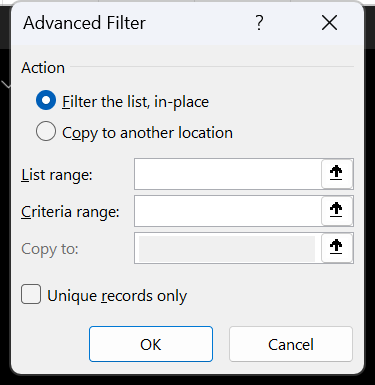

# Exercise 24 · Advanced filters and criteria ranges

Fifteen filters over the same twenty-seven employees, each one harder than the last. The student builds a criteria range for every question, runs **Advanced Filter** with **Copy to another location**, and hands back a sheet where fifteen extracted result blocks sit below the source, each with its criteria visible above it. The last four teach wildcards in their four positions, and the fifteenth compares each row against the average of the whole column, which is the one criterion that has to be a formula. It lands in week 15, sessions 29 and 30, the two sessions the syllabus gives to advanced filters.

**Objectives** MO-200 3.3.1, MO-200 4.2.1, MO-201 2.2.5

Advanced Filter itself is not a numbered objective on either exam. It shows up inside MO-201 2.2.5, where **Unique records only** in the same dialog is the graded route to removing duplicates, and its criteria ranges are the manual version of what MO-200 3.3.1 does with menus. The syllabus gives it two whole sessions anyway, which is why the exercise is this long.

## The data

One sheet, `Filtro avanzado`, ten columns, twenty-seven employees in `B3:K29` with headers in row 2. Small enough to sit inline, and it needs to, because every criteria range in this exercise is built by copying headings out of it.

The file is [`labs/data/ex24-employees.csv`](data/ex24-employees.csv), 27 rows plus a header. Dates are written `YYYY-MM-DD`. Salary and Bonus are exported at full stored precision; the sheet displays both with two decimals, and Bonus is five per cent of Salary throughout, typed as a value rather than computed.

| Code | Names | 1st Last Name | 2nd Last Name | DOB | Department | Branch | Start date | Salary | Bonus |
|---|---|---|---|---|---|---|---|---|---|
| GE-OAN94 | Ana | Pérez | Chavez | 1991-10-29 | Administration | Tlalpan | 2014-10-23 | 7,876.85 | 393.84 |
| SE-OEC57 | Pamela | López | Ortega | 1992-08-27 | Administration | Tlaltenango | 2019-10-09 | 6,028.52 | 301.43 |
| GE-SAR51 | Rubi | Gómez | García | 1991-04-12 | Logistics | Azcapozalco | 2012-02-12 | 6,373.64 | 318.68 |
| SU-AHI98 | Diego | Luna | González | 1994-06-28 | Human resources | Tlaltenango | 2016-07-14 | 2,191.33 | 109.57 |
| ED-AIG66 | Jorge | Negrete | Vega | 1993-12-24 | Marketing | Centro | 2020-05-05 | 2,156.76 | 107.84 |
| ED-SEJ97 | Carolina | Herrera | Hernández | 1994-05-22 | Logistics | Tlalpan | 2016-08-03 | 5,664.51 | 283.23 |
| ED-SAC88 | Tamara | Villa | Juárez | 1994-06-13 | Accounting | Azcapozalco | 2019-01-20 | 6,319.52 | 315.98 |
| DI-LER98 | Ricardo | Tapia | Enriquez | 1992-02-14 | Logistics | Tlalpan | 2017-02-08 | 4,664.64 | 233.23 |
| ED-OAZ93 | Bruno | Diaz | Ricardez | 1991-04-13 | Accounting | Centro | 2011-07-31 | 8,336.62 | 416.83 |
| JU-EUT49 | Karina | Ruiz | Contreras | 1994-10-22 | Logistics | Tlaltenango | 2017-11-16 | 7,425.17 | 371.26 |
| ED-OOC60 | Rosa | Flores | Flores | 1990-04-23 | Accounting | Azcapozalco | 2013-01-22 | 2,246.99 | 112.35 |
| MI-EON29 | Euduviges | Ramirez | Osorio | 1993-10-02 | Logistics | Centro | 2018-09-26 | 6,130.64 | 306.53 |
| DI-AOR46 | Ludmila | Carrasco | Morales | 1993-06-10 | Administration | Tlaltenango | 2014-10-31 | 3,150.73 | 157.54 |
| MI-RLB28 | Andrés | Rodriguez | Carrera | 1994-08-03 | Marketing | Centro | 2017-03-12 | 3,435.77 | 171.79 |
| JU-OSB17 | Valeria | Buenrostro | Robles | 1990-05-19 | Accounting | Tlalpan | 2015-07-03 | 1,545.99 | 77.30 |
| ED-ASD85 | José | Larios | Casas | 1990-09-19 | Accounting | Centro | 2014-09-13 | 4,534.69 | 226.73 |
| ED-OAS81 | Pedro | Cárdenas | Rosas | 1990-02-12 | Administration | Centro | 2018-03-31 | 2,855.61 | 142.78 |
| DI-DER50 | Estefanía | Toledo | Ramos | 1991-06-23 | Logistics | Tlalpan | 2014-12-15 | 6,623.87 | 331.19 |
| JU-OEN54 | Paulina | Rubio | Vallejo | 1991-05-20 | Logistics | Tlaltenango | 2014-03-02 | 3,531.08 | 176.55 |
| MI-OST29 | Vicente | Fernández | Nuñez | 1990-03-16 | Human resources | Tlalpan | 2014-08-10 | 4,737.20 | 236.86 |
| JU-NON42 | Josefina | Tovar | Gutiérrez | 1994-06-06 | Administration | Tlalpan | 2016-05-17 | 2,556.18 | 127.81 |
| FI-AAB54 | Mauricio | Garcés | Castillo | 1991-11-27 | Accounting | Azcapozalco | 2019-04-12 | 5,915.78 | 295.79 |
| TE-ECN22 | Marcela | Palacios | Mendoza | 1992-12-09 | Accounting | Centro | 2016-10-03 | 2,927.00 | 146.35 |
| AU-FHW89 | Guillermo | Blanco | Farías | 1995-03-21 | Logistics | Tlaltenango | 2019-07-15 | 3,448.00 | 172.40 |
| CU-OSI54 | Alejandra | Guzmán | Paniagua | 1993-08-14 | Administration | Centro | 2015-03-24 | 7,033.00 | 351.65 |
| AG-NUE42 | Tiburcio | Padilla | Guerrero | 1994-04-01 | Marketing | Tlalpan | 2019-05-30 | 5,320.00 | 266.00 |
| DI-UAS-32 | Eustorgio | Alvarez | Jiménez | 1992-11-23 | Human resources | Azcapozalco | 2016-01-17 | 4,527.00 | 226.35 |

Four branches: Azcapozalco, Centro, Tlalpan, Tlaltenango. Five departments: Accounting, Administration, Human resources, Logistics, Marketing. Birth dates run from February 1990 to March 1995. The average salary is 4,724.336068, which filter 15 needs.

Read the branch spelling twice. The sheet says **Azcapozalco**, without the t. The original instructions say Azcapotzalco, which is how the borough is actually spelled. A criterion typed the correct way returns nothing. Either fix the data or type the criterion to match it, and pick one before writing filters 3 and 6.

## What to do

Everything goes below the source data, starting at `B32`. Give each filter its own band of rows: the criteria range on top, the extract underneath, and enough blank rows that the fifteen blocks never touch. Advanced Filter reads the block that surrounds whatever cell you point it at, so two blocks that share an edge become one block.

Before the first filter, read what a criteria range is. Copy the headings you need out of row 2, exactly as they are spelled. Write the conditions under them. Conditions side by side on one row are joined with **and**. Conditions stacked on separate rows are joined with **or**. A heading may be repeated in two columns when a field needs two conditions at once, which is how a date range is written.

1. Employees in the Centro branch. One heading, one condition.
2. Employees in the Administration department or in Logistics. One heading, two rows.
3. Employees in Accounting at Centro, or in Logistics at Azcapozalco. Two headings, two rows, four cells.
4. Employees in Accounting at Centro or at Tlalpan. Two headings, two rows, and the department repeated on both rows.
5. Employees whose code begins with E and who were born in 1994. Code criterion `E*`, plus DOB twice, `>=1/1/1994` and `<=12/31/1994`, all on one row. The dates go in whatever order this machine reads them: the sheet formats DOB as `mm-dd-yy`, so month first. Type a date into a spare cell first and see which way round it lands before writing the criterion.
6. Employees who do not work at Azcapozalco and whose salary is under 6,000. Branch `<>Azcapozalco` and Salary `<6000` on one row.
7. Employees not in Administration and not in Marketing, born between 1991 and 1994. Department repeated with `<>Administration` and `<>Marketing`, plus DOB twice for the range, `>=1/1/1991` and `<=12/31/1994`, four headings on one row.
8. Employees at Tlalpan or Tlaltenango. Show only Names, 1st Last Name, 2nd Last Name and Branch. The extract layout is set by typing those four headings in the **Copy to** row before running the dialog.
9. Employees whose first surname begins with R and whose salary is between 4,000 and 6,000. Show only Code, Department and Branch.
10. Employees whose code contains an A. Criterion `*A*`.
11. Employees whose code contains an E. Show only Code, Names, 1st Last Name and Branch.
12. Employees whose code begins with E. Criterion `E*`. Same four output columns.
13. Employees whose code has E as its second character. Criterion `?E*`. Same four output columns.
14. Employees whose code ends in 8. Criterion `*8`.
15. Employees earning more than the average of the list. This one cannot use a field heading. Put the text `f(x)` in the criteria heading cell, or anything that is not one of the ten field names, and under it write `=J3>AVERAGE($J$3:$J$29)`. The reference to `J3` stays relative so it walks down the rows; the AVERAGE range is locked so it does not.

Route for all fifteen: the Advanced Filter route below. Route for the extra output columns in filters 8, 9, 11, 12 and 13: the same dialog, **Copy to** half.

## Exam routes used here

**Advanced Filter, extract to another location**

1. Build the criteria range first. Copy the field headings out of row 2 with Ctrl+C and Ctrl+V so the spelling matches character for character. A heading typed by hand with a trailing space matches nothing.
2. Write the conditions in the rows under the headings. Side by side is **and**, stacked is **or**.
3. If the extract needs only some columns, type those headings, in the order you want them, in the row that will be the top of the result block.
4. Click a single cell inside the source data, `B2:K29`.
5. **Data** tab, **Sort & Filter** group, click **Advanced**.
6. The **Advanced Filter** dialog opens. Under **Action**, select **Copy to another location**.
7. Check **List range**. It should read `$B$2:$K$29`. Correct it if Excel guessed short.
8. Click into **Criteria range** and drag over the criteria block, headings included. Include the heading row and no blank rows below the conditions. One blank row inside the criteria block means "no condition", which matches every record.
9. Click into **Copy to** and click the single cell that will hold the top left corner of the result, or drag over the row of headings from step 3 when only some columns are wanted.
10. Leave **Unique records only** clear unless duplicates have to be collapsed. That check box is the graded route for MO-201 2.2.5.
11. Click **OK**.

*Copy to another location under Action is what brings the Copy to box into play, and List range, Criteria range and Copy to are the three addresses to read back before clicking OK.*

The result is a copy of values, not a live view. It does not update when the source changes, and the source stays untouched. Run the filter again to refresh it.

The **Copy to** destination has to be on the sheet that was active when the dialog opened. Extracting to another sheet works, but only if you start from that sheet: click a cell there first, open **Advanced**, and then point **List range** and **Criteria range** back at the data sheet. Starting from the data sheet and typing another sheet's address into **Copy to** gets refused.

Selecting **Filter the list, in-place** under **Action** hides the non-matching rows instead of extracting, which is useful for checking a criteria range before committing to an extract. Clear it with **Data** tab, **Sort & Filter** group, **Clear**.

**Wildcards in criteria**

`?` stands for one character, `*` for any run of characters including none. `~` before a `?` or a `*` means the literal character. A plain text criterion already behaves as "begins with", so `E` and `E*` do the same thing. To demand the whole cell instead, write `="=E"`.

| Question | Criterion |
|---|---|
| contains an A anywhere | `*A*` |
| begins with E | `E*` |
| second character is E | `?E*` |
| ends in 8 | `*8` |
| is exactly E | `="=E"` |

**AutoFilter, the contrast. MO-200 3.3.1**

1. Click a cell in the range and go to **Data** tab, **Sort & Filter** group, click **Filter** to put the arrows on the header row.
2. Click the arrow on the column to filter.
3. Clear **(Select All)**, then tick only the values the task names, and click **OK**. Or point to **Text Filters**, **Number Filters** or **Date Filters** and pick the operator, which opens **Custom AutoFilter** where two conditions can be joined with **And** or **Or**.
4. Ctrl+Shift+L turns the arrows on and off.

AutoFilter reaches most of filters 1 to 6 in fewer clicks. It cannot join three conditions, it cannot use a formula as a criterion, and it hides rows rather than extracting them. Filters 7, 9 and 15 are where it runs out, and that is the argument for the whole exercise.

**AVERAGE inside a criterion. MO-200 4.2.1**

1. **Formulas** tab, **Function Library** group, **AutoSum** arrow, then **Average**. Or **More Functions**, **Statistical**, **AVERAGE**.
2. In **Number1**, select `$J$3:$J$29`. Press F4 until both the column and the row carry dollars.
3. Click **OK**, then wrap the result in the comparison by hand: the criteria cell has to read `=J3>AVERAGE($J$3:$J$29)` and evaluate to TRUE or FALSE.

The cell will display FALSE, because it is being evaluated against row 3 while it sits in the criteria block. That is expected. Advanced Filter re-evaluates it once per record.

## Checks

Run each filter and count the rows it extracted. Fourteen of the fifteen have answers.

| # | Question | Rows | Codes |
|---|---|---|---|
| 1 | Centro branch | 8 | ED-AIG66, ED-OAZ93, MI-EON29, MI-RLB28, ED-ASD85, ED-OAS81, TE-ECN22, CU-OSI54 |
| 2 | Administration or Logistics | 14 | |
| 3 | Accounting at Centro, or Logistics at Azcapozalco | 4 | GE-SAR51, ED-OAZ93, ED-ASD85, TE-ECN22 |
| 4 | Accounting at Centro or Tlalpan | 4 | ED-OAZ93, JU-OSB17, ED-ASD85, TE-ECN22 |
| 5 | Code begins with E, born 1994 | 2 | ED-SEJ97, ED-SAC88 |
| 6 | Not Azcapozalco, salary under 6,000 | 15 | |
| 7 | Not Administration, not Marketing, born 1991 to 1994 | 13 | |
| 8 | Tlalpan or Tlaltenango | 14 | |
| 9 | First surname begins with R, salary 4,000 to 6,000 | **0** | none |
| 10 | Code contains an A | 13 | |
| 11 | Code contains an E | 17 | |
| 12 | Code begins with E | 7 | ED-AIG66, ED-SEJ97, ED-SAC88, ED-OAZ93, ED-OOC60, ED-ASD85, ED-OAS81 |
| 13 | Code has E as second character | 4 | GE-OAN94, SE-OEC57, GE-SAR51, TE-ECN22 |
| 14 | Code ends in 8 | 4 | SU-AHI98, ED-SAC88, DI-LER98, MI-RLB28 |
| 15 | Salary above the average | 13 | |

Filter 9 returns an empty block, with the headings and nothing under them. That is the right answer for this data, not a mistake. Four employees have a first surname starting with R, and every one of them falls outside 4,000 to 6,000: Rodriguez at 3,435.77, Rubio at 3,531.08, Ramirez at 6,130.64, Ruiz at 7,425.17. Check the criteria range anyway, then move on.

Filter 15, the thirteen above 4,724.34: GE-OAN94, SE-OEC57, GE-SAR51, ED-SEJ97, ED-SAC88, ED-OAZ93, JU-EUT49, MI-EON29, DI-DER50, MI-OST29, FI-AAB54, CU-OSI54, AG-NUE42. If the answer is 27 rows or 1 row, the AVERAGE range was left relative and drifted down the sheet as Excel walked the records.

Filters 12 and 13 have to disagree. Seven codes start with E, four have E in second place, and no code is in both lists. If they return the same rows, the `?` in `?E*` was typed as something else.

Filters 10 and 11 have to overlap without matching. Thirteen codes hold an A, seventeen hold an E. If either returns 27, the criterion lost a `*` and became "begins with".

The extract in filters 8, 9, 11, 12 and 13 has only the columns those tasks named, in the order the headings were typed. Ten columns wide means the **Copy to** box was pointed at a single empty cell rather than at the row of headings.

Last check on the whole sheet: the source block `B2:K29` still has twenty-seven rows and no hidden ones. Advanced Filter set to **Copy to another location** never touches it, and a source that has lost rows means somebody sorted or deleted inside a result block.

## Notes on the source

**The data file is misnamed.** `Excel24_instructions(Advanced Filters).xlsx` contains no instructions. It is the employee list and nothing else. The instructions are in `Exercise 24_Instructions(Advanced Filters).docx`, which is a separate file with an almost identical name. Rename the workbook to something like `Excel24_data(Advanced Filters).xlsx` before handing it out.

**Azcapozalco.** Spelled without the t everywhere in the data, and with the t in the instructions. Filters 3 and 6 fail silently against the correct spelling. Fixing the three affected cells in the source is the better repair, since the borough is Azcapotzalco; whichever way it goes, both files have to agree.

**The average criterion is written with a relative range.** The original gives the example `=J3>AVERAGE(J3:J29)`. The AVERAGE range has to be absolute. Advanced Filter shifts the formula down one row per record, so on record two it compares against the average of `J4:J30`, on record three against `J5:J31`, and by the end it is averaging empty cells. The corrected form, `=J3>AVERAGE($J$3:$J$29)`, is in task 15.

**Filter 9 has no answer.** The question is well formed and the data cannot satisfy it. Either keep it as a lesson in reading an empty result, or widen the band to 3,000 to 7,000, which returns Rodriguez and Rubio.

**Bonus is typed, not calculated.** Column K holds five per cent of column J as hard values. Nothing in this exercise depends on it, but a student who changes a salary will see the bonus stay put.

**Two names carry trailing spaces.** `Contreras ` on JU-EUT49 and `Flores ` on ED-OOC60. They are preserved in the CSV. Neither is used as a criterion here, so nothing breaks, and both would break a filter that matched on second surname.

**One code breaks the pattern.** Every code reads two letters, a hyphen, three letters and two digits, except `DI-UAS-32`, which carries an extra hyphen. It does not affect any of the fifteen answers, and it would affect any criterion built on character positions past the sixth.
