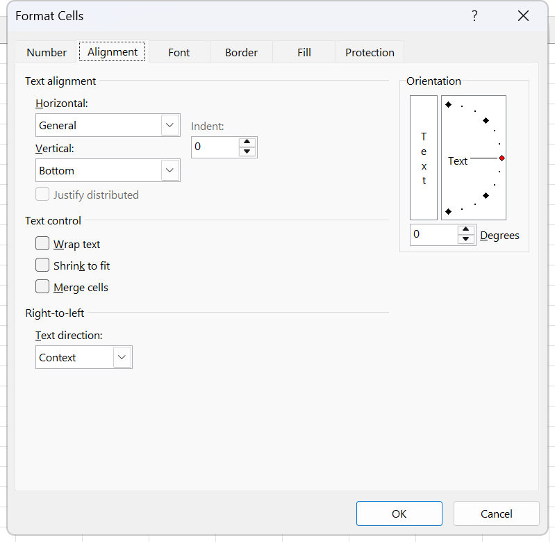
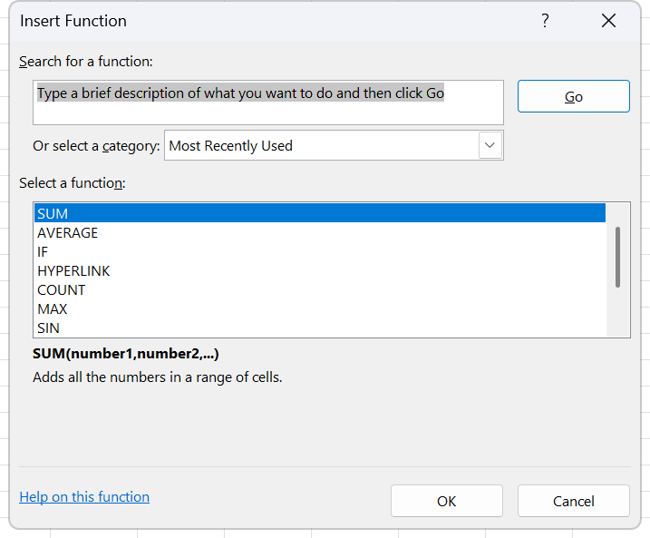
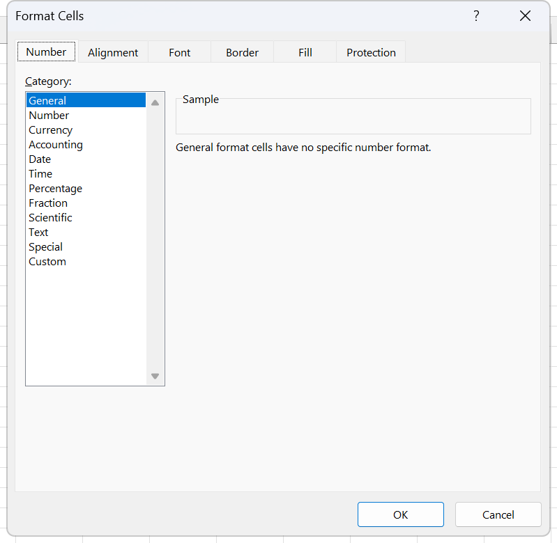

# Homework 6 · Statistical functions, counting and text built by formula

A university's programme list, twenty-three rows, with two percentage columns to fill, seven summary figures to calculate, and one sentence per row that has to be assembled by formula rather than typed. The counting half is the point: two of the seven answers are about a column that holds `YES` or nothing at all, and the pair of functions that reads that column is exactly the pair the exam separates. It lands in week 4, sessions 7 and 8. Hand in the finished workbook as `Homework 6 Excel_Your name.xlsx`.

**Objectives** MO-200 1.4.3, 2.1.2, 2.1.3, 2.2.2, 2.2.5, 4.2.1, 4.2.2, 4.3.3, MO-201 3.1.1, 3.3.1

## The data

One sheet, `Hoja1`. Header on row 3, data on rows 4 to 26. Rows 1 and 2 are empty and are where the title and the dated line go.

[../data/hw06-programs.csv](../data/hw06-programs.csv), 23 rows.

| PROGRAM | FACULTY / SCHOOL | # STUDENTS | WITH SCHOLARSHIP (#) | ENGLISH LEVEL | STUDENT EXCHANGE AVAILABLE |
|---|---|---|---|---|---|
| Música | Bellas Artes | 324 | 15 | Basic | YES |
| Enfermería | Ciencias de la Salud | 487 | 44 | Basic | |
| Psicología | Ciencias de la Salud | 811 | 32 | Medium | |
| Medicina | Ciencias de la Salud | 1135 | 82 | High | YES |
| Comunicación | Comunicación | 649 | 14 | High | |
| Derecho | Derecho | 1460 | 89 | Basic | YES |
| Gobierno | Economía y Gobierno | 324 | 6 | Basic | |
| Economía | Economía y Gobierno | 487 | 18 | Medium | YES |
| Administración y dirección | Empresariales | 487 | 5 | High | |
| Recursos Humanos | Empresariales | 649 | 27 | Medium | |
| Contaduría | Empresariales | 811 | 22 | Medium | YES |
| Mercadotecnia | Empresariales | 973 | 37 | High | YES |
| Finanzas | Empresariales | 1135 | 63 | High | YES |
| Negocios Internacionales | Empresariales | 1297 | 59 | High | |
| Administración y Hospitalidad | Esdai | 487 | 9 | Medium | YES |
| Filosofía | Filosofía | 324 | 4 | Basic | |
| Ing. Mecánica | Ingeniería | 324 | 8 | High | YES |
| Ing. Animación | Ingeniería | 487 | 12 | High | YES |
| Ing. Mecatrónica | Ingeniería | 487 | 19 | High | |
| Ing. Innovación | Ingeniería | 649 | 22 | High | YES |
| Ing. Tecnologías de la Información | Ingeniería | 811 | 43 | High | |
| Ing. Industrial | Ingeniería | 1135 | 79 | High | YES |
| Pedagogía | Pedagogía | 487 | 7 | Basic | YES |

Two columns are missing from the CSV because they are the answer: `% STUDENTS` sits in column D between `# STUDENTS` and `WITH SCHOLARSHIP (#)`, and `WITH SCHOLARSHIP (%)` sits in column F. Both are empty in the source file. In the sheet the column order is A `PROGRAM`, B `FACULTY / SCHOOL`, C `# STUDENTS`, D `% STUDENTS`, E `WITH SCHOLARSHIP (#)`, F `WITH SCHOLARSHIP (%)`, G `ENGLISH LEVEL`, H `STUDENT EXCHANGE AVAILABLE`.

The exchange column holds `YES` on thirteen rows and nothing on the other ten. Blank means no; there is no `NO` anywhere in it, and that is what tasks 7f and 7g are testing.

The labels for the seven summary figures sit in K16:K22, and their answers go in the column beside them.

## What to do

1. Put a title for the database in row 1, centred across the columns that hold data. Use **Center Across Selection**, not **Merge & Center**. Route 2.2.2. The two look identical on screen and only one of them leaves the cells sortable.
2. In row 2, under the title, write a line that reads `Information as of` and then today's date, and make it update itself every day. Routes 3.3.1 and 4.3.3: `TODAY()` for the date, and the sentence assembled with `CONCAT` or `TEXTJOIN`. `TODAY()` returns a serial number, so wrap it in `TEXT` to control how it reads inside the sentence.
3. Insert a column at the left holding a consecutive number for each programme, 1 to 23. Route 2.1.3 to make the column, route 2.1.2 to fill it.
4. Format the table so the data types read clearly, colour the columns, and hide the faculty column.
5. Fill `% STUDENTS`, column D, with each programme's share of all students, and `WITH SCHOLARSHIP (%)`, column F, with each programme's scholarship holders as a share of its own students. Lock the grand total in the first one so it survives being filled down. Routes 4.1.1 and 2.2.5.
6. In a new last column, build a sentence for every row that reads `In the Program of Música, there is a total of 324 students`. It has to be assembled by formula from the two cells, not typed. Route 4.3.3.
7. Calculate the seven figures whose labels sit in K16:K22:
   - a. Total students. Route 4.2.1.
   - b. Total scholarship students. Route 4.2.1.
   - c. Average number of students across all programmes. Route 4.2.1.
   - d. Minimum number of students. Route 4.2.1.
   - e. Maximum number of students. Route 4.2.1.
   - f. Number of programmes that offer a student exchange. Route 4.2.2 with `COUNTA`, or route 3.1.1 with `COUNTIF` and the criterion `"YES"`.
   - g. Number of programmes that do not. Route 4.2.2 with `COUNTBLANK`.
8. Freeze the panes so the header row and the programme name stay on screen while the rest scrolls. Route 1.4.3.
9. Apply whatever formatting makes the sheet clear and readable.
10. Save as `Homework 6 Excel_Your name.xlsx` and upload it to Moodle.

## Exam routes used here

**2.2.2 Modify cell alignment, orientation, and indentation.** Select A1 across to the last data column, on row 1. Press **Ctrl+1**, go to the **Alignment** tab, open the **Horizontal** list and pick **Center Across Selection**. That entry is worth naming out loud: it centres a title over several columns and looks exactly like Merge & Center, and it does not merge, so sorting and filtering still work. The other Horizontal entries are **General**, **Left (Indent)**, **Center**, **Right (Indent)**, **Fill**, **Justify** and **Distributed (Indent)**; **Vertical** holds **Top**, **Center**, **Bottom**, **Justify** and **Distributed**. Set anything else the task pairs with it in the same visit, then click **OK**.

*The Horizontal list at the top left is where Center Across Selection hides. The Merge cells tick box sits on the same tab just below it, which is how the two get mixed up in the first place.*

**2.1.2 Fill cells by using Auto Fill.** Type the first value, and if the step is not 1 type the second too and select both. Select the seed cells together with the whole range to be filled, because the selection defines the extent. **Home** tab, **Editing** group, **Fill**. For a straight copy click **Down**, **Right**, **Up** or **Left**. For a pattern click **Series...**, set **Series in** to **Columns**, **Type** to **Linear**, the **Step value** to 1, and a **Stop value** if the task gives an end rather than a range. Click **OK**.

**2.1.3 Insert and delete multiple columns or rows.** Select one whole column heading to insert one column. **Home** tab, **Cells** group, click the **arrow on the Insert button**, not the button face, then **Insert Sheet Columns**. To hide the faculty column, select its heading, then **Home** tab, **Cells** group, **Format**, **Hide & Unhide**, **Hide Columns**.

**2.2.5 Apply number formats.** Select the numbers only. **Home** tab, **Number** group, open the **Number Format** list and pick **Percentage**, then click **Increase Decimal** for the decimals. The **Percent Style** button applies zero decimals.

**4.2.1 Perform calculations by using the AVERAGE(), MAX(), MIN(), and SUM() functions.** Click the result cell. **Formulas** tab, **Function Library** group, click the arrow under **AutoSum** and pick **Sum**, **Average**, **Max**, **Min** or **Count Numbers**; the plain button face applies **Sum**. Excel proposes a range with a moving dashed border; if it guessed wrong, drag over the right one while the function is still open. Press `Enter`. Through the dialog: **Insert Function**, category **Math & Trig** for SUM or **Statistical** for AVERAGE, MAX and MIN, then fill **Number1** in the **Function Arguments** dialog and read **Formula result =** before clicking **OK**. `Alt+=` inserts SUM with a guessed range.

*The dialog half of this route starts here. The category box opens on Most Recently Used, so it has to be changed to Math & Trig or Statistical before SUM, AVERAGE, MAX or MIN appears in the list underneath.*

**4.2.2 Count cells by using the COUNT(), COUNTA(), and COUNTBLANK() functions.** Click the result cell. **Formulas** tab, **Function Library** group, click **More Functions**, point to **Statistical**, and click **COUNT**, **COUNTA** or **COUNTBLANK**. COUNT also appears on the **AutoSum** list under the friendlier name **Count Numbers**. In the **Function Arguments** dialog, fill **Value1** for COUNT and COUNTA, or **Range** for COUNTBLANK, then read **Formula result =** and click **OK**. The three do not overlap the way people assume: on a four-cell range holding a number, a text string, a formula returning `""` and one truly empty cell, COUNT returns 1, COUNTA returns 3 and COUNTBLANK returns 2. COUNTA and COUNTBLANK both count the cell holding `""`, so the two results can add up to more cells than the range has. In this homework the exchange column holds text or nothing, so COUNT would return 0 and is the wrong choice.

**4.3.3 Format text by using the CONCAT() and TEXTJOIN() functions.** Click the result cell. **Formulas** tab, **Function Library** group, **Text**, then **CONCAT**. In the **Function Arguments** dialog, click in **Text1**; CONCAT takes a whole range in one box, so drag over a range rather than filling one box per cell. Add literal text in the next box including its spaces, for example `In the Program of` with its trailing space; you type the text and the dialog adds the quotation marks. Read **Formula result =** and click **OK**.

For TEXTJOIN: same menu, then **TEXTJOIN**. Fill **Delimiter** with the separator, **Ignore_empty** with `TRUE`, and **Text1** with the range. `TRUE` is the box that matters: over Ana, empty and Luz it returns `Ana, Luz`, while `FALSE` returns `Ana, , Luz` with the doubled delimiter showing.

Writing `=A4&" "&B4` concatenates correctly and is not a function, so a task worded "use CONCAT" earns nothing for it. CONCATENATE, the retired predecessor, still runs and is not what the objective names.

**1.4.3 Freeze worksheet rows and columns.** Excel freezes everything above and everything to the left of the cell you select. Here the header row is row 3 and the programme name is column B once the consecutive number is inserted, so the anchor is C4. Click that single cell, then **View** tab, **Window** group, **Freeze Panes**, and **Freeze Panes** in the drop-down. **Freeze Top Row** and **Freeze First Column** ignore the selection and freeze exactly one line each, which is not what this task asks for. To release, **Freeze Panes**, **Unfreeze Panes**.

**Expert 3.1.1, the COUNTIF half.** Click the result cell. **Formulas** tab, **Function Library** group, **More Functions**, **Statistical**, **COUNTIF**. In the **Function Arguments** dialog put the exchange column in **Range** and `YES` in **Criteria**; the dialog adds the quotation marks. Read **Formula result =** and click **OK**.

**Expert 3.3.1 Reference date and time by using the NOW() and TODAY() functions.** Select the cell. **Formulas** tab, **Function Library** group, **Date & Time**, then **TODAY**. The **Function Arguments** dialog opens with no argument boxes at all, only the description and the **Formula result =** line, because neither function takes arguments. Click **OK**. Format the result afterwards, because the raw return is a serial number: press **Ctrl+1**, **Number** tab, pick **Date** from the **Category** list and choose the type. Inside a sentence built by CONCAT the serial has to be converted rather than formatted, so wrap it: `TEXT(TODAY(),"dd/mm/yyyy")`.

*The second half of the route, where the serial number TODAY hands back is made to read as a date. Date sits in the Category list on the left, and the Sample box shows what the cell will look like before OK is clicked.*

## Checks

- Row 1 holds one title spanning the table, and A1 is still a single cell. Click B1: it is empty and selectable. If B1 cannot be selected on its own, the title was merged and the task was missed.
- Close the file, change the system date, reopen it. The line in row 2 shows the new date. If it does not, the date was typed.
- The first column runs 1 to 23 with no gaps.
- Column B is hidden. Select columns A and C together and use **Format**, **Hide & Unhide**, **Unhide Columns** to prove it is there.
- The `% STUDENTS` column adds to 100%. Click its last cell: the divisor is locked, `$C$27` or whatever the grand total's address is, not a reference that slid down.
- The sentence column reads `In the Program of Música, there is a total of 324 students` on the first row. Click the cell and read the formula bar: it must show a function, not the finished sentence.
- The seven answers: 16,220 total students, 716 scholarship students, an average of 705.22, a minimum of 324, a maximum of 1,460, 13 programmes with an exchange and 10 without. The last two add up to 23.
- Scroll down and right. Row 3 and the programme name stay on screen.

## Notes on the source

`Homework Excel 6.xlsx` keeps its instruction list in cells J4 to J26 of the data sheet, running alongside the table, and the labels for the seven calculations in K16 to K22. The list is numbered 1 to 9 in the source and the numbering holds up. The programme names, faculties and the sheet name are in Spanish and are left that way. Task 4 says "properly format information with colors in columns" and task 9 says "apply the format you want", so both are graded on legibility rather than on a named style.
