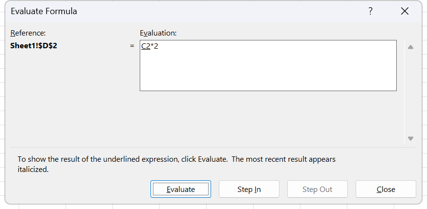

# Homework 8 · Nested IF

Three sheets, three bands tables, and one formula per sheet that has to test more than one thing. The middle sheet is the hard one: the comment a student gets depends on the subject first and the score second, so the nesting goes two levels deep in two different directions. It lands in week 7, session 14, the session the syllabus gives to nested IF. Hand in the finished workbook as `Homework 8 Excel_Your name.xlsx`.

**Objectives** MO-200 4.2.3, MO-201 3.1.1, 3.5.4

## The data

Three sheets, `Ex 1`, `Ex 2` and `Ex 3`. Each holds twenty records and a small reference table off to the right.

### Ex 1

[../data/hw08-ex1-sales.csv](../data/hw08-ex1-sales.csv), 20 rows. Header on row 1.

| Number | Month | Sales Rep | Sales | Zone |
|---|---|---|---|---|
| 1 | January | Ryan | 1046700 | South |
| 2 | January | Jacob | 680006 | North |
| 3 | January | Anderson | 727370 | South |
| 4 | January | Emily | 500543 | North |
| 5 | January | Richard | 1004356 | East |
| 6 | February | Kevin | 1168017 | West |
| 7 | February | Rachel | 545785 | East |
| 8 | February | Jenna | 755408 | West |
| 9 | January | Monica | 1100283 | West |
| 10 | January | Chandler | 1132846 | East |
| 11 | January | Phoebe | 1101206 | West |
| 12 | February | Gordon | 882264 | South |
| 13 | April | Joey | 1059305 | South |
| 14 | March | Johnson | 841687 | North |
| 15 | March | Kristen | 634195 | South |
| 16 | March | Patrick | 626240 | East |
| 17 | February | David | 531543 | South |
| 18 | February | Adam | 888762 | West |
| 19 | February | Bell | 1137234 | South |
| 20 | January | Nathalia | 1039741 | North |

Column F is headed `Commission` and is empty. The bands sit in I4:J8. [../data/hw08-ex1-commission-bands.csv](../data/hw08-ex1-commission-bands.csv)

| Sales | Commission |
|---|---|
| Less Than $600,000 | 0 |
| $600,000 - $750,000 | 0.03 |
| $750,001 - $900,000 | 0.05 |
| More Than $900,000 | 0.07 |

### Ex 2

[../data/hw08-ex2-scores.csv](../data/hw08-ex2-scores.csv), 20 rows. Header on row 1.

| Student | Result Date | Teacher | Subject | Score |
|---|---|---|---|---|
| Ross | 2022-11-07 | Arteus | Physics | 91 |
| Jim | 2022-11-09 | Freya | Mathematics | 89 |
| Anderson | 2022-11-10 | Baldur | Chemistry | 58 |
| Heather | 2022-11-07 | Arteus | Physics | 17 |
| Richard | 2022-11-07 | Arteus | Physics | 34 |
| Jordan | 2022-11-10 | Baldur | Chemistry | 74 |
| Rachel | 2022-11-09 | Freya | Mathematics | 18 |
| Jenna | 2022-11-09 | Freya | Mathematics | 37 |
| Monica | 2022-11-10 | Baldur | Chemistry | 79 |
| Chandler | 2022-11-09 | Freya | Mathematics | 5 |
| Phoebe | 2022-11-09 | Freya | Mathematics | 84 |
| Gordon | 2022-11-07 | Arteus | Physics | 58 |
| Joey | 2022-11-09 | Freya | Mathematics | 86 |
| Johnson | 2022-11-09 | Freya | Mathematics | 44 |
| Kristen | 2022-11-07 | Arteus | Physics | 36 |
| Patrick | 2022-11-10 | Baldur | Chemistry | 53 |
| David | 2022-11-09 | Freya | Mathematics | 29 |
| Adam | 2022-11-07 | Arteus | Physics | 22 |
| Bell | 2022-11-10 | Baldur | Chemistry | 44 |
| Nathalia | 2022-11-07 | Arteus | Physics | 89 |

Column F is headed `Comment` and is empty. The reference table sits in I4:K13, with the subject name merged across its three rows. [../data/hw08-ex2-comment-bands.csv](../data/hw08-ex2-comment-bands.csv)

| Subject | Condition | Comment |
|---|---|---|
| Physics | More Than 90 | Outstanding |
| | More Than 60 | Good |
| | Below 60 | Bad |
| Chemistry | More Than 80 | Outstanding |
| | More Than 50 | Good |
| | Below 50 | Bad |
| Mathematics | More Than 70 | Outstanding |
| | More Than 40 | Good |
| | Below 40 | Bad |

### Ex 3

[../data/hw08-ex3-scores.csv](../data/hw08-ex3-scores.csv), 20 rows. Header on row 1. The same twenty students, all sitting Physics with the same teacher on the same day, so only the score matters.

| Student | Result Date | Teacher | Score | Subject |
|---|---|---|---|---|
| Ross | 2022-11-07 | Arteus | 91 | Physics |
| Jim | 2022-11-07 | Arteus | 89 | Physics |
| Anderson | 2022-11-07 | Arteus | 58 | Physics |
| Heather | 2022-11-07 | Arteus | 17 | Physics |
| Richard | 2022-11-07 | Arteus | 34 | Physics |
| Jordan | 2022-11-07 | Arteus | 74 | Physics |
| Rachel | 2022-11-07 | Arteus | 18 | Physics |
| Jenna | 2022-11-07 | Arteus | 37 | Physics |
| Monica | 2022-11-07 | Arteus | 79 | Physics |
| Chandler | 2022-11-07 | Arteus | 5 | Physics |
| Phoebe | 2022-11-07 | Arteus | 84 | Physics |
| Gordon | 2022-11-07 | Arteus | 58 | Physics |
| Joey | 2022-11-07 | Arteus | 86 | Physics |
| Johnson | 2022-11-07 | Arteus | 44 | Physics |
| Kristen | 2022-11-07 | Arteus | 36 | Physics |
| Patrick | 2022-11-07 | Arteus | 53 | Physics |
| David | 2022-11-07 | Arteus | 29 | Physics |
| Adam | 2022-11-07 | Arteus | 22 | Physics |
| Bell | 2022-11-07 | Arteus | 44 | Physics |
| Nathalia | 2022-11-07 | Arteus | 89 | Physics |

Column F is headed `Grade` and is empty. The bands sit in I4:J10. [../data/hw08-ex3-grade-bands.csv](../data/hw08-ex3-grade-bands.csv)

| Score Range | Grade |
|---|---|
| More Than 90 | A |
| 75 - 89 | A- |
| 60 - 74 | B |
| 45 - 59 | C |
| 33 - 44 | D |
| Below 33 | F |

## What to do

1. **Ex 1.** Fill column F with the commission each representative earns. The commission is a rate applied to the sales figure, so the cell has to end up holding money, not a percentage. Route 4.2.3, nested three deep.
2. Write the nest so the tests run in one direction, either from the smallest band up or from the largest band down. Mixed directions are where nested IF goes wrong.
3. **Ex 2.** Fill column F with the comment. The formula reads the subject first, then the score, because the same score means different things in different subjects. A 79 in Chemistry is `Good`, a 79 in Mathematics is `Outstanding`. Route 3.1.1.
4. **Ex 3.** Fill column F with the letter grade from the six bands. Route 4.2.3.
5. On any one row of Ex 2, run **Evaluate Formula** and step through the nest until it resolves. Route 3.5.4. This is the tool the syllabus pairs with nested IF, and a nest three or six levels deep is exactly what it exists for.
6. Save as `Homework 8 Excel_Your name.xlsx` and upload it to Moodle.

## The band boundaries, read carefully

The bands in Ex 1 are worded loosely and the wording decides four of the twenty answers.

- `Less Than $600,000` and `$600,000 - $750,000` means exactly 600,000 earns three per cent, not zero.
- `$750,001 - $900,000` and `More Than $900,000` means exactly 900,000 earns five per cent, not seven.
- No sales figure in the data sits on either boundary, so the two readings give the same result on this data set. Write the formula for the boundaries anyway, because the exam data will sit on them.

The Ex 3 bands leave gaps at every boundary as written, `More Than 90` then `75 - 89`, so 90 exactly belongs to no band. Read them as ranges that meet: 90 and above is A, 75 to 89 is A minus, and so on. The data holds no 90, so again the gap does not bite here.

## Exam routes used here

**4.2.3 Perform conditional operations by using the IF() function.** Click the result cell. **Formulas** tab, **Function Library** group, **Logical**, **IF**. In the **Function Arguments** dialog, click in **Logical_test** and build the comparison by clicking the cell and typing the operator and the value. Click in **Value_if_true** and type the result without quotation marks; the dialog adds them and shows the finished value to the right of the box. Click in **Value_if_false**. Leaving it empty returns `FALSE`, which is almost never what the task wants. Read **Formula result =** and click **OK**. Lock any reference that must not move with `F4` before filling down, then spot check one row on each side of every boundary.

*One level of the nest on its own. Every deeper IF opens a dialog identical to this one, which is exactly why the levels are so easy to lose count of.*

**Expert 3.1.1, nesting.** This is the part the exam is actually testing, and the route is worth following even though typing is faster.

1. Build the outer IF with the route above, and fill in **Logical_test** and **Value_if_true**.
2. Click into **Value_if_false** and leave it empty.
3. Look at the **Name Box**, at the left end of the formula bar. While a **Function Arguments** dialog is open it stops showing the cell reference and becomes a function drop-down.
4. Open it and pick **IF** from the list of recently used functions, or pick **More Functions...** to open **Insert Function**.
5. A fresh **Function Arguments** dialog opens for the inner IF, nested inside the argument box you were standing in. Fill it the same way.
6. Repeat for each further level. To go back up a level, click the function name in the formula bar; Excel reopens that function's dialog with its arguments in place.

*What step 4 opens if More Functions... is chosen rather than picking IF straight off the Name Box list. The category box lands on Most Recently Used, where IF is already sitting once the outer level has been built.*

The categories, for reference: IF, IFS, SWITCH, AND, OR and NOT are under **Logical**. The conditional-aggregation family is not in a top-level gallery: **More Functions**, then **Statistical** for COUNTIF, COUNTIFS, AVERAGEIF, AVERAGEIFS, MAXIFS and MINIFS, and **Math & Trig** for SUMIF and SUMIFS.

**Expert 3.5.4 Evaluate formulas.** Select the cell holding the nest. Go to the **Formulas** tab, **Formula Auditing** group, and click **Evaluate Formula**. The dialog shows the formula with the next expression to be resolved underlined. Click **Evaluate** and that expression is replaced by its value. Click **Step In** when the underlined part is a reference to another cell, to open that cell's own formula, and **Step Out** to come back. Keep clicking **Evaluate** until the whole formula has collapsed to one value, then click **Restart** to run it again or **Close** to finish. On a nest, the useful moment is watching which comparison returns `FALSE` first, because that is the branch the formula actually takes.

*The expression about to be resolved is the underlined one. Each click of Evaluate swaps it for its value and underlines the next, so a nest comes apart one comparison at a time instead of all at once.*

## Checks

- Ex 1: Ryan on 1,046,700 earns 73,269. Emily on 500,543 earns 0. Jenna on 755,408 earns 37,770.40. Kristen on 634,195 earns 19,025.85.
- The commission column shows money, not `0.07`. If it shows the rate, the formula returned the band instead of multiplying by sales.
- Ex 2: Monica scored 79 in Chemistry and reads `Good`. Joey scored 86 in Mathematics and reads `Outstanding`. Nathalia scored 89 in Physics and reads `Good`. Anderson scored 58 in Chemistry and reads `Good`, while Gordon scored 58 in Physics and reads `Bad`. Those two rows are the whole point of the sheet; if they read the same, the subject is not being tested.
- Ex 3: Ross reads `A`, Jim reads `A-`, Jordan reads `B`, Patrick reads `C`, Johnson reads `D`, Chandler reads `F`.
- Anderson and Gordon both scored 58 in Ex 3 and both read `C`.
- Open **Evaluate Formula** on any Ex 2 row and click **Evaluate** repeatedly. The dialog reaches a single value with no `#VALUE!` or `#NAME?` on the way.

## Notes on the source

The file is named `Homework Excel 8 (nested If).xlsx` and its three sheets are `Ex 1`, `Ex 2` and `Ex 3`, with a space in each name. The instructions are typed into cells I2 of each sheet rather than gathered on an instruction sheet. In `Ex 2` the subject names in column I are merged across three rows each, which reads clearly in Excel and flattens into blanks in the CSV; the CSV keeps the blanks so the grouping stays visible. The date column in `Ex 2` carries three different dates and in `Ex 3` carries one, and neither is used by any task.
